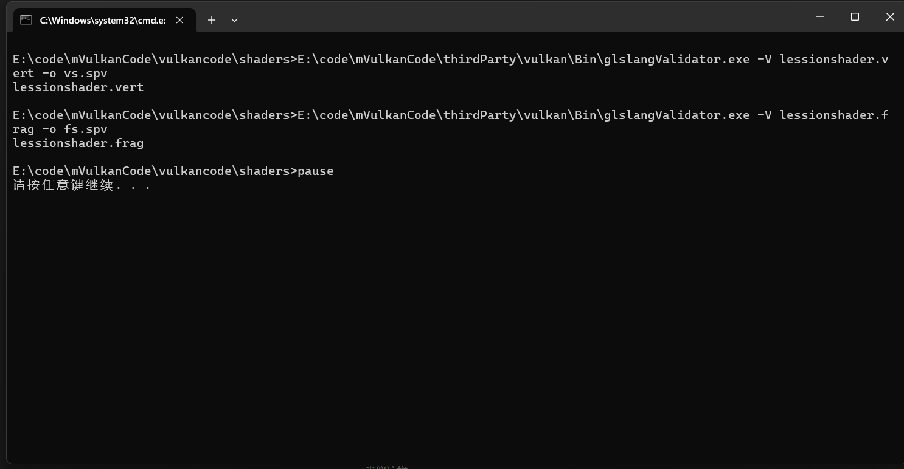
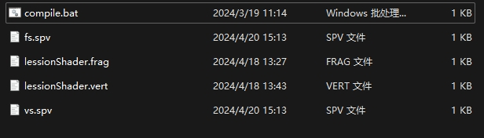

# shader和Pipline

## shader编译

在vulkan中只能接收到编译好的二进制语言(vs.spv / fs.spv)

也就是说不能像opengl那样直接传入着色器语言在内部进行编译，只能先提前编译好，再传入vulkan中

这里要用到vulkan中的工具 glslangValidator.exe

具体位置在 vulkan\Bin\里面：


使用cmd的运行脚本写一个编译器（就是写一个bat文件）：

```cmake
E:\code\mVulkanCode\thirdParty\vulkan\Bin\glslangValidator.exe -V 顶点着色的源码名字 -o 编译后的名字

E:\code\mVulkanCode\thirdParty\vulkan\Bin\glslangValidator.exe -V 片段着色器的源码名字 -o 编译后的名字

pause
```

类似这样

```
E:\code\mVulkanCode\thirdParty\vulkan\Bin\glslangValidator.exe -V lessionshader.vert -o vs.spv

E:\code\mVulkanCode\thirdParty\vulkan\Bin\glslangValidator.exe -V lessionshader.frag -o fs.spv

pause
```

写完的着色器代码，双击bat文件就能够编译。如果有写的代码有错误还会报错

编译完成就会跳出这些：





见到   fs.spv    和    vs.spv   就代表生成成功

下面将这些生成的二进制文件导入到vulkan程序中就可以


## shader类的编写


老样子先看看头文件的类怎么写：

```cpp
#pragma once
#include "device.h"
#include "../base.h"

namespace FF::Wrapper {

	class Shader {
	public:
		using Ptr = std::shared_ptr<Shader>;
		static Ptr create(const Device::Ptr& device, const std::string& fileName, VkShaderStageFlagBits shaderStages, const std::string& entryPoint) {
			return std::make_shared<Shader>(device, fileName, shaderStages,entryPoint);
		}

		Shader(const Device::Ptr& device, const std::string &fileName, VkShaderStageFlagBits shaderStages, const std::string &entryPoint);
		~Shader();

		[[nodiscard]] auto getShaderStage() const { return mShaderStage; }
		[[nodiscard]] auto& getShaderEntryPoint() const { return mEntryPoint; }
		[[nodiscard]] auto getShaderModule() const { return mShaderModule; }

	private:
		VkShaderModule mShaderModule{VK_NULL_HANDLE};
	
		Device::Ptr mDevice{ nullptr };

		std::string mEntryPoint;

		VkShaderStageFlagBits mShaderStage;
	};

}
```


这里最主要的变量就是：

VkshaderModule     处理着色器二级制码最主要的类型

VkShaderStageFlagBits   用于告诉管线这个shader是什么类型的 片段还是顶点还是几何

std::string entryPoint 用于告诉从这个源码的哪个关键函数进入 一般为"main"

看看shader类是怎样构造的：

```cpp
	Shader::Shader(const Device::Ptr& device, const std::string& fileName, VkShaderStageFlagBits shaderStages, const std::string& entryPoint) {
		mDevice = device;
		mShaderStage = shaderStages;
		mEntryPoint = entryPoint;
		std::vector<char> codeBuffer = readBinary(fileName);
		VkShaderModuleCreateInfo shaderCreateInfo{};
		shaderCreateInfo.sType = VK_STRUCTURE_TYPE_SHADER_MODULE_CREATE_INFO;
		shaderCreateInfo.codeSize = codeBuffer.size();
		shaderCreateInfo.pCode = reinterpret_cast<const uint32_t*>(codeBuffer.data());


		if (vkCreateShaderModule(mDevice->getDevice(), &shaderCreateInfo, nullptr, &mShaderModule) != VK_SUCCESS) {
			throw std::runtime_error("Error: failed to create shader");
		}
	}
```

这里要对着色器源码的文本进行读取，要用上 c++的文件流读取，编写一个 readBinary的函数：

```cpp
	static std::vector<char> readBinary(const std::string& fileName) {
		std::ifstream file(fileName.c_str(), std::ios::ate | std::ios::binary | std::ios::in);

		if (!file) {
			throw std::runtime_error("Error: failed to open shader file");
		}

		const size_t fileSize = file.tellg();
		std::vector<char> buffer(fileSize);

		file.seekg(0);
		file.read(buffer.data(), fileSize);
		file.close();

		return buffer; 

	}
```

创建还是老样子，使用createinfo结构传入vkcreate函数，这样一个shander类就构造完成了

来看看完整的cpp实现是怎么写的：

```cpp
#include "shader.h"

namespace FF::Wrapper {

	static std::vector<char> readBinary(const std::string& fileName) {
		std::ifstream file(fileName.c_str(), std::ios::ate | std::ios::binary | std::ios::in);

		if (!file) {
			throw std::runtime_error("Error: failed to open shader file");
		}

		const size_t fileSize = file.tellg();
		std::vector<char> buffer(fileSize);

		file.seekg(0);
		file.read(buffer.data(), fileSize);
		file.close();

		return buffer; 

	}

	Shader::Shader(const Device::Ptr& device, const std::string& fileName, VkShaderStageFlagBits shaderStages, const std::string& entryPoint) {
		mDevice = device;
		mShaderStage = shaderStages;
		mEntryPoint = entryPoint;
		std::vector<char> codeBuffer = readBinary(fileName);
		VkShaderModuleCreateInfo shaderCreateInfo{};
		shaderCreateInfo.sType = VK_STRUCTURE_TYPE_SHADER_MODULE_CREATE_INFO;
		shaderCreateInfo.codeSize = codeBuffer.size();
		shaderCreateInfo.pCode = reinterpret_cast<const uint32_t*>(codeBuffer.data());


		if (vkCreateShaderModule(mDevice->getDevice(), &shaderCreateInfo, nullptr, &mShaderModule) != VK_SUCCESS) {
			throw std::runtime_error("Error: failed to create shader");
		}
	}

	Shader::~Shader() {
		if (mShaderModule != VK_NULL_HANDLE) vkDestroyShaderModule(mDevice->getDevice(), mShaderModule,nullptr);
		mDevice.reset();
	}
}
```


## Pipeline类的编写


看看头文件的类：

```cpp
#pragma once
#include "shader.h"
#include "device.h"
#include "../base.h"
#include "renderPass.h"

namespace FF::Wrapper {

	class Pipeline {
	public:
		using Ptr = std::shared_ptr<Pipeline>;
		static Ptr create(const Device::Ptr& device, const RenderPass::Ptr& renderpass) { return std::make_shared<Pipeline>(device, renderpass); }

		Pipeline(const Device::Ptr &device, const RenderPass::Ptr &renderpass);
		~Pipeline();

		void setShaderGroup(const std::vector<Shader::Ptr>& shaderGroup);

		void setViewport(const std::vector<VkViewport>& viewports) { mViewports = viewports; }

		void setScissors(const std::vector<VkRect2D>& scissors) { mScissors = scissors; }

		void pushBlendAttachment(const VkPipelineColorBlendAttachmentState& blendattachment) { 
			mBlendAttachmentStates.push_back(blendattachment); 
		}

		void bulid();
	public:
		VkPipelineVertexInputStateCreateInfo mVertexInputsState{};
		VkPipelineInputAssemblyStateCreateInfo mAssemblyState{};
		VkPipelineViewportStateCreateInfo mViewportState{};
		VkPipelineRasterizationStateCreateInfo mRasterState{};
		VkPipelineMultisampleStateCreateInfo mSampleState{};
		std::vector<VkPipelineColorBlendAttachmentState> mBlendAttachmentStates{};
		VkPipelineColorBlendStateCreateInfo mBlendState{};
		VkPipelineDepthStencilStateCreateInfo mDepthStencilState{};
		VkPipelineLayoutCreateInfo mLayoutState{};

	public:
		[[nodiscard]] auto getPipeline() const { return mPipline; }

	private:
		Device::Ptr mDevice{ nullptr };

		VkPipeline mPipline{ VK_NULL_HANDLE };

		RenderPass::Ptr mRenderPass{ nullptr };

		VkPipelineLayout mLayout{ VK_NULL_HANDLE };
		std::vector<Shader::Ptr> mShaders{};
		std::vector<VkViewport> mViewports{};
		std::vector<VkRect2D> mScissors {};
	};
}
```

看着很多，但是很多都是还没有进行实行的pipeline组件，关键的还是私有的那几个数据：


VkPipeline 这个就是管线创建的关键信息

RenderPass 对管线渲染进行描述，下一篇再详细讲

VkPipelineLayout 管线中的信息如何进行访问的结构

std::vector< Shader::Ptr >  管线中使用到的着色器集合

std::vector< VkViewport > 对视窗进行的描述 ,这部分数据从swapchain中获取

std::vector< VkRect2D >  对于渲染区域的描绘信息

其他的描述信息后面再 进行记录讲解


构造就只是对一堆的结构体的信息描述，告诉结构体这些是什么信息：

```cpp
Pipeline::Pipeline(const Device::Ptr& device, const RenderPass::Ptr& renderpass) {
	mDevice = device;
	mRenderPass = renderpass;
	mVertexInputsState.sType = VK_STRUCTURE_TYPE_PIPELINE_VERTEX_INPUT_STATE_CREATE_INFO;
	mAssemblyState.sType = VK_STRUCTURE_TYPE_PIPELINE_INPUT_ASSEMBLY_STATE_CREATE_INFO;
	mViewportState.sType = VK_STRUCTURE_TYPE_PIPELINE_VIEWPORT_STATE_CREATE_INFO;
	mRasterState.sType = VK_STRUCTURE_TYPE_PIPELINE_RASTERIZATION_STATE_CREATE_INFO ;
	mSampleState.sType = VK_STRUCTURE_TYPE_PIPELINE_MULTISAMPLE_STATE_CREATE_INFO;
	mBlendState.sType = VK_STRUCTURE_TYPE_PIPELINE_COLOR_BLEND_STATE_CREATE_INFO;
	mDepthStencilState.sType = VK_STRUCTURE_TYPE_PIPELINE_DEPTH_STENCIL_STATE_CREATE_INFO;
	mLayoutState.sType = VK_STRUCTURE_TYPE_PIPELINE_LAYOUT_CREATE_INFO;
}
```

这些信息都是公共外部也可以调用到的数据，因此只要 在  application类 中进行传入就行


最主要的函数还得是build函数：

```cpp
void Pipeline::bulid() {
	std::vector<VkPipelineShaderStageCreateInfo> shaderCreateInfos{};
	for (const auto& shader : mShaders) {
		VkPipelineShaderStageCreateInfo shaderCreateInfo{};
		shaderCreateInfo.sType = VK_STRUCTURE_TYPE_PIPELINE_SHADER_STAGE_CREATE_INFO;
		shaderCreateInfo.stage = shader->getShaderStage();
		shaderCreateInfo.pName = shader->getShaderEntryPoint().c_str();
		shaderCreateInfo.module = shader->getShaderModule();

		shaderCreateInfos.push_back(shaderCreateInfo);
	}

	mViewportState.viewportCount = static_cast<uint32_t>(mViewports.size());
	mViewportState.pViewports = mViewports.data();
	mViewportState.scissorCount = static_cast<uint32_t>(mScissors.size());
	mViewportState.pScissors = mScissors.data();

	mBlendState.attachmentCount = static_cast<uint32_t>(mBlendAttachmentStates.size());
	mBlendState.pAttachments = mBlendAttachmentStates.data();

	if (mLayout != VK_NULL_HANDLE) {
		vkDestroyPipelineLayout(mDevice->getDevice(), mLayout, nullptr);
	}

	if (vkCreatePipelineLayout(mDevice->getDevice(), &mLayoutState, nullptr, &mLayout) != VK_SUCCESS) {
		throw std::runtime_error("Error: failed to create pipeline layout");
	}

	VkGraphicsPipelineCreateInfo pipelineCreateInfo{};
	pipelineCreateInfo.sType = VK_STRUCTURE_TYPE_GRAPHICS_PIPELINE_CREATE_INFO;
	pipelineCreateInfo.stageCount = static_cast<uint32_t>(shaderCreateInfos.size());
	pipelineCreateInfo.pStages = shaderCreateInfos.data();
	pipelineCreateInfo.pVertexInputState = &mVertexInputsState;
	pipelineCreateInfo.pInputAssemblyState = &mAssemblyState;
	pipelineCreateInfo.pViewportState = &mViewportState;
	pipelineCreateInfo.pRasterizationState = &mRasterState;
	pipelineCreateInfo.pMultisampleState = &mSampleState;
	pipelineCreateInfo.pDepthStencilState = nullptr;
	pipelineCreateInfo.pColorBlendState = &mBlendState;
	pipelineCreateInfo.layout = mLayout;
	pipelineCreateInfo.renderPass = mRenderPass->getRenderPass();
	pipelineCreateInfo.subpass = 0;

	pipelineCreateInfo.basePipelineHandle = VK_NULL_HANDLE;
	pipelineCreateInfo.basePipelineIndex = -1;

	if (mPipline != VK_NULL_HANDLE) {
		vkDestroyPipeline(mDevice->getDevice(), mPipline, nullptr);
	}

	if (vkCreateGraphicsPipelines(mDevice->getDevice(), VK_NULL_HANDLE, 1, &pipelineCreateInfo, nullptr, &mPipline) != VK_SUCCESS) {
		throw std::runtime_error("Error: failed to create pipeline");
	}
}

```

首先从传入的shaders数组中获取数据，创建管线链接着色器的信息,

要注意设置entrypoint时要讲字符串转为C的格式（c_str()）

```cpp
	std::vector<VkPipelineShaderStageCreateInfo> shaderCreateInfos{};
	for (const auto& shader : mShaders) {
		VkPipelineShaderStageCreateInfo shaderCreateInfo{};
		shaderCreateInfo.sType = VK_STRUCTURE_TYPE_PIPELINE_SHADER_STAGE_CREATE_INFO;
		shaderCreateInfo.stage = shader->getShaderStage();
		shaderCreateInfo.pName = shader->getShaderEntryPoint().c_str();
		shaderCreateInfo.module = shader->getShaderModule();

		shaderCreateInfos.push_back(shaderCreateInfo);
	}
```

然后对viewport进行设置：

```cpp
mViewportState.viewportCount = static_cast<uint32_t>(mViewports.size());
mViewportState.pViewports = mViewports.data();
mViewportState.scissorCount = static_cast<uint32_t>(mScissors.size());
mViewportState.pScissors = mScissors.data();

mBlendState.attachmentCount = static_cast<uint32_t>(mBlendAttachmentStates.size());
mBlendState.pAttachments = mBlendAttachmentStates.data();
```

然后就是各种组件的信息组合创建，创建一个Vkpipeline，

来看看完整的实现：


```cpp
#include "pipeline.h"

namespace FF::Wrapper {
	Pipeline::Pipeline(const Device::Ptr& device, const RenderPass::Ptr& renderpass) {
		mDevice = device;
		mRenderPass = renderpass;
		mVertexInputsState.sType = VK_STRUCTURE_TYPE_PIPELINE_VERTEX_INPUT_STATE_CREATE_INFO;
		mAssemblyState.sType = VK_STRUCTURE_TYPE_PIPELINE_INPUT_ASSEMBLY_STATE_CREATE_INFO;
		mViewportState.sType = VK_STRUCTURE_TYPE_PIPELINE_VIEWPORT_STATE_CREATE_INFO;
		mRasterState.sType = VK_STRUCTURE_TYPE_PIPELINE_RASTERIZATION_STATE_CREATE_INFO ;
		mSampleState.sType = VK_STRUCTURE_TYPE_PIPELINE_MULTISAMPLE_STATE_CREATE_INFO;
		mBlendState.sType = VK_STRUCTURE_TYPE_PIPELINE_COLOR_BLEND_STATE_CREATE_INFO;
		mDepthStencilState.sType = VK_STRUCTURE_TYPE_PIPELINE_DEPTH_STENCIL_STATE_CREATE_INFO;
		mLayoutState.sType = VK_STRUCTURE_TYPE_PIPELINE_LAYOUT_CREATE_INFO;
	}

	Pipeline::~Pipeline() {
		if (mLayout != VK_NULL_HANDLE) vkDestroyPipelineLayout(mDevice->getDevice(), mLayout, nullptr);

		if (mPipline != VK_NULL_HANDLE) vkDestroyPipeline(mDevice->getDevice(), mPipline, nullptr);

		mDevice.reset();
	}

	void Pipeline::bulid() {
		std::vector<VkPipelineShaderStageCreateInfo> shaderCreateInfos{};
		for (const auto& shader : mShaders) {
			VkPipelineShaderStageCreateInfo shaderCreateInfo{};
			shaderCreateInfo.sType = VK_STRUCTURE_TYPE_PIPELINE_SHADER_STAGE_CREATE_INFO;
			shaderCreateInfo.stage = shader->getShaderStage();
			shaderCreateInfo.pName = shader->getShaderEntryPoint().c_str();
			shaderCreateInfo.module = shader->getShaderModule();

			shaderCreateInfos.push_back(shaderCreateInfo);
		}

		mViewportState.viewportCount = static_cast<uint32_t>(mViewports.size());
		mViewportState.pViewports = mViewports.data();
		mViewportState.scissorCount = static_cast<uint32_t>(mScissors.size());
		mViewportState.pScissors = mScissors.data();

		mBlendState.attachmentCount = static_cast<uint32_t>(mBlendAttachmentStates.size());
		mBlendState.pAttachments = mBlendAttachmentStates.data();

		if (mLayout != VK_NULL_HANDLE) {
			vkDestroyPipelineLayout(mDevice->getDevice(), mLayout, nullptr);
		}

		if (vkCreatePipelineLayout(mDevice->getDevice(), &mLayoutState, nullptr, &mLayout) != VK_SUCCESS) {
			throw std::runtime_error("Error: failed to create pipeline layout");
		}

		VkGraphicsPipelineCreateInfo pipelineCreateInfo{};
		pipelineCreateInfo.sType = VK_STRUCTURE_TYPE_GRAPHICS_PIPELINE_CREATE_INFO;
		pipelineCreateInfo.stageCount = static_cast<uint32_t>(shaderCreateInfos.size());
		pipelineCreateInfo.pStages = shaderCreateInfos.data();
		pipelineCreateInfo.pVertexInputState = &mVertexInputsState;
		pipelineCreateInfo.pInputAssemblyState = &mAssemblyState;
		pipelineCreateInfo.pViewportState = &mViewportState;
		pipelineCreateInfo.pRasterizationState = &mRasterState;
		pipelineCreateInfo.pMultisampleState = &mSampleState;
		pipelineCreateInfo.pDepthStencilState = nullptr;
		pipelineCreateInfo.pColorBlendState = &mBlendState;
		pipelineCreateInfo.layout = mLayout;
		pipelineCreateInfo.renderPass = mRenderPass->getRenderPass();
		pipelineCreateInfo.subpass = 0;
	
		pipelineCreateInfo.basePipelineHandle = VK_NULL_HANDLE;
		pipelineCreateInfo.basePipelineIndex = -1;

		if (mPipline != VK_NULL_HANDLE) {
			vkDestroyPipeline(mDevice->getDevice(), mPipline, nullptr);
		}

		if (vkCreateGraphicsPipelines(mDevice->getDevice(), VK_NULL_HANDLE, 1, &pipelineCreateInfo, nullptr, &mPipline) != VK_SUCCESS) {
			throw std::runtime_error("Error: failed to create pipeline");
		}
	}

	void Pipeline::setShaderGroup(const std::vector<Shader::Ptr>& shaderGroup) {
		mShaders = shaderGroup;
	}
}
```
