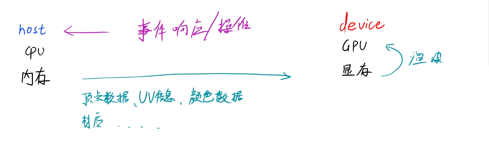
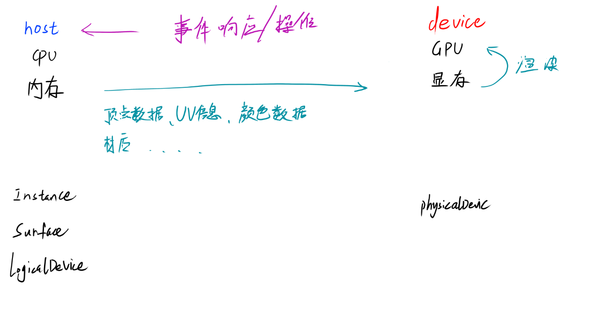
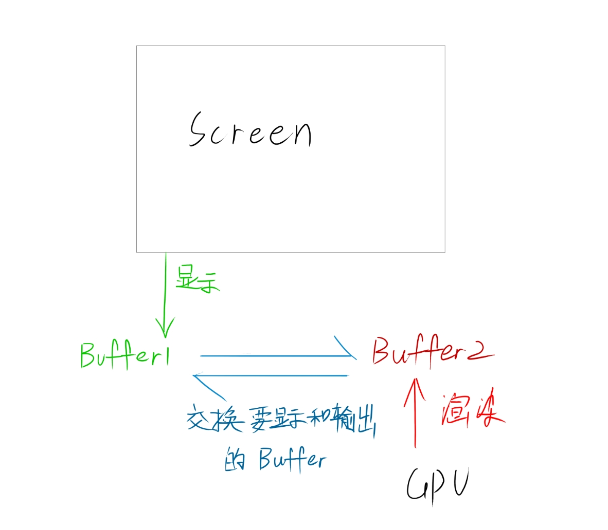
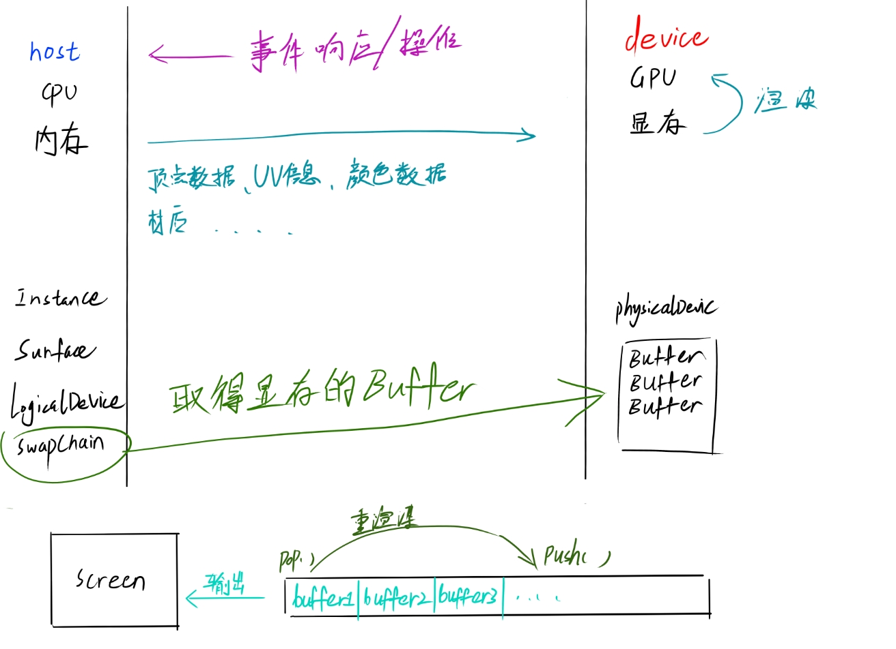

# VulKan接口的设计样式

## 设计模式

vulkan的设计由Host端和Device端组成（即客户端+服务端，在图形渲染中指 逻辑端+渲染端）

Host：CPU 和 内存为基础进行的操作都为Host，比如游戏的逻辑，按键监听，模型读取。

Device：GPU与显存的操作，如图形渲染、后期处理。

## 基础设施

### 元数据与设备

Instance： 各渲染程序元数据，VulKan版本，引擎版本，debug启用，扩展开启

Surface：连接操作系统相关的窗口（可以是windows.h 或者 glfw）与vulkan的图像组件

PhysicalDevic：表示使用哪一张显卡作为渲染

LogicalDevic：显卡属于Devic端，申请一个资源后，需要让逻辑设备Host操作设备

### 交换链

单一屏幕缓冲时，会让显示器撕裂，原因如下：

执行垂直消隐前，就去更新帧数据的RGB，就会发生撕裂，因此必须要等待垂直消隐时间完成才能去更新帧；

（垂直消隐：一页扫描完毕返回屏幕左上角的原因）

防止撕裂，就会耗掉更长的时间（刷新时间+渲染更新时间 = 显示一帧的时间）

因此为了解决这个问题，需要用多个buffer来进行渲染；

假设使用两个buffer：

不断将执行显示和渲染的缓冲区进行交替；这也是双缓冲的原理。

从而取消了屏幕消隐的时间，而又不会产生撕裂；

但是在刷新率和渲染速度过快时，双缓冲会显得不够用；

因此以这个交换的原理，建立一个缓冲队列存入N个buffer（由渲染速度和刷新率决定多少个）

不断把渲染好的 buffer push进队列，对队列头部的buffer输出到屏幕，

这就是   交换链

