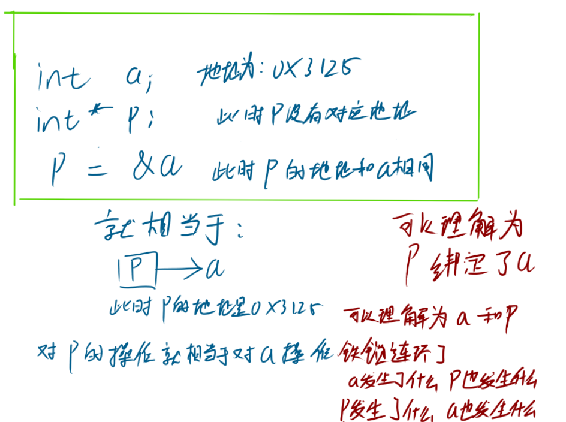

# C/C++指针快速了解

在C/C++中，指针是一个很重要的东西， 后面的各种数据结构比如链表，树的实现中都需要用到指针；但是指针对于大部分C语言的小白来说都难以理解（但这还不是最难理解，最抽象的）希望这篇笔记能够让你通俗易懂的理解指针（但愿......）

## 首先要知道指针要拿来干什么，是什么？

先拿最好理解的***数组***来反向理解指针：

对于数组来说，存储的是一串数据

```C++
int arr[] = {0, 4, 2, 3};
```

对于     |数组|   内的数据，每个数据都有齐对应的下标 ，比如我要在 arr数组中 找到4 ，那么这个4在数组中对于的下标为1 ，即arr[1] = 4;

（如果这个都不了解，那基本得要把有关数组的知识点看一遍了）

声明一个数组的原理，其实就是开辟了一段空间， 并且给这些空间内的数据对应的下标；

如果声明一个数组的原理是开辟一段空间，那么同理，我们每声明一个量都会开辟一个空间，如：

```C++
int num = 1;                //声明变量的时候，程序会在内存空间中开辟1个int大小的空间
int arr[] = {0, 4, 2, 3};   //那么对于该数组，程序会在内存空间中开辟4个int大小的空间
```

在上面的注释中我讲到了      |内存|        你可以把内存理解为一个超级大超级大的数组                在数组中每个数据都有自己的下标， 那么同样的  在内存中声明的每个量，都有自己对应的“下标”，但是在内存中不叫“下标”，我们将他称为      ！！**内存地址**！！

那么指针是拿来干什么的呢？就是去拿到我们声明这些量在内存中的地址！

```C++
int num = 1;
int* p = &num ;    //获取变量 num 的地址
```



(得到的地址其实是C语言自己生成的地址，其在内存中的真实地址不做分析)

## 指针能拿来干什么？

还是通过数组理解   数组中如果要修改某个 位置的值一般会这样写：

```
arr[0] = 1;
```

可以理解为修改对应下标的值，

那要修改单一 一个变量的值，一般都是：

```
int n1 = 1;
n1 = 3;
```

但通过指针去获得了这个变量的地址我们可以这样写：

```C++
int n2 = 1;
int* p = &n2;
*p = 3;      //*p的意思是对指针p解指针
```

与数组的      a[index] = num        一个道理;

但是为什么我用   *p  =   而不是   p =   呢？

记住这里的p只是个地址，他和数组的下标相似，这里p是对于声明的整形n2的地址！地址！

如果我们使用  p =  3;    那么按道理来说p就不指向n2的地址了 而是指向了对于为“3”的这块地址了

（实际上这样写是不和法的，会报错, 千万不要傻乎乎的  “p = 114514;”这只会报错, 因为这不是合法的地址，应当是 "p = &n2;"）       *加上数组名字   这个作用叫做解指针，这个的作用就是得到指针绑定的地址所对应的值。

指针的应用还可以用在函数中， 例如声明一个两个数交换的函数：

```C++
void spawn(int a, int b) {
  int t = a;
  a = b;
  b = t;
}

int main() {
  int n1=1, n2=2;

  spawn(n1, n2);

  return 0;
}
```

运行上面的语句不会改n1和n2的值，因为传入的只是两个值而没有传入声明n1和n2的地址

因此应当让函数传入两个地址， 这里指针的用处就体现了

```c++
void spawn(int *a, int *b) {
  int t = *a;      //解指针还会拿到这个地址所储存的数据，和arr[0]可以拿到arr中第0个元素的值一个道理
  *a = *b;
  *b = t;
}

int main() {
  int n1=1, n2=2;

  spawn(&n1, &n2);     //因为是指针，所以要传入n1和n2的地址

  return 0;
}
```

以上这段代码就能够将n1和n2的值给交换

这是指针最基础的用法

后面还会有指针的指针、指针与数组、指针与函数......怕你脑子爆炸所以先不写这么多，你要是能理解这些再来告诉你如何使用这些高级操作
