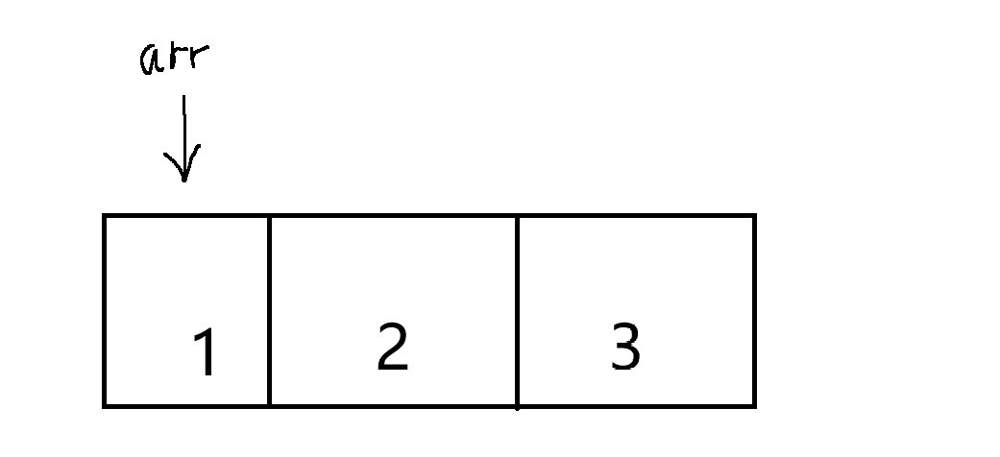
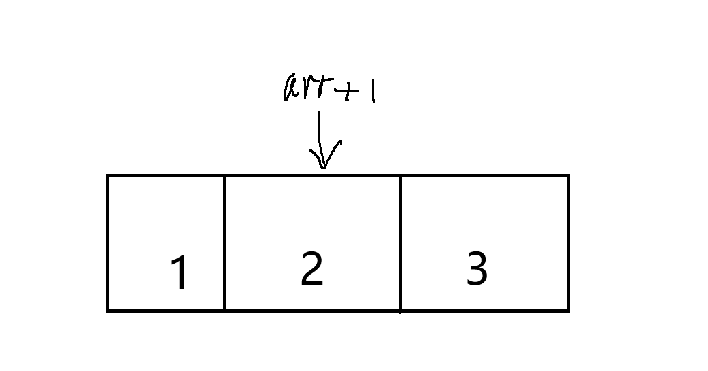

# 指针的运用（1）

## 指针的一些注事项

最简单的运用就是绑定一个量的地址：

```cpp
int i = 0;
int* p = &i;
```

那如果不对指针进行绑定呢？

```cpp
int *p;
```

这个时候这种指针叫做   |野指针|    他指向的地址是系统占用的地址，而且野指针绝不能调用和修改里面的值

即不能解指针,也不能给指针对于的地址添上数据,   *p = 114514,  对于野指针是不合法的！

绝对不要对野指针进行解指针(*p)会变得不幸。

除了野指针不能被调用外还有一种指针不能被调用----------|空指针|：

```cpp
int* p = nullptr;   //C++的空指针              (两者无本质区别，只是C++这个是专门用在指针的)
int* p = NULL;      //C语言的空指针
```

对于空指针也不能被调用，但是空指针与0有一样的特性，因为空指针返回的布尔变量为false:

```cpp
int* p = nullptr;
if (!p) cout<<"指针为空"<<endl;     //  !p ->   如果p指针为空则返回一个  false   !false = true
else if(p) cout<<“指针不为空”<<endl;
```

## 给指针开辟空间

### 指针开辟一个空间

指针不单单可以绑定一个量的指针，还可以在内存中的堆区开辟一块空间，代码如下：

```cpp
int* p = (int*)malloc(sizeof(int)); 
*p = 10;                                //c语言的开辟法

int* p2 = new int(10);                  //C++的开辟方法

//释放内存空间,养成良好习惯防止内存溢出
free(p);                                //C语言
delete p2;                               //cpp              两者无区别
```

这里的堆区是指C语言在内存中能够使用的空间，

对于指针空间的开辟有两种：

纯C的和CPP的；

C的开辟的源函数是这样的

```cpp
void malloc(size_t _Size) {.....}
```

这里的size_t _Size 是一个接收  类型大小  的一种类型  当然不用理解他，只需要知道你要给这个函数传入类型的大小 （比如sizeof(int)   一个整形的size(占用的字节)）

那么前面的(int*)是什么意思呢,

正如上面的原函数所表示的  他这个函数的类型是   void    要将他转换类型为   (int* )   整形的指针

因此为：

```cpp
(int*)malloc(sizeof(int));
```

对于C++的new这里，使用的是C++的运算符重载的知识就不过多解释了(delete也是）

```cpp
 new 类型(变量);
```

和C的区别就是它可以直接对内存地址上进行赋值。


### 指针与数组

对于开辟数组是这样的：

```cpp
int arr[] = {1,2,3};
```

数组的名字代表了   第0号位置     在内存上的地址

即    arr == &arr[0];

对 arr 进行 *arr 就可以得到对应内存地址上存放的值

那要是， 想要得到第1号位置的值我该怎么做呢----------arr[1]!

当然这文章主

要讲指针的运用，在开辟数组时，里面的里面所占用的空间是连续的,如图所示



那我该如何用指针拿到位置1的值呢？

既然arr代表第一个位置的地址那我arr+1不就是arr  1位置上   的值咯，如图所示：


因此*(arr+1) == arr[1];

那么对于在数组中其他位置的值也同理


当然的，也可以用指针来开辟一个数组：

```cpp
int* arr = (int*)malloc(sizeof(int)*10);
int* arr2 = new int[10];
```

这样就可以开辟一个长度为10的   整形   空  数组

（只是开辟了空间，里面的值还需要一个一个传入）

对于指针开辟的数组可以使用[传统的 p[indx],

噢！记得要释放空间防止内存溢出

```cpp
for (int i=0; i<10; i++) {
  if (arr) free(arr);                                 //C语言的写法
  arr++;
}

delete[] arr2;                                        //C++的写法
```


对于数组空间的释放中C语言的要复杂点点，不过也就多点语法的事。

（如果你觉的我一定要C的写法，那就用这写法吧）


### 指针与字符

字符串大家都知道，用的字符数组：

```cpp
char name[] = "happy";
```

那么根据上面的知识可以很简单的写出以char指针开辟的字符串：

```cpp
char* name = (char*)malloc(10);    //因为char占用的字节为1所以可以不用sizeof(cahr)
name = "happy";
char* n2 = new char[10];
n2 = "114514";
char* test = "unhappy";
```

但是这种字符串是不能够使用下标或者找到对应地址来修改值的：

```cpp
cout<<name[0]<<endl;         //正常输出'h'
name[0] = 'y';               //程序不正常退出
*name = 'k';                 //程序不正常退出
```

这和开辟的地方有关，我们普通的字符数组是开辟在栈区，而指针是开辟在堆区有关，这里不做详细解释，先记住。


## 注意事项

由于篇幅问题，估计还要写两篇左右的文章。

现在这些也只是指针进阶一丢丢的应用，后面还会有二维数组的结合，函数与指针，

记住在程序结束时一定一定要释放内存，很重要！！

篇幅比较长不理解建议多看几遍。
