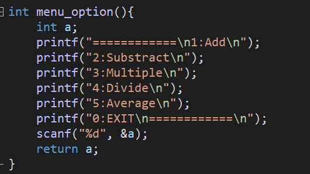
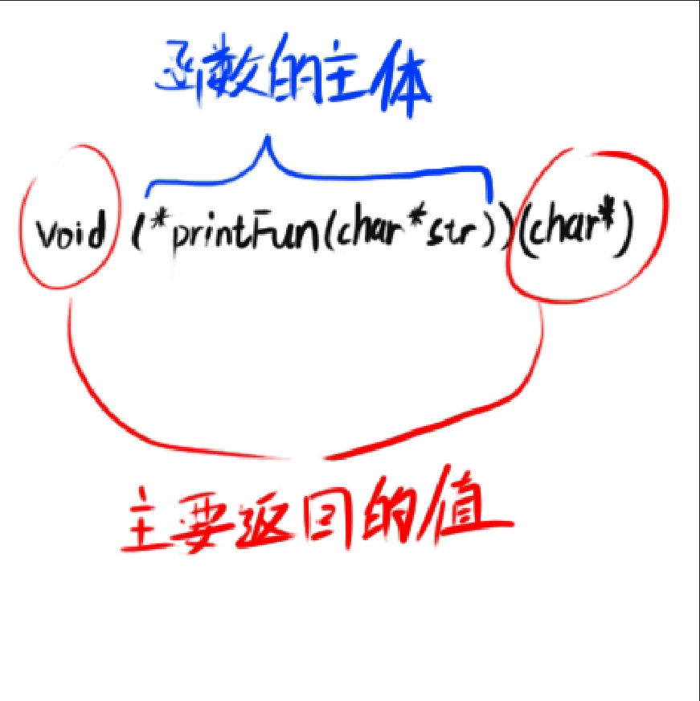

# 指针的运用（4）

## 指针与函数

在这里我会把函数给过一遍，并且额外补充一些东西，

来写一个最简单的函数：

```cpp
void HelloFunction() {
  cout<<"Hello world";
  return;
}
```

定义函数的时候，最前面的那个类型值决定了这个函数要返回什么值 （void代表值为空，所以不用返回值，不过像返回空的函数都默认带有一个  return;     你可以加，也可以不加，这个因情况而定）

再比如下面这个:

```cpp
float pi() {
   return 3.14159269;
}
```

因为函数的类型是float 所以他return的时候，也只能返回float类型的参数；

既然一个函数需要声明他的类型，那么在定义函数的时候就一定会在内存中开辟空间，它能在内存中开辟空间就代表着，他一定有自己对硬的地址位置;

函数名就对应了他所开辟的地址；

那要如何指向一个函数呢？

```cpp
int add(int a, int b) {
  return a + b;
}

int main() {
  int (*p)(int, int) = add;
  cout<<p(1,3);
}
```

看了之后你一定会感到奇葩，这什么玩意？

和上一篇的二维数组一样 要用（） int  (*p)定义一个整形的指针，目的是为了接收函数的返回值，然后加上这个函数要传入的参数(int, int)；

int (*p)(int, int)

一个函数指针就这样完成了；

他可以指向一段返回int类型，传入两个int的函数：

比如我再定义一个：

```cpp
 int dot(int a, int b) {
      return a*b;
}
```

它同样能够被函数指针指向 （int (*p)(int, int) = dot;）；

对于函数指针的调用，只需要对应   函数指针名(  传入的参数  );      即可。

如上段代码     p(3, 4);

## 函数指针数组

函数指针只能指向一个函数，这样其实很鸡肋，没啥用处（至少到现在是），我还不如直接调用函数；

当然现在确实很鸡肋，但是后面讲到他的传入用法的时候才会发现他用处大这呢。

但是现在我们先讲函数指针的数组；

比如之前 吕校讲那个计算器系统：



还记的吧，不记得也没关系，这个函数的作用就是输入对应编号就执行哪个功能

那么，这个作业的源代码是怎样的呢？通过 menu_option函数返回的数传给设定的一个int

choice；来对choice的值进行判断，决定他去实现哪个功能；

来看看参考答案的源码：

（12周的作业，也可以去学习通自行查看）

```cpp

printf("Input num1, num2(10 28): ");
scanf("%d%d", &num1, &num2);

while (1) {

  choice = menu_option();

  errNo = 0;

  switch (choice) {

    case 1: result = add(num1, num2); break;

    case 2: result = substract(num1, num2); break;

    case 3: result = multiple(num1, num2); break;
  
    case 4: result = divide(num1, num2); break;

    case 5: result = average(num1, num2); break;

    case 0: bye_message(); break;

    default: error_message(); errNo=1; break;

  }

  if (choice == 0) break;

  else if (!errNo) show_result(result);

} 


```

通过switch分支来对choice进行判断对应的数字，然后再调用函数，这样写虽然直观，但是不整洁，

因此我们就需要函数指针数组来优化代码，但是，

在优化之前我们先来看看有哪几个函数：

```cpp
int menu_option(){                                      //接收值的窗口
	int a;
	printf("============\n1:Add\n");
	printf("2:Substract\n");
	printf("3:Multiple\n");
	printf("4:Divide\n");
	printf("5:Average\n");
	printf("0:EXIT\n============\n");
	scanf("%d", &a);
	return a;
}
int intadd(int a,int b) {                        //加法
	return a + b;
}
int intsubstract(int a,int b) {                 //减法
	return a - b;
}
int intdivide(int a, int b) {                   //除法
	return a/b;
}
int multiple(int a, int b) {                    //乘法
	return a*b;
}
int average(int a, int b) {                     //
	return intadd(a,b)/2;
}

void error_message() {
	printf("INPUT 1~5  0->EXIT.\n");
}
void bye_message() {
	printf("Thanks...");
}
```

我们先来看看，那些个函数格式是一样的：

加法、减法、除法、乘法、求平均数，都是返回int，传入两个int的函数

因此我们可以把这些函数封装进一个函数指针数组里面：

```cpp
int (*Function[5])(int, int) = {intadd, intsubstract, multiple, intdivide, average};
```

注意，千万不要和二维数组的(*p)[5]搞混，(*p[5])是整形指针的数组，而前者是指向5个长度的整形数组的指针；一个指向函数，一个指向数组。

也就是说上面的这个 Function这个数组 每一个数据对应的都是一个函数；

比如说我要相加：

```
int res = Function[0](1,2);        //计算1+2并返回结果
```

那么就可以减少switch分支判断的使用，从而简化成：

```cpp
int (*Function[5])(int, int) = {intadd, intsubstract, multiple, intdivide, average};

	printf("Please input 2 numbers:");
	scanf("%d%d", &num1, &num2);

	do{

		choice = menu_option();

		if(choice >=1 && choice <=5) {
			result = Function[choice-1](num1, num2);
			printf("Result = %d.\n", result);
		}
		else if(!choice) {
			bye_message();
		}
		else {
			error_message();
		}

	} while(choice);
```

如果使用三目运算甚至可以极限压缩到3行代码，但考虑到有人不理解三目运算，我这里暂时先用少量if分支，

这样就把又长又臭的代码给简化了。


## 函数指针当作函数的传入量

众所周知指针能够当作函数的传入量，那么函数指针也不会例外，他也可以当作传入量

如下面的代码，我将实现一个冒泡排序，并且可以通过传入的函数指针来改变他排序的方向：

```cpp
bool minback (int a, int b) {                               //从大到小
	return a < b;
}

bool maxback (int a, int b) {                                //从小到大
	return a > b;
}
void sort(int* arr, int len, bool (*p)(int, int)) {
	for (int i=0; i<len; i++) {
		for (int j=0; j<len-i-1; j++) {
			if (p(arr[j], arr[j+1])){
				int t = arr[j];
				arr[j] = arr[j+1];
				arr[j+1] = t;
			}
		}
	}
}

int main() {

	int arr[8] = {8,7,3,4,1,2,6,9};
	bool (*p[2])(int, int) = {minback, maxback};
	sort(arr, 8, p[0]);
	for (int i =0; i<8; i++) {
		cout<<arr[i]<<" ";
	}

        return 0;
} 


```

sort中第三个参数传入的是一个函数，而且是指定了为返回bool  传入两个int的函数，不能传入其他函数；

## 函数指针作为返回值

没错指针也是可以返回的

比如这个函数：

```cpp
int* makearr() {
	int* arr = (int*)calloc(10, sizeof(int));
	return arr;
} 
```

他会返回一个10个int长度，值全是0的数组；

但是你接收这个返回值必须得是指针，返回指针只能接收指针，绝对不要开一个数组去接收他的返回值；


同样的指针都能作为返回参数，那函数指针就更可以作为返回参数；

```cpp
void printhello(char* str) {                                       //hello函数
	cout<<"hello"<<str<<endl;
}
void printbey(char* str) {
	cout<<"bey"<<str<<endl;                                    //beybey函数
}

void (*printFun(char* str))(char*) {
	return str == "hello" ? printhello : printbey;
}


int main() {
	char* usefun = "hello";
	char* name = "fish";
	printFun(usefun)(name);
} 
```


及其抽象，就像喝醉酒的人在键盘上乱写的东西；

但是别急，且听我细细分析；




这个函数返回的是一个 void ( * )(char*)；一个返回为空，传入字符串的函数指针；

函数主体部分就是中间那一块；

(传入一个char*, 就是字符串 )

然后因为返回的是一个函数指针所以也是一个函数所以需要   p( )( );


当然也可以用一个函数指针来接收他返回的值，但这里就不写了，知道就好了。


## 补充

终于指针的笔记写完了。不过有没有人看就真的不知道了（唉）
