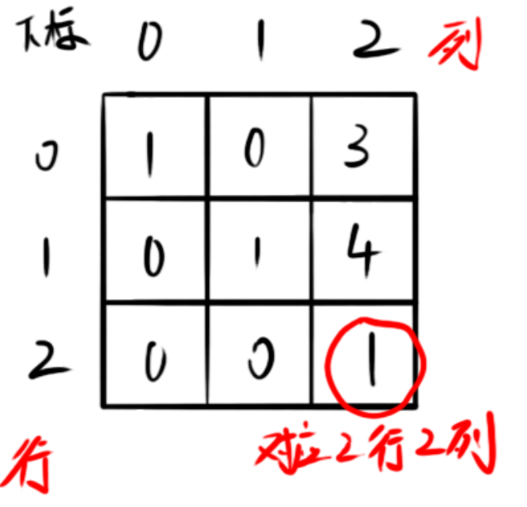
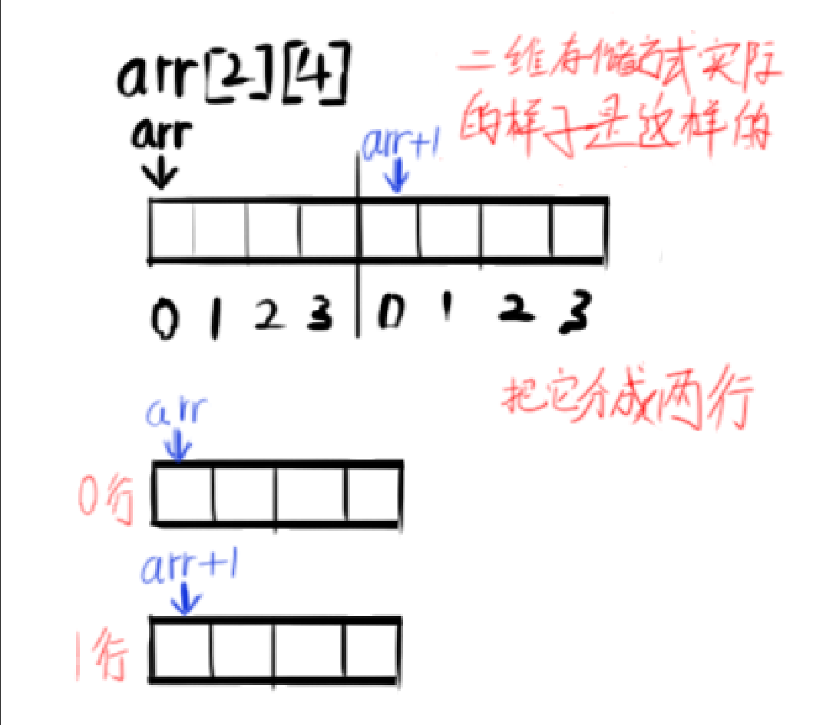
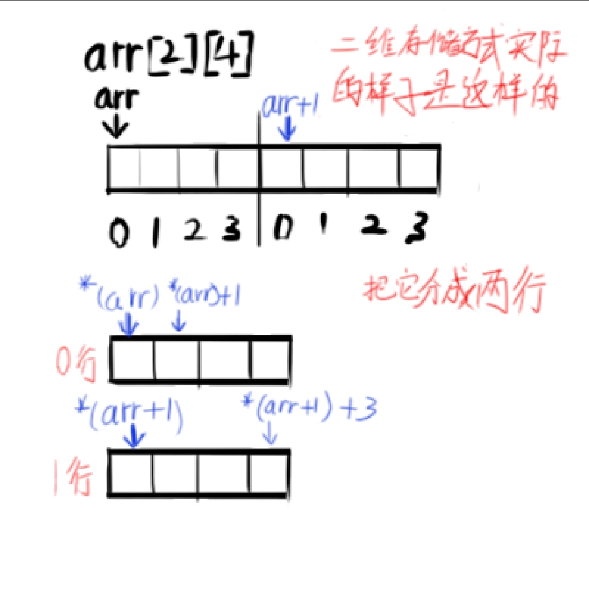
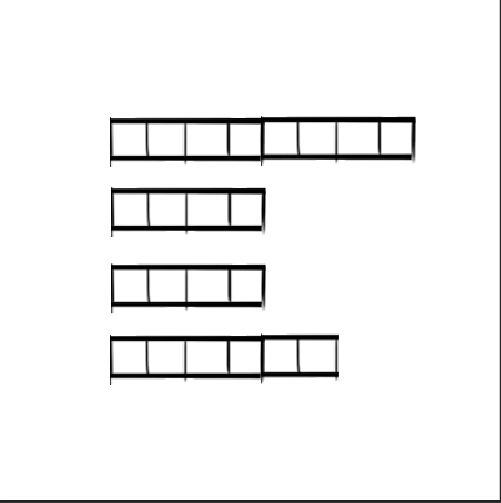

# 指针的运用（3）

## 指针与二维数组

为了防止一些人不知道二维数组是什么

我先给大家看看二维数组的创建：

```cpp
int mat[3][3] = {
                     1,0,3,
                     0,1,4,
                     0,0,1,
                            }; 
```

其实二维数组就是数组的数组的意思，什么意思呢，就是为数组再创建一个数组的意思,，（这不废话吗！）

如上段代码，一共有9个数据，这9个数是怎么排列的呢？

比如第一个数 1   要在数组中取到他是这样的--------mat[0][0]；

那我想取第3个数（3）该怎么取？    答案是mat[0][2]；

那我想取第6个数（4）该怎么做？    答案是mat[1][2];

来画个图方便理解：



由上面的规律不难看出第一个[ ]里面填写的是“行”第二个填写的是“列”。

上面说过二维数组其实就是数组的数组，再来加深下理解，这里每一行其实都对应了一个数组；

比如说 第0行  对应的其实是 {1, 0, 3}这个数组; 第2行，对应的其实是{0, 0, 1}这个数组；

因此创建二维数组还有这种写法：

```cpp
	int mat[3][3] = {
	                {1,0,3},
	                {0,1,0},
	                {0,0,1}
	                        };
```

有上面的知识，就可以来看看指针和二维数组之间的关系了

### 指针指向一个二维数组

我们需要一个指针数组来指向二维数组

```cpp
int arr[3][4] = {
           {1,0,3,4},
           {0,1,0,5},
           {0,0,1,0},
};
int (*p)[4] = arr;
```

在对二维指针数组进行分析前，这里要讲个概念，指针的指针：

```cpp
int** p;
```

没想到把，指针也会有自己的指针；

顾名思义，指向指针的指针，这也正说明了一件事，在C语言中的内存地址是虚拟的，他并不是物理内存中的真实地址。

如果要对指针的指针进行内存开辟的话，代码是这样的：

```cpp
int** p = (int**)malloc(sizeof(int*)*4); //开辟四个长度的整形指针数组
```

注意哦，这里开辟的是四个整形指针，而不是整形；

如果我要得到某一个地址的值我就要解两次指针（如需要*(*p)就可以得到指针首地址的数据）；可是这样不是更麻烦了嘛？有必要这样吗？

对于二维数组来说，有！！

根据之前的知识我们知道，数组的名字就是数组首个数据的地址，第二个就是就是 数组名字+1，但是这个规则在二维数组中并不正确，上面说过，二维数组就是数组的数组，所以我们二维数组名字+1，是在这个二维数组中的第二个 子数组的开头。

请看下图：



所以*(arr)得到的就是第一个子数组的首地址，而*(arr+1)则是第二个子数组的首地址，以此类推；

可这样只是拿到了子数组的首地址，子数组其他位置的值又该怎么拿到呢？

拿到首地址了，其他值还会远吗？

*(arr)拿到的既然是个地址，是个地址，那我结指针后得到的还是个地址，那我再对这个解指针的地址+1不就好了，

即*(arr) + 1，这样就可以拿到这个子数组的第二个位置的数据。

如图所示，为了统一我这里将首地址给解指针：



如果要得到对应地址的值，就要再解一次指针 ，如*(*(arr+1)+1)就可以得到第二个子数组的第二个位置的数。


### 指针开辟一个二维数组

回到指针的指针，这里给他开辟六个整形指针：

```cpp
int** p = (int**)malloc(sizeof(int*)*6);
```

现在这个指针的指针就相当于有6个空间的整形指针数组，而里面的每个地址对应的值都是指针，而且还是没开辟的指针，所以我们可以对里面所有的的整形指针开辟空间：

```cpp
 	for (int i =0; i<6; i++) {
	 	p[i] = (int*)calloc(3, sizeof(int));    //开辟一个6X3的二维数组，且值全是0
	}
```

用指针最大的好处就是，可以开辟不受限制的二维数组，如下图：

```cpp
for (int i = 0; i<6; i++) {
  p[i] = (int*)calloc(rand()%9 + 1, sizeof(int));   随机开辟1 到 10个整形
}
```

他的每一行都是随机长度的数组：



如果把指针的指针也给随机开辟，那就是一张随机生成的图了！

这就和肉鸽游戏的随机生成图差不多了！你会做游戏了！（bushi）


## 注意事项

终于把二维数组与指针给写完了，这篇的知识点比较多，也比较难理解，可能会有诸多遗漏，如果有疑问请向我提出，

如果有建议，那就更好了！下一篇不出意外就是指针与函数了。睡觉！
