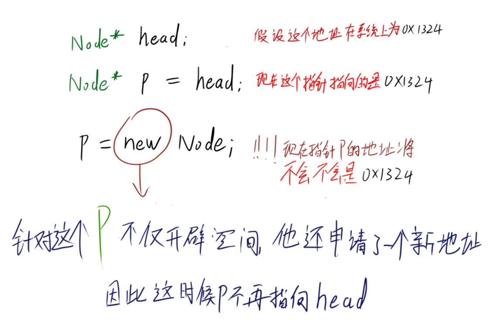
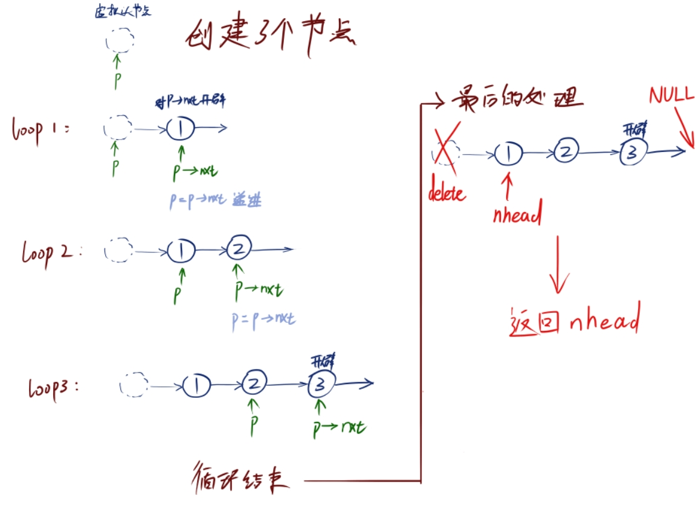
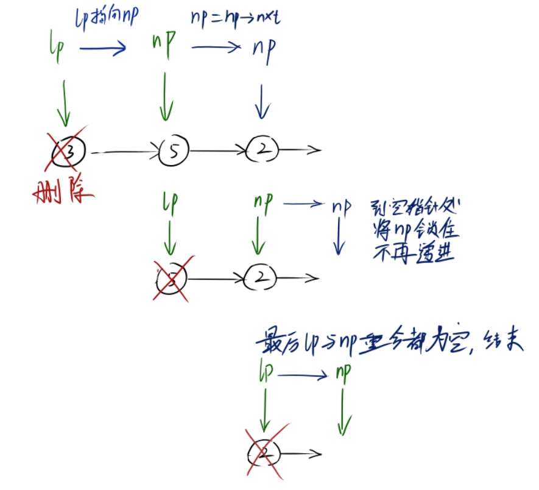

# 链表的批量创建和删除

本来应该讲插入的，但是再讲插入之前先来一个补充，所以就有了这篇

在对三个插入进行讲解之前，先来创建一条链；

但是这次要创建一个长链子，所以不可能一个一个的new出来，因此这里会用到循环或者递归来实现一个批量创建节点，并且连成链表：

```cpp
Node* make_NodeList(int num) {                                       //这里传入的是要创建的数量
	Node* head = new Node;                                       //开辟一个虚拟节点，作为载体
	Node* p = head;
	for (int i=0; i<num; i++) {                                  //for循环遍历
		int val; cin>>val;
		p->nxt = new Node;
		p->nxt->val = val;
		p = p->nxt;
	}
	Node* nhead = head->nxt;
	delete head;
	return nhead;
}
```

对于初次看到这个，可能会有点蒙圈，

为什么有个head节点？

p为什么指向head？

为什么不能直接对p进行创建呢？

为什么要对p->nxt 进行开辟呢？

这里将会对这些一点一点进行分析。


为什么我要开辟个head节点，并且用p指针去指向他呢？

大家都知道，没有开空间的指针是指向系统内存地址的野指针；是不能赋值调用的，所以这里必须得开个虚拟头节点，

并且使用一个遍历用的指针指向 head；

“  可我为啥不能在循环里面通过   p指针   连着头节点 一起new呢？”

这是不行的，上面说过，head指向的是一个野指针  如果对他进行开辟会分配一个    新的内存地址   

也就是说  当我们对 p 这个指向 head节点地址   进行开辟时，被开辟的只会是 p 这个指针， 而不是 head；

可能有点绕，我这里画个图：



然后针对 p->nxt   也就是  head->nxt进行 开辟，然后让指针递进， p = p->nxt;

最后生成完毕要生成的数量，再将末尾的指向改为 nullptr， 告诉这个链表到头了；

最后用  nhead指向实际上 开辟为链表的空间，将这个nhead 返回就是最后批量创建的结果了，别忘了返回前，delete掉 虚拟节点head

为了加深理解可以看看这个图：



```cpp
Node* head = make_NodeList(3);
```

只要这样就能够调用了。


当然也可以用递归来写一遍：

```cpp
void make_NodeList2(int num, Node* &h) {
	if (num == 0) {
		h = nullptr;
		return;
	}
	int val; cin>>val;
	h = new Node;
	h->val = val;
	make_NodeList2(num-1, h->nxt);
}
```

递归的写法虽然大相径庭，但是原理是一样的，这个函数传入了一个节点的指针，这个指针必须是没有开辟的指针，

```cpp
Node* head;
make_NodeList2(3,head);
```

（递归一定要弄懂！是十分重要的，   尤其到了后面的    二叉树遍历，递归是绝对不可少的！）

最后养成良好习惯把整个链表给delete掉：

```cpp
void deleteNodelist(Node* head) {
	Node* lp = head;
	Node* np = head->nxt;
	while(lp) {
		cout<<lp->val<<" deleted"<<endl;
		delete lp;
		lp = np;
		if (np) np = np->nxt;                                //当np为空时停止np指针的递进
	}
}
```

如果理解了上面的的创建那最后的释放就更好理解了





## 注意

主要还是讲他的线性性，加深下对链表的理解；有了这个理解后面的就很容易理解了。

如果有任何问题和想法，请补充。
