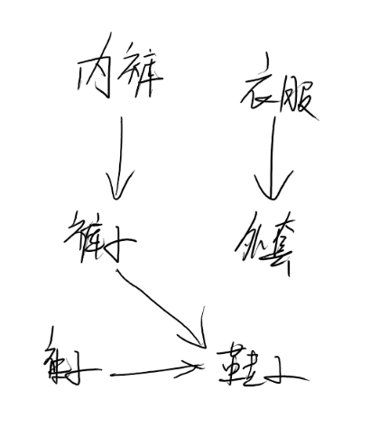
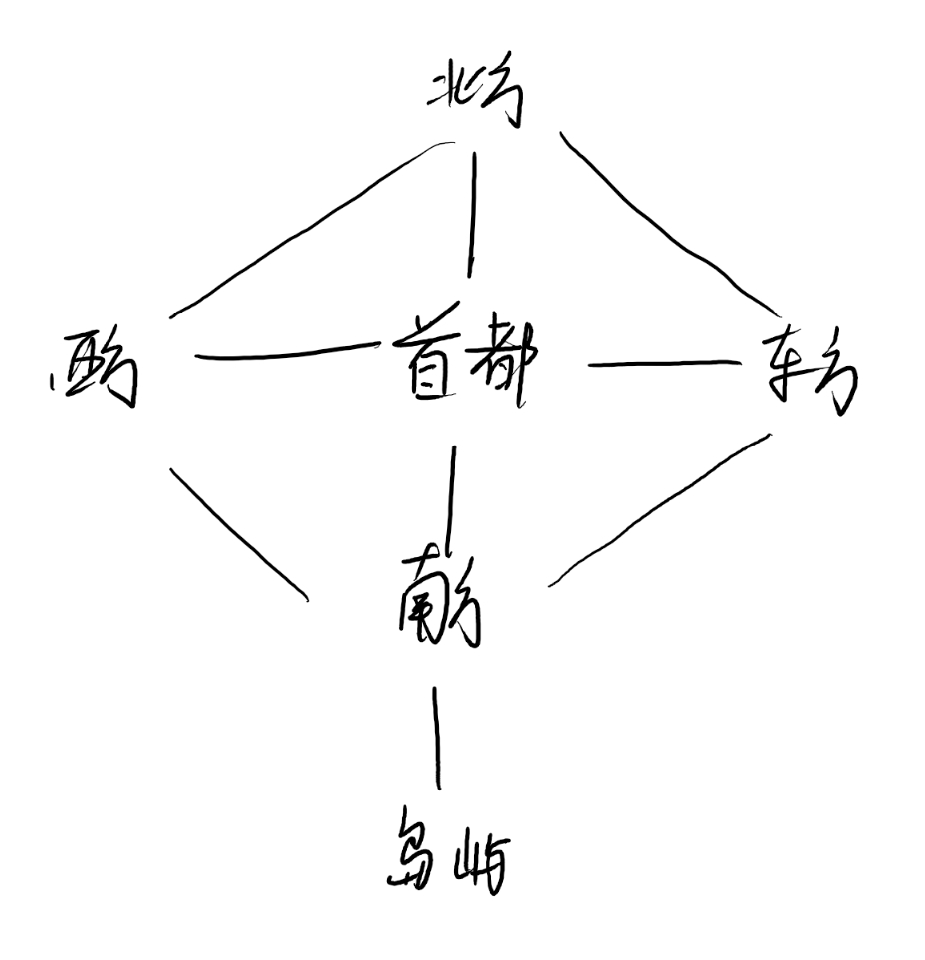
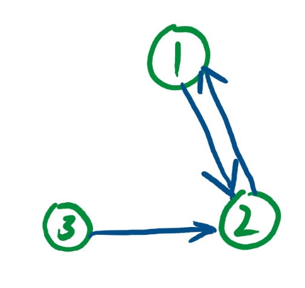
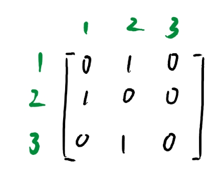
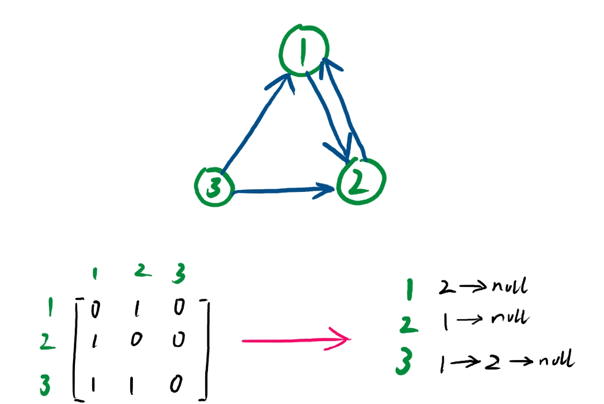

# 图

图是一种十分常见的数据结构，关系对应，地图连接，网络连接的表示都能够抽象为一张图。

比如说穿衣的顺序：



表示一个地图的联通：



和树有点像，其实树也是图的一种，但是普通的图的联通规则 更为随意。没有多的约束他的排布。

和树一样有“度”

比如上图中鞋子的入度为2 出度为0，总度数为2，第二张是个无向图，一条边代表一个入度和出度，因此南方的入度为4，出度为4，总度数为8。

度在拓扑序中会有所体现；这个在后面的笔记会讲到。

总而言之，图其实节点与节点之间的映射关系。一种能够用很清晰画出来的结构；

那么，这种结构应该如何用代码去表示呢？

## 图的存储

刚才说过，图是一个点与另一个点的关系映射，而这个关系映射的名字叫做 路径，比如下图：



3到2有一条路径，1到2有一条路径，2到1也有一条路径。

那么我们可以尝试者将他化为一个3X3的关系矩阵，0代表没有通路，而1代表有通路：



矩阵点(1,2)为一，代表1节点有一条路径通向2节点。为0则代表 n(行)节点没有通路到达m(列)节点；

诶，矩阵？对于矩阵，我们就可以使用一个二维数组去存储下来 ，而这种使用二维数组来表示路径的方法就叫做，邻接矩阵法；

代码如下:

```cpp
class graph {
public:
    //图的初始化
    graph(int n): size(n) {
        mp = new bool*[n+1];//这里多存储一行只是因为数组的下标是从0开始的
        for (int i=0; i<=n; i++) {
            mp[i] = new bool[n+1];
            for (int j=0; j<=n; j++) mp[i][j] = 0; //初始化所有的值为不连通
        }
    }

    ~graph() {
        //内存清理
        for (int i=0; i<=size; i++) {
            delete mp[i];
        }
        delete[] mp;
    }

    //插入路径，就让a -> b 变为1即可
    void insert(int a, int b) {
        mp[a][b] = 1;
    }

    void printGra() {
        for (int i=1; i<=size; i++) {
            for (int j =1; j<=size; j++) cout<<mp[i][j]<<" ";
            cout<<endl;
        }
    }
private:
    int size;
    bool **mp;
};
```

他主要的存储就是这个bool二维数组， 插入就只要将mp[a][b]设为1就行了。

但是邻接矩阵的存储方式是很耗空间的，特别是对于多节点的简单图，如果一个图有30000个节点，而某一节点只有一条路径到另一个节点，那么整一行邻接表示会有29999个0。

我们不妨去掉所有两个节点本来就没有的路径，剩下有通路的用一个链表去链接起来：



使用链表上代表某一行的节点能能到达的点，这种方法叫做邻接表。

代码如下：

```cpp
class graph {
    struct Node {
        Node();
        Node(int nx): to(nx) {}
        int to;
        Node* nxt{nullptr};
    };
public:
    graph(int n): size(n) {
        mp = new Node*[n+1](); //一个道理多开辟一位
    }

    ~graph() {
        for (int i=0; i<=size; i++) {
            dfs(mp[i]);
        }
        delete[] mp;
    }

    void insert(int a, int b){
        //要特判一下，链表头为空的情况
        if (!mp[a]) {
            mp[a] = new Node(b);
            return;
        }
        //在链表数组的第a个插入b，代表 a->b有路径
        Node* p = mp[a];
        while(p->nxt) p = p->nxt;
        p->nxt = new Node(b);
    }

    void printGra() {
        for (int i=1; i<=size; i++){
            cout<<i<<": ";
            for (Node* p = mp[i]; p!= nullptr; p =p->nxt) cout<<p->to<<" ";
            cout<<"\n";
        }
    }
private:
    //删除用的dfs
    void dfs(Node* p) {
        if (!p) return;
        dfs(p->nxt);
        delete p;
    }

private:
    int size;
    Node** mp;
};

```

不过缺点就是查询两节点是否有路径的时间复杂度相比邻接矩阵要更高；不过两者在接下来的图的搜素中并没有太多的不同。

## 图的广搜与深搜
