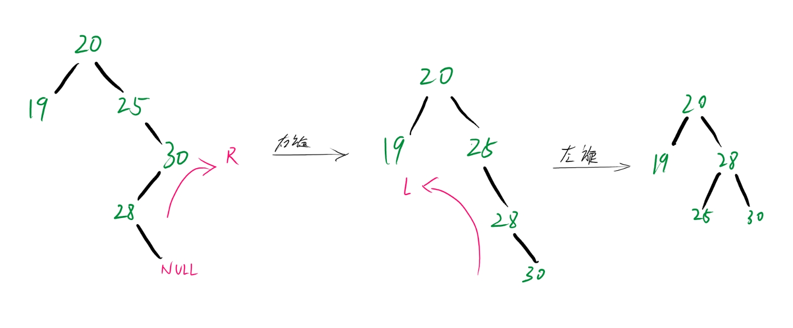

# 二叉搜索树

在普通的二叉树中；

查询的时间复杂度取决于节点的个数，所以普通二叉树的搜索的最坏情况是O(n)的，为什么这么说呢？

因为普通的二叉树是混乱的，随机的，程序在找的时候他并不知道你这个节点的具体位置，只能全都找一遍，直到能找到那个存在的节点，比如下图：


每一个节点都遍历了一遍，这样数据量一大起来是及其不友好的。

因此可以在树的结构进行下手，可是该怎么下手呢？

可以对树的结构进行排序！以每个点为主，将比父节点大的插到右边，比父节点小的插到左边：


遵循这个左节点小于父节点而右节点大于父节点的规则进行插入，就能够得到一颗排序好的树，这就是 二叉搜索树(AVLTree)，

他的平均搜索复杂度取决于这个树的深度O(h);如下图


就是这样的一条路，相比无序树，它不需要遍历所有的节点，最坏的情况取决于这个树的深度(搜索和插入)，这是一个巨大的优化。当然这样的排序还会有一点缺点，这个后面再聊。

### 插入和查询

先来看看插入和查询的代码实现：

```cpp
//插入
    void insert(int x) {
        if(!head) {
            head = new Node(x);
            return;
        }
        Node* p = head;
        Node* par = nullptr;    //找到父节点
        while(p) {
            par = p;
            if (x > p->val) p = p->right; //目标值大于遍历的节点，则往右
            else if (x < p->val) p = p->left; //否则往左
            else return;      //注意：搜索树绝对不能出现节点相同的情况
        }
        (x > par->val) ? par->right = new Node(x) : par->left = new Node(x); //简单的三目运算优化
    }
  
  //查询
    Node* search(int x) {
        Node* p = head;
        while(p && p->val != x) (x > p->val) ? p = p->right : p = p->left;
        return p;//返回找到的地址
    }
```

### 删除

有插入那必定有删除，插入只要知道相比树上节点与插入节点的大小就行了，删除要考虑的事情就很多了 （构槽公式秒了）；

删除一个节点可以分为三种情况：

* 删除的节点没有左右孩子，这种情况直接删除，将删除节点置空就好
* 删除的节点有左或者右孩子（两者只能有一个的情况），让删除节点的左或者右孩子链接到，删除节点的父节点的左右孩子（比如说我要删除的节点有右孩子没有左孩子，就直接让父节点的右指针指向删除节点的右孩子，左也一样）
* 删除的节点两者都有，让删除节点的父节点的右指针指向删除节点的右孩子，然后查询右孩子的左链，找到有孩子最左的节点（就是比右孩子小，比删除节点大的节点的最小情况）然后将其删除节点的左孩子插到右孩子的左链上，达到删除的操作

画个图来解释就是这样的：


先来看看第一种情况的代码：

```cpp
Node* p = head;
        Node* par = nullptr; //找到父节点
        while(p && p->val != x) {
            par = p;
            if (x > p->val) p = p->right;
            else if (x < p->val) p = p->left;
        }
        if (!p) return; //如果没有找到要删除的节点直接退出

        //情况一：
        if (!p->left && !p->right) {
            if (!par) head = nullptr; //par为空，说明被删除的节点是根节点
            else if (par->left == p) par->left = nullptr;
            else par->right = nullptr;
            delete p;
        }
```

当被删除的节点的左右孩子都是空的时候，判断一下上级的父节点要删除的节点是父节点的左孩子还是右孩子，然后将该要删除的节点置空即可。

先来看看第二种情况：

```cpp
else if (!p->right) {
            if (!par) head = p->left;
            else if (par->left == p) par->left = p->left;
            else par->right = p->left;
            delete p;
        }
        else if (!p->left) {
            if (!par) head = p->right;
            else if (par->left == p) par->left = p->right;
            else par->right = p->right;
            delete p;
        }
```

和上面一样要找到上级的父节点，然后看看被删除的节点的左右孩子，哪里不空接哪里。

然后就是最后一种情况：

```cpp
else {
            if (!par){
                Node *s = findMin(p->right);
                s->left = p->left;
                head = p->right;

            }
            else {
                par->right = p->right;
                Node *s = findMin(par->right);
                s->left = p->left;
            }
            delete p;
        }
    //该函数的目标是找到右孩子的左链的最左节点（就是最小节点）
    Node* findMin(Node* p) {
        while(p && p->left) p = p->left;
        return p;
    }
```

父节点连接被删除节点的右孩子，右孩子再将被删除节点的左孩子给拉到最左的链条，继承了被删除节点的遗产。

上面就是三种删除的实现，现在来看看整体朴素搜索树的代码

（使用面向对象）

```cpp
class AVLTree {
    //Node 的结构体
    struct Node {
        int val;
        Node *left, *right;
        Node(int x) {
            val = x;
            left = nullptr;
            right = nullptr;
        }
        Node(int x, Node* l, Node* r) {
            val = x;
            left = l;
            right = r;
        }

    };
public:
    AVLTree(){

    }
    //析构清理内存养成良好习惯 （竞赛可以不用）
    ~AVLTree() {
        de(head);
    }
    //插入
    void insert(int x) {
        if(!head) {
            head = new Node(x);
            return;
        }
        Node* p = head;
        Node* par = nullptr;
        while(p) {
            par = p;
            if (x > p->val) p = p->right;
            else if (x < p->val) p = p->left;
            else return;
        }
        (x > par->val) ? par->right = new Node(x) : par->left = new Node(x);
    }
    //查找
    Node* search(int x) {
        Node* p = head;
        while(p && p->val != x) (x > p->val) ? p = p->right : p = p->left;
        return p;
    }
    //打印
    void printTree() {
        Pdfs(head);
    }
    //删除
    void earse(int x) {
        Node* p = head;
        Node* par = nullptr;
        while(p && p->val != x) {
            par = p;
            if (x > p->val) p = p->right;
            else if (x < p->val) p = p->left;
        }
        if (!p) return;

        if (!p->left && !p->right) {
            if (!par) head = nullptr;
            else if (par->left == p) par->left = nullptr;
            else par->right = nullptr;
            delete p;
        }
        else if (!p->right) {
            if (!par) head = p->left;
            else if (par->left == p) par->left = p->left;
            else par->right = p->left;
            delete p;
        }
        else if (!p->left) {
            if (!par) head = p->right;
            else if (par->left == p) par->left = p->right;
            else par->right = p->right;
            delete p;
        }
        else {
            if (!par){
                Node *s = findMin(p->right);
                s->left = p->left;
                head = p->right;

            }
            else {
                par->right = p->right;
                Node *s = findMin(par->right);
                s->left = p->left;
            }
            delete p;
        }

    }

private:
    //中序输出  输出的序列必定是从小到大排好序的
    void Pdfs(Node* p) {
        if (!p) return;
        Pdfs(p->left);
        cout<<p->val<<" ";
        Pdfs(p->right);
    }
    //递归删除操作
    void de(Node* p) {
        if (!p) return;
        de(p->right);
        de(p->left);
        delete p;
    }
    //一个子函数,目的是找到一个节点的最左节点
    Node* findMin(Node* p) {
        while(p && p->left) p = p->left;
        return p;
    }


private:
    Node* head{nullptr};
};
```

## 搜索树的缺陷以及优化

上面我们有分析过，一颗二叉搜索树的搜索时间长度取决于他的整个树的深度；假设一颗二叉搜索树的节点个数是 N

这个树的高度的最大可能为：

$$
h = log_2{n}
$$

也就是说二叉搜索树的最坏情况只到达 O(logn)..........吗？？？

在上面我们知道，搜索树是根据节点大小有规律的往左或往右排序的，现在假设有一组递增的序列要插入到搜索树中：

如图所示：


这颗树一共有n个节点，这个时候不论怎么查找他都要顺着以1为根节点的右链往下找，直到找到这个节点为止，而这个时候树一共有n层，也就是说他最坏情况是O(n)，这就导致返璞归真，甚至退化成了一个链表结构；为了解决这个，这里引入了一个新的规则——平衡。

### 平衡规则

像天平一样，只有保证左边和右边的重量一致，同时重物所挂的位置一致才能让天平平衡；

类似的在树中，一个节点他的左右子树的深度相差不超过1的时候，就说这棵树是平衡的：


就相当于一个天平往左或往右多挂了些东西，导致天平往左或往右倾斜了，天平倾斜的时候就可以调整物体在天平的挂载位置，就能让天平重新平衡。

同理的这套规则类似于搜索树的平衡调整，当一个节点的左右子树深度差值超过了1，对应的就是这个树往左或者往右倾斜了，往右倾斜了，就把他往左 “偏移”回去；往左倾斜了，就把他往右 “偏移” 回去。

这个“偏移”的步骤，在平衡二叉搜索树中有着自己的名字——旋转。

### 旋转

这个旋转是怎么旋的啊？

比如下面这个不平衡的树：


很明显的这颗树 右倾 了，为了让他平衡我们需要一个 左旋


这样子这个树就平衡了，z成了树的新的根节点，x成了z的左孩子；

可是这个旋转该怎么化为一段代码呢？

现在我把旋转中的每一步都拆分出来，化为独立的一步


右旋也是一个道理。

可以把他想像成太重了，支撑不住上面的节点，上面的节点往下滑了下来。


这样两个节点不仅不会离开，之间的结构还更稳定了 （感人大作T~T bushi）。

可以试着根据上面的图自己去推导一遍右旋，这里直接给出左右旋的代码：

```cpp
    //右旋
    Node* RRoate(Node* p) {
        if (!p) return p;
        Node* q = p->left;
        p->left = q->right;
        q->right = p;
        return q;
    }
    //左旋
    Node* LRoate(Node* p) {
        if (!p) return p;
        Node* q = p->right;
        p->right = q->left;
        q->left = p;
        return q;
    }

```

对于每一棵树，他下面所有的子树必须都得平衡，也就是说在进行 平衡规则时，必须得保证其子树都是平衡的，所以对整棵树的平衡需要自底而上，递归的去平衡他的所有子树。

接下来看下树不平衡时的各种情况：

最简单的情况（L型）


右子树插入后不平衡了对子树进行左旋进行平衡，

同理当子树往左倾时，一个右旋将他摆正回来 (R型)


但是当插入在最右节点的左端的时候呢？（RL型）


如果随便的进行旋转会导致乱七八糟的不成样子，

但是仔细看可以看见 25 的右链往左边折了一下，因此我们可以使用右旋让他把方向正回来，然后再进行一次左旋完成平衡：



就是对25的右子树进行一次右旋，让整棵树变成 L型 再进行一次左旋。

同理的如果整棵树左倾有方向不一致的情况 ，就对左子树进行一个左旋摆正，再对整棵树进行右旋，保证树平衡（LR型， 就是使用L旋转 让树变成R型，再右旋）


再来看一组样例


上图的树中所有子树都是平衡的，但是主树是右倾的，多出来的节点在树的最右端，这种情况只需要对整一颗主树进行一次左旋就能够让整一棵树平衡。

同理的如果子树都平衡但主树左倾，就对整一颗树进行一次右旋。

但是如果多出来的节点不在最左端呢？

比如67的左边连接了一个 65 ，出现了转向，这时候把右子树进行一个右旋再将整棵树进行左旋即可

总而言之常用 L型， R型，LR型和RL型的转向就能解决所有的平衡问题


### 代码实现

因为平衡需要将所有的子树也平衡，是一个递归的过程，为了让插入和删除的时候耗时不会太大，需要将插入和删除改为递归的形式。

递归的插入和删除时这样的：

```cpp
//插入
    insert(Node* p, int x):
        if (!p) return new Node(x);
        else if (x > p->val) p->right = MakebalanceInsert(p->right,x);
        else if (x < p->val) p ->left = MakebalanceInsert(p->left, x);
        else return p;

//删除
    earse(Node* p, int x):
        if (!p) return nullptr;
        if (x < p->val) p->left = MakebalanceEarse(p->left, x);
        else if (x > p->val) p->right = MakebalanceEarse(p->right, x);
        else {
            if (!p->right && !p->left) {
                delete p;
                p = nullptr;
                return nullptr;
            }
            else if (!p->right) {
                Node* tmp = p->left;
                delete p;
                p = nullptr;
                return tmp;
            }
            else if (!p->left) {
                Node* tmp = p->right;
                delete p;
                p = nullptr;
                return tmp;
            }
            Node* s = p->right;
            Node* mi = findMin(s);
            mi->left = p->left;
            delete p;
            p = nullptr;
            return s;
        }   
```

修改完后就要添加平衡判断，判断这个树是否平衡需要获取左子树和右子树的高度，再计算高度的差值（这里将差值叫做平衡因子）如果平衡因子的范围在 [-1, 1] 内，则树是平衡的，如果超出这个范围，那么树就是不平衡的。

```cpp
    //计算平衡因子
    int getbalance(Node* p) {
        return getheight(p->left) - getheight(p->right);
    }
    //高度获取
    int getheight(Node* p) {
        return !p ? 0 : 1 + max(getheight(p->left), getheight(p->right));
    }
```

要注意的是这里的平衡因子计算是 左子树高度减去右子树高度，也就是说当值为正时左树比右树深，反则右树比左树深。

判断平衡的代码是这样的：

```cpp
        //获取平衡
        int balance = getbalance(p);
        //如果平衡就直接返回子树
        if (balance >= -1 && balance <= 1) return p;
        //树右倾时
        if (balance < -1) {
            if (getbalance(p->right) > 0) p->right = RRoate(p->right); //查看子树的右子树有没有转向即RL型
            return LRoate(p);  //对节点进行左旋转向
        }
        //树左倾时
        else if (balance > 1) {
             if (getbalance(p->left) < 0) p->left = LRoate(p->left);  //判断是不是LR型
             return RRoate(p); //对节点进行右旋转向
        }
```

最后再将这段代码添加到插入和删除的最后面，平衡插入搜索就完成了：

```cpp
    //平衡插入
    Node* MakebalanceInsert(Node* p, int x) {
        if (!p) return new Node(x);
        else if (x > p->val) p->right = MakebalanceInsert(p->right,x);
        else if (x < p->val) p ->left = MakebalanceInsert(p->left, x);
        else return p;
        //平衡代代码
        int balance = getbalance(p);
        if (balance >= -1 && balance <= 1) return p;
        if (balance < -1) {
            if (getbalance(p->right) > 0) p->right = RRoate(p->right);
            return LRoate(p);
        }
        else if (balance > 1) {
             if (getbalance(p->left) < 0) p->left = LRoate(p->left);
             return RRoate(p);
        }

    }
  
    //平衡删除
    Node* MakebalanceEarse(Node* p, int x) {
        if (!p) return nullptr;
        if (x < p->val) p->left = MakebalanceEarse(p->left, x);
        else if (x > p->val) p->right = MakebalanceEarse(p->right, x);
        else {
            if (!p->right && !p->left) {
                delete p;
                p = nullptr;
                return nullptr;
            }
            else if (!p->right) {
                Node* tmp = p->left;
                delete p;
                p = nullptr;
                return tmp;
            }
            else if (!p->left) {
                Node* tmp = p->right;
                delete p;
                p = nullptr;
                return tmp;
            }
            Node* s = p->right;
            Node* mi = findMin(s);
            mi->left = p->left;
            delete p;
            p = nullptr;
            return s;
        }
        //平衡代码
        if (p == nullptr) return nullptr;
        int balance = getbalance(p);
        if (balance < -1) {
            if (getbalance(p->right) > 0) p->right = RRoate(p->right);
            return LRoate(p);
        }
        else if (balance > 1) {
            if (getbalance(p->left) < 0) p->left = LRoate(p->left);
            return RRoate(p);
        }
        return p;
    }

```

最后的最后，来看看完整的类的实现：

```cpp
class AVLTree {
    struct Node {
        int val;
        Node *left, *right;
        Node(int x) {
            val = x;
            left = nullptr;
            right = nullptr;
        }
        Node(int x, Node* l, Node* r) {
            val = x;
            left = l;
            right = r;
        }

    };
public:
    AVLTree(){

    }

    ~AVLTree() {
        de(head);
    }
    //插入调用函数
    void insert(int x) {
        //调用插入，返回一个新的树
        head = MakebalanceInsert(head, x);
    }
    //删除调用函数
    void earse(int x) {
        //调用删除，返回一个新的树
        head = MakebalanceEarse(head, x);
    }

    Node* search(int x) {
        Node* p = head;
        while(p && p->val != x) (x > p->val) ? p = p->right : p = p->left;
        return p;
    }

    void printTree() {
        Pdfs(head);
    }


private:
    //中序输出
    void Pdfs(Node* p) {
        if (!p) return;
        Pdfs(p->left);
        cout<<p->val<<" ";
        Pdfs(p->right);
    }

    void de(Node* p) {
        if (!p) return;
        de(p->right);
        de(p->left);
        delete p;
    }


    Node* findMin(Node* p) {
        while(p && p->left) p = p->left;
        return p;
    }

    Node* MakebalanceInsert(Node* p, int x) {
        if (!p) return new Node(x);
        else if (x > p->val) p->right = MakebalanceInsert(p->right,x);
        else if (x < p->val) p ->left = MakebalanceInsert(p->left, x);
        else return p;

        int balance = getbalance(p);
        if (balance >= -1 && balance <= 1) return p;
        if (balance < -1) {
            if (getbalance(p->right) > 0) p->right = RRoate(p->right);
            return LRoate(p);
        }
        else if (balance > 1) {
             if (getbalance(p->left) < 0) p->left = LRoate(p->left);
             return RRoate(p);
        }

    }

    Node* MakebalanceEarse(Node* p, int x) {
        if (!p) return nullptr;
        if (x < p->val) p->left = MakebalanceEarse(p->left, x);
        else if (x > p->val) p->right = MakebalanceEarse(p->right, x);
        else {
            if (!p->right && !p->left) {
                delete p;
                p = nullptr;
                return nullptr;
            }
            else if (!p->right) {
                Node* tmp = p->left;
                delete p;
                p = nullptr;
                return tmp;
            }
            else if (!p->left) {
                Node* tmp = p->right;
                delete p;
                p = nullptr;
                return tmp;
            }
            Node* s = p->right;
            Node* mi = findMin(s);
            mi->left = p->left;
            delete p;
            p = nullptr;
            return s;
        }
        if (p == nullptr) return nullptr;
        int balance = getbalance(p);
        if (balance < -1) {
            if (getbalance(p->right) > 0) p->right = RRoate(p->right);
            return LRoate(p);
        }
        else if (balance > 1) {
            if (getbalance(p->left) < 0) p->left = LRoate(p->left);
            return RRoate(p);
        }
        return p;
    }

    //右旋
    Node* RRoate(Node* p) {
        if (!p) return p;
        Node* q = p->left;
        p->left = q->right;
        q->right = p;
        return q;
    }
    //左旋
    Node* LRoate(Node* p) {
        if (!p) return p;
        Node* q = p->right;
        p->right = q->left;
        q->left = p;
        return q;
    }

    int getbalance(Node* p) {
        return getheight(p->left) - getheight(p->right);
    }

    int getheight(Node* p) {
        return !p ? 0 : 1 + max(getheight(p->left), getheight(p->right));
    }
private:
    Node* head{nullptr};
};

```

### 平衡的缺陷

但是平衡二叉搜索树的为了优化搜索，牺牲了插入和删除的速度，因此还能够再添加更多规则去让他更优化，但是由于篇幅问题，平衡二叉树的优化到这里基本上已经够用了。其他的在以后的笔记会讲到。
