# 二叉树

练练排线


## 树

树是什么，有分叉、有叶子、有根，有的叉上没叶子，这就是树

类似这种结构的都叫做树，比如你的族谱：

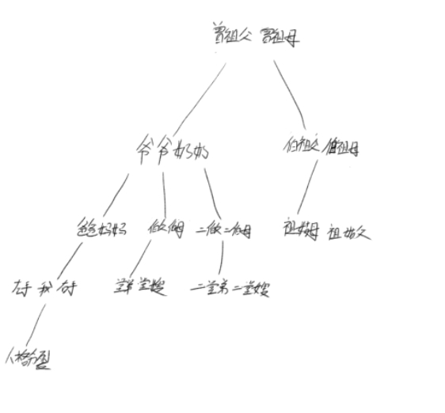

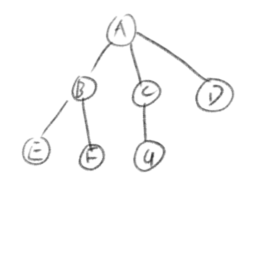

这就是树，这个图中，它的祖先是A，有三个孩子节点 B、C、D；而 B 又有两个孩子节点E、F。。。

同时E、F、G、D都是叶子节点等等，都是这棵树其中的一些性质。

### 树的性质:

1. 节点： 树上的每一个单元都算是一个节点，比如 A、B、C都是节点。
2. 节点的度： 什么是节点的度分为两种，入度和出度，比如A是祖先节点所以它的入度为0，但是他有三个孩子，所以它的出度为三，再比如B节点的入度是一，出度为二。树的度： 就是节点最大的度，比如这颗树，最大的度是3，那么树的度就是3
3. 树的度： 就是节点最大的度，比如这颗树，最大的度是3，那么树的度就是3度：
4. 兄弟： 同一个父节点的节点互为兄弟，比如B、C、D就互为兄弟节点
5. 堂兄弟： 在同一层的节点互为堂兄弟，比如E和G互为堂兄弟节点
6. 叶子节点： 下面再无分支的节点成为叶子节点，比如E、F、G节点都是叶子节点
7. 层次： 顾名思义，祖先节点为第一层，往下依次类推
8. 深度： 即树的最大层次，这个图中是3
9. 森林： 多颗不相交的树的集合

#### 性质上要注意的问题:

$$
节点总数 = 总度数 + 1
$$

因为，总度中，祖先节点的入度是0，所以要算上祖先节点+1

度为m的树，和m叉树不能混为一谈

度为m的树，至少有一个节点的度为m，但是m叉树，所有的节点的度都可以小于等于m，也就是说不一定有节点的度为m，

m度树必须要有 m+1个节点，但是m叉树随机，可以有节点也可以没节点


度为m的树，或者m叉树，第 i 层的节点数最多为：

$$
m^{i-1}
$$

高度为h的m叉树至多的节点数有：

$$
\frac{m^{h-1}}{m-1}
$$

高度为h的树最少有h个节点


n个节点的m叉树的最小高度为：

$$
\frac {m^{h-1}}{m-1}<n \leqq \frac {m^{h-1}}{m-1}
$$

至于怎么推的我没去深究，要推导也不难，但是记住就好。


## 二叉树

上面的b性质太枯燥了，不如直接来实践，二叉树的设计和链表差不多的，链表是靠一个指针去记录了它下一个的门牌号，

那二叉树就靠两个指针去指向两个不同的门牌号，仅此而已。

节点的结构体就是这样来定义：

```cpp
struct Node{
  int val;
  Node* left;
  Node* right;
}
```

简单明了。

但是这个不是最主要的，最主要的是树的遍历，因为是无序树，比较简单，因此代码中先只用结构体来写

```cpp
struct Node {
    int val;
    Node* left;
    Node* right;
    Node(int v) {
        val = v;
        left = nullptr;
        right = nullptr;
    }

    Node(int v, Node* l, Node* r) {
        val = v;
        left = l;
        right = r;
    }
};


int main() {
    Node* A = new Node(10);
    Node* B = new Node(200);
    Node* C = new Node(20);
    Node* D = new Node(600);
    Node* E = new Node(1000);
    A->left = B;
    A->right = C;
    B->left = D;
    B->right = E;

    delete A;
    delete B;
    delete C;
    delete D;
    delete E;
}
```

现在这棵二叉树是这样的：

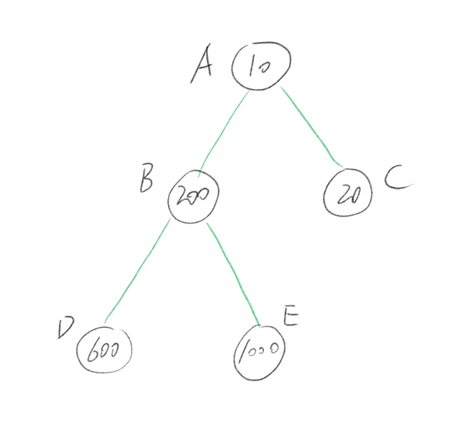

只有三个节点，那我想要输出这颗树所有的节点，要怎么输出呢？

答案就是递归，要怎么递归呢，这里就要使用到一种思想：

$$
深度优先搜索(DFS)
$$

顾名思义，就是一种按树的深度来进行的搜索，先来看看代码：

```cpp
void P_dfs(Node* h) {
    if (!h) return;   //遍历到的节点为空时，证明是叶子节点，直接返回上层
    cout<<h->val<<endl;
    P_dfs(h->left); //递归左孩子
    P_dfs(h->right); //递归右孩子
}
```

将A节点，也就是祖先节点传入进去，通过层层的递归，最后将整个树给输出出来，

作个图更好理解

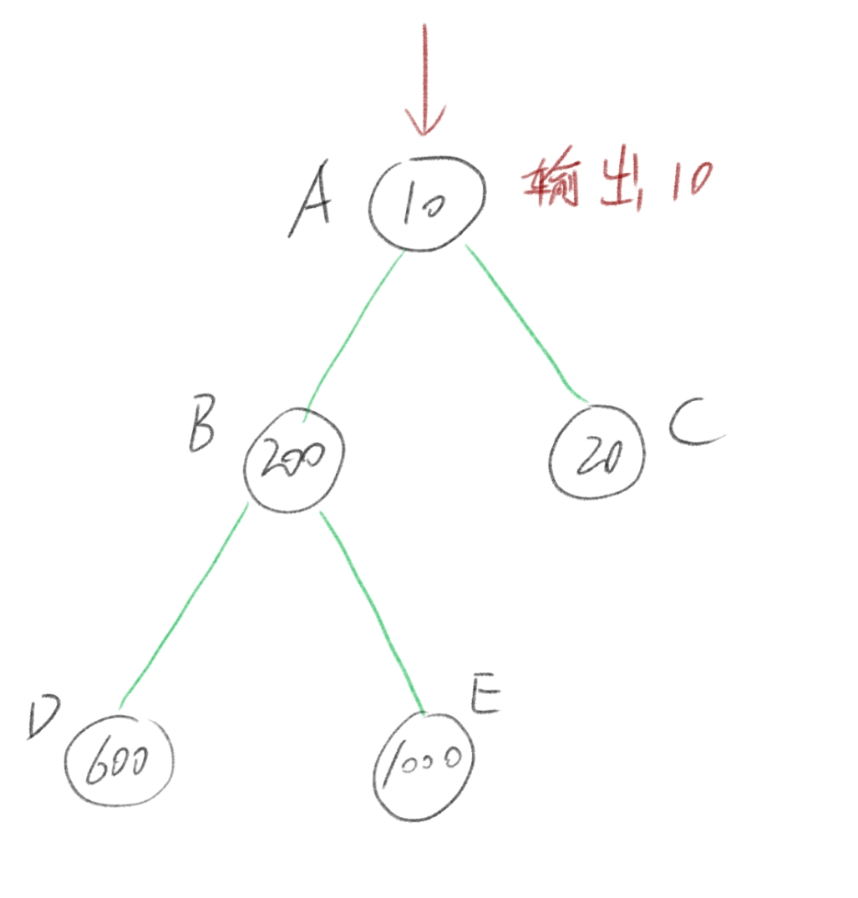

首先输出祖先节点的值；

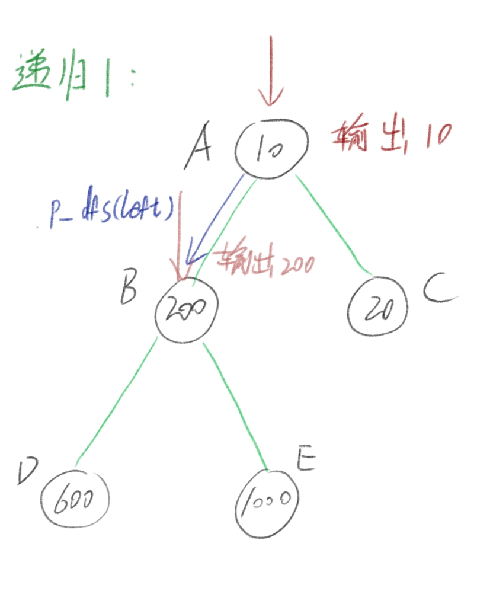

然后进行了第一次递归（即代码执行到了 P_dfs(h->left) ），输出遍历到的节点；

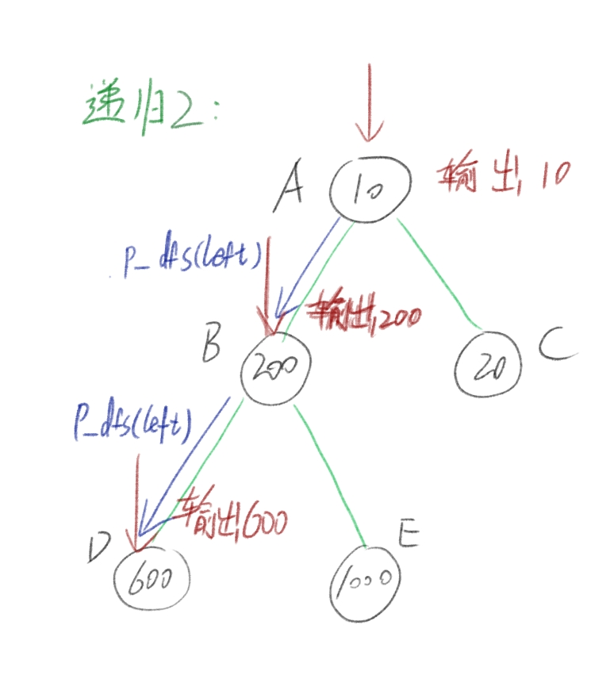

进行第二次递归（即代码执行到了 P_dfs(h->left) ），输出遍历到的节点；

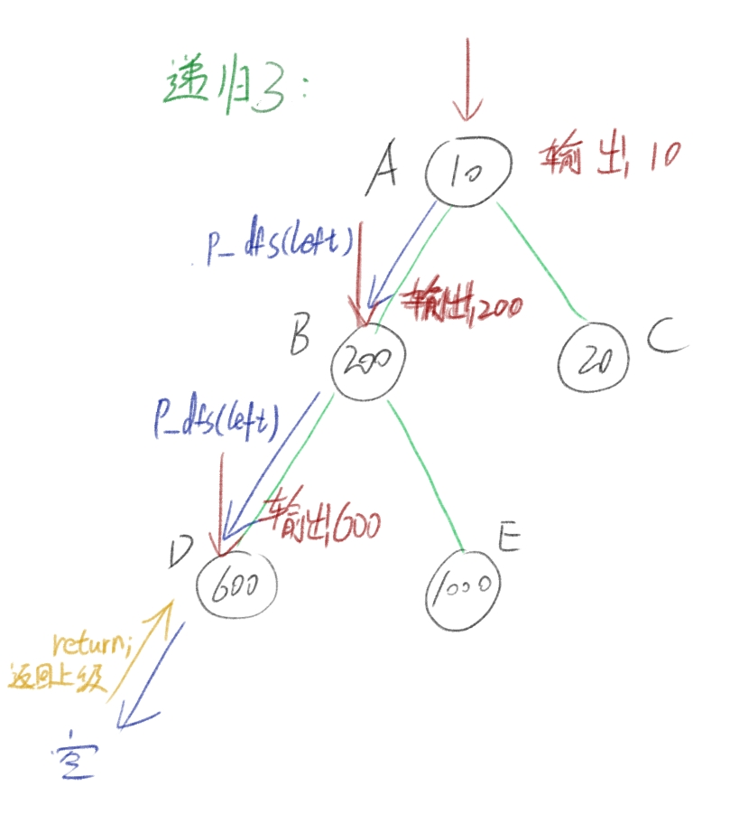

进行第三次递归，遇到空节点，返回上层；

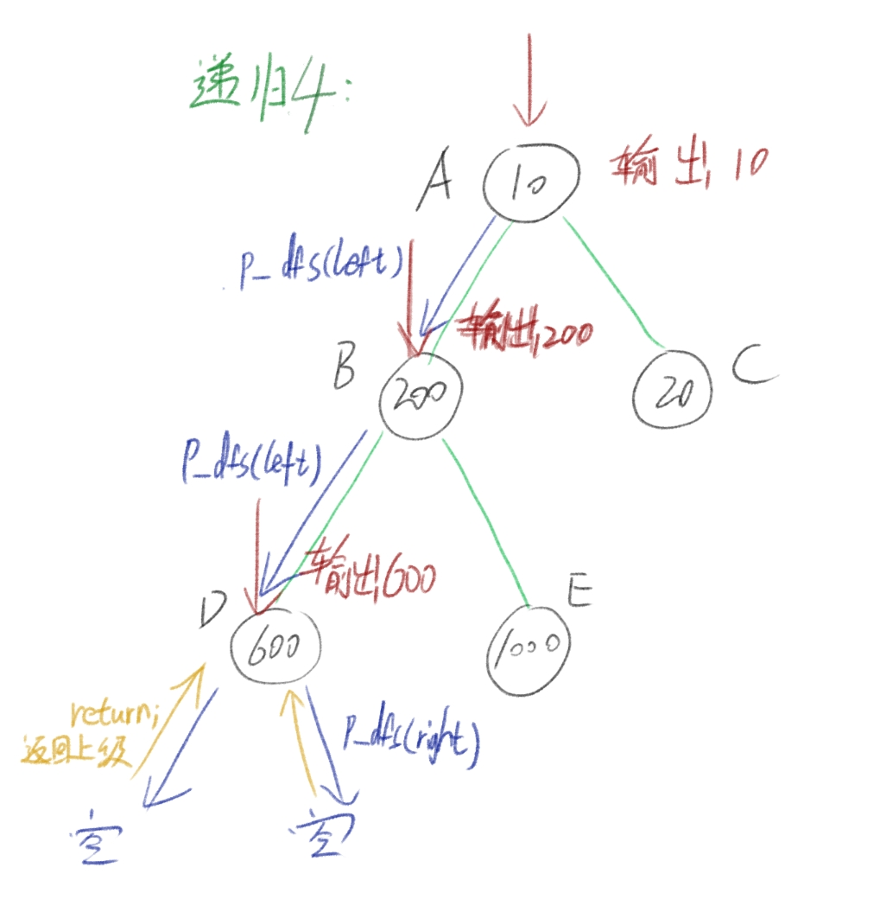

进行第四次递归，因为往左递归已经执行完成了，因此往右边递归，遇到空节点，返回上层；

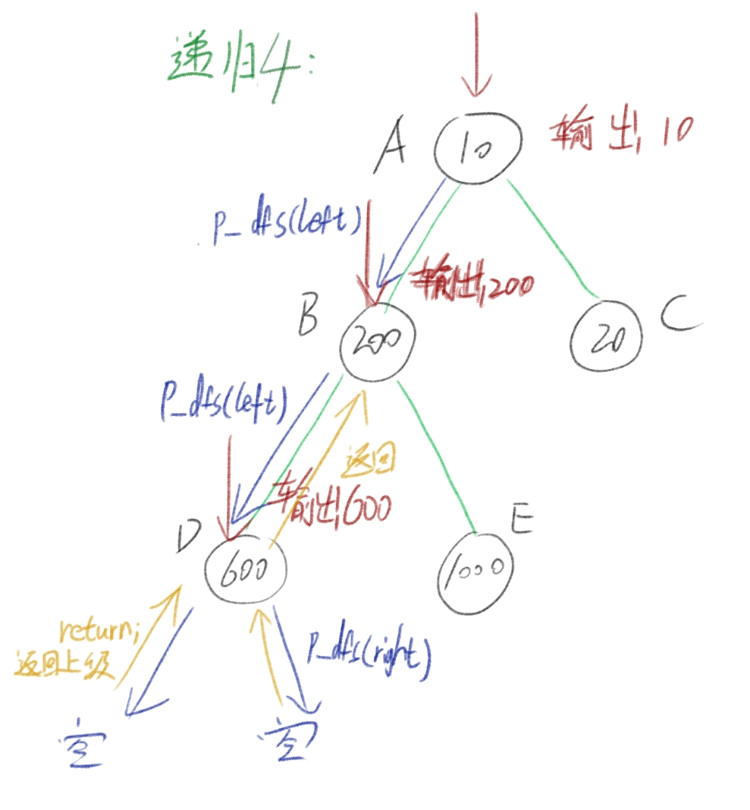

D节点的左右孩子都遍历完了，返回上层节点B

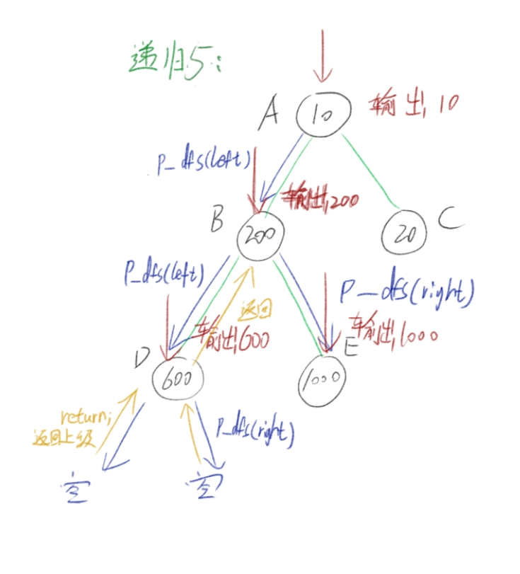

执行第五次递归（即代码执行到了 P_dfs(h->right) ），输出遍历到的节点，


总之依次类推，最好对着代码看着图片自己画个图走一遍加深理解。

最后的输出结果是这样的：

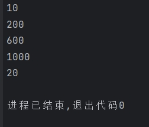

这种遍历叫做前序遍历，先输出，再遍历，

有前，那肯定有后有中啦

来看看其他遍历：

中：

```cpp
void M_dfs(Node* h) {
    if (!h) return;
    P_dfs(h->left);
    cout<<h->val<<endl;
    P_dfs(h->right);
}
```

后：

```
void B_dfs(Node* h) {
    if (!h) return;
    P_dfs(h->left);
    P_dfs(h->right);
    cout<<h->val<<endl;
}
```

只是把输出给换个位置而已，要实在不理解像上面这样画图就行；

深度优先遍历其实就用到了栈的原理，每次递归都是一次进栈，返回就是一次出栈，可以去尝试着用栈来模拟递归，将它改成循环:

```cpp
void DFS(Node* h) {
    stack<Node*> s1;          //这个stack是cpp自带的，记得导入#include <stack>，
    s1.push(h);               //当然也可以用自己的栈，不过记得val的类型改 Node*
    while(!s1.empty()) {
        Node* now = s1.top();
        s1.pop();
        cout<<now->val<<endl;
        if (now->right != nullptr) s1.push(now->right);
        if (now->left != nullptr) s1.push(now->left);
    }
}
```

深度优先搜索每一次只能遍历一个节点，一次只能输出一个，为什么不能输出它整一层的数据呢？当然可以，这种叫做树的层序遍历，又称为：

$$
广度优先搜索(BFS)
$$


广度优先搜索要基于一个队列来实现：

```cpp
void BFS(Node* h) {
    int nowNodes = 1; //当前的节点个数
    int nxtNodes = 0;//下一层的节点个数
    queue<Node*> q1;                                //和上面的stack一样需要导入 #include <queue>
    q1.push(h);
    while(!q1.empty()) {
        Node* now = q1.front();  
        q1.pop();
        cout<<now->val;
        if (now->left != nullptr) {
            q1.push(now->left);
            nxtNodes++;
        }
        if (now->right != nullptr) {
            q1.push(now->right);
            nxtNodes++;
        }
        nowNodes--;
        if (!nowNodes) {
            cout<<endl;
            nowNodes = nxtNodes;
            nxtNodes = 0;
        }else {
            cout<<" ";
        }
    }
}
```

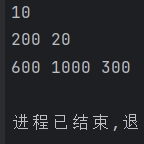

做个图模拟遍历过程

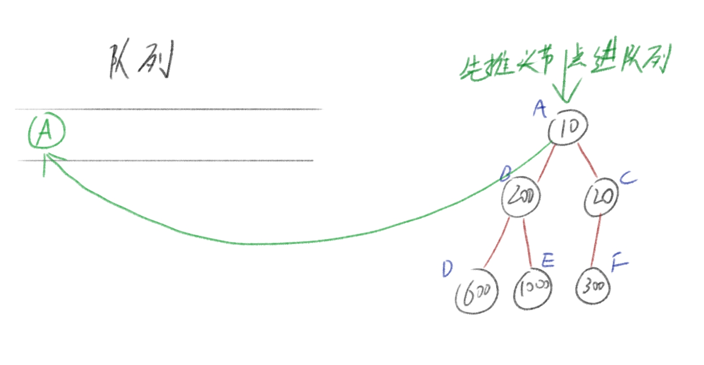

A出队，同时将A的左右孩子节点推入队列：

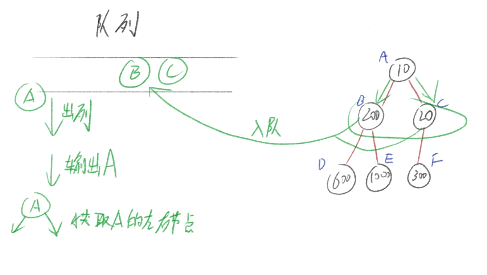

B出列，同时将B的左右孩子推入队列：

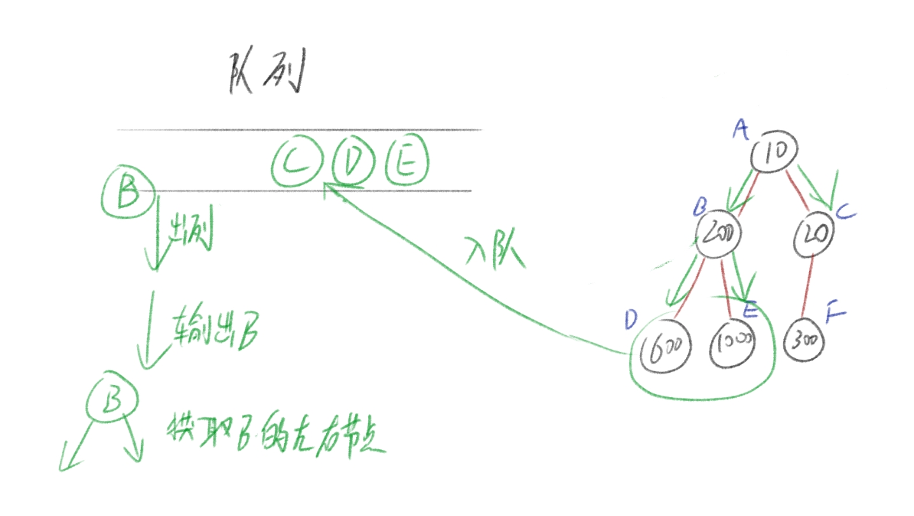

依次类推。

这就是广度优先搜索。


这两个搜索，尤其深度优先搜索，是最重要的算法，像很多问题，都会出现各种各样的树形结构，这时候用深度递归就能够很简洁的去解决问题，而广度优先搜索在后面图的结构会有很大的用处，而且广度优先搜索使用的是循环不会大量的开辟空间，可以节省很多的空间出来


## 总结

这篇讲了些树的性质，如果你要考研，最好还是自己去推导一遍这些性质（如果有时间我会把推导过程写上去QAQ）和二叉树的遍历，以此来描述深度优先搜索和广度优先搜索（很重要），如果还有不理解，建议反复多看几遍深度和广度搜索的推导过程，自己去推一遍，接下来就要讲特殊的二叉树了（同时自己复习一遍XD）
