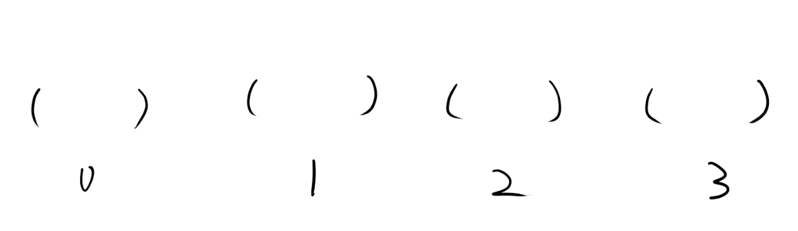
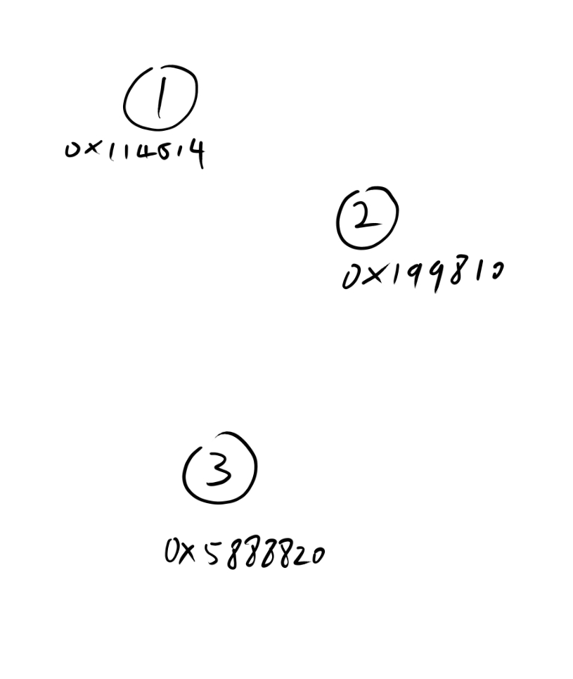
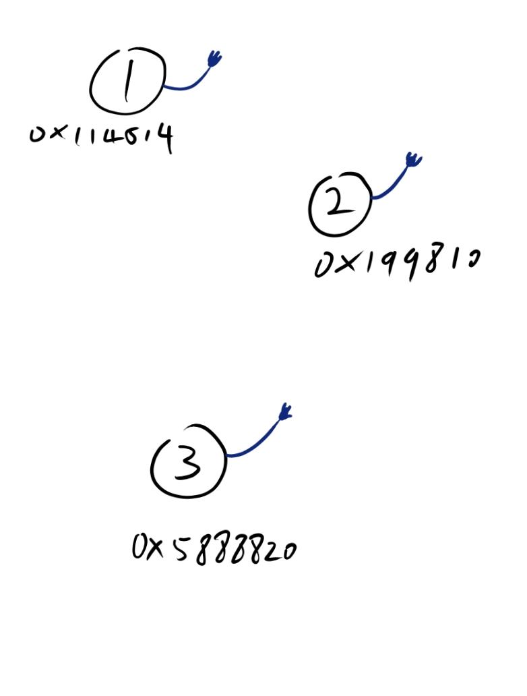
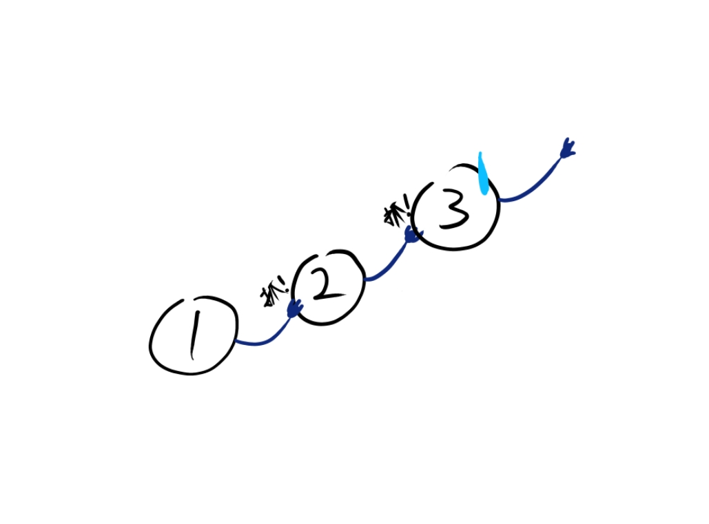
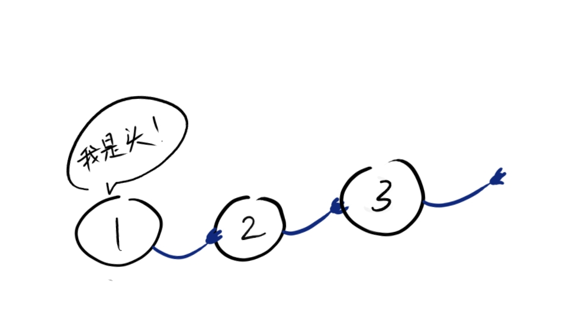
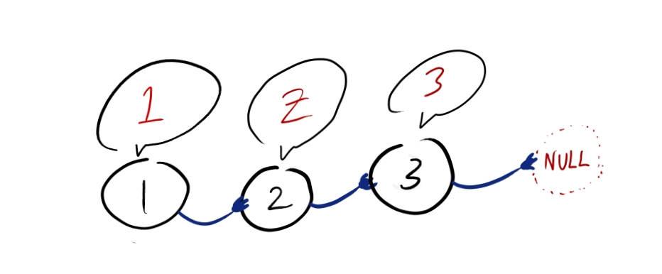
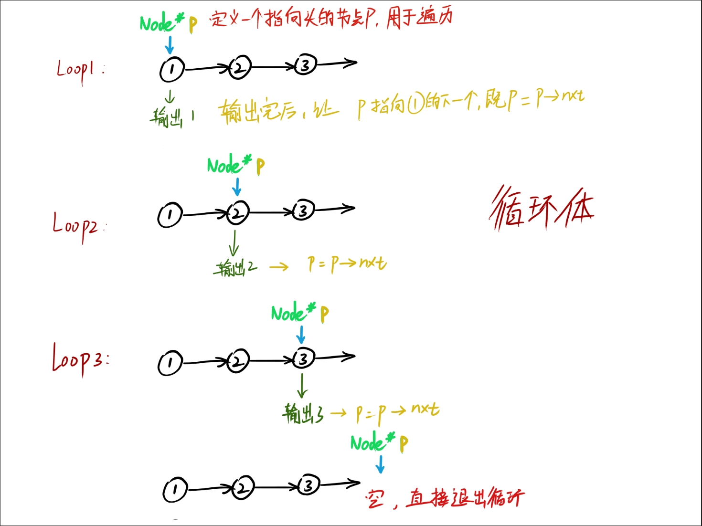

# 链表介绍

这篇笔记需要有前面指针的知识，因此在学习链表前，请确保你的指针已经完全过关；

数组大家都知道；开辟一段连续的空间，通过下标来查找存储的东西



在数组中储存，他们都是有序的；在内存中他们是连续的一段；

但是数组的范围一旦定义就不能再扩大（除了指针可以动态开辟）

而且数组的删除增加及其的麻烦，

有没有一种办法能够将数据灵活的给联系起来，把分散的数据连接起来，并且能够不断扩展呢？

那必定有；

先来看看图：



假设现在内存中有三个分散的整形，他们之间并没有任何的关联；

我假设这三个整形都有一只手；



现在，让1抓住2, 2抓住3，3没的抓：




这个时候他们形成了一条链子，让彼此之间有了关系，而这之间形成的这种链状的关系，就是   链表。

在图片中每个节点的“手”可以用指针来代替；

自己有值，又带有下一个值地址；

也就是说一个  节点   有两个类型， （在图中为 int   和    Node*）

因此可以用一个结构体来表示这个  节点   ：

```cpp
struct Node {
	int val;                  //该节点存放的值
	Node* nxt;                //代表下一个node的位置
};

 int main() {
 	Node* head = (Node*)malloc(sizeof(Node));                  //创建头节点
 	head->val = 1;  
 
 	Node* n = (Node*)malloc(sizeof(Node));                      //创建n
 	n->val = 2;
 	head->nxt = n;                                              //告诉头的下一个指向n
 
 	Node* n2 = (Node*)malloc(sizeof(Node));                     //创建n2
 	n2->val = 3;
 	n->nxt = n2;                                                //告诉节点n下一个指向n2

        n2->nxt = NULL;                                             //n2没得指，所以让他指向空
 }

```

这里先用着 C 的语法开辟空间，最后一个   节点的   下一个   一定要是NULL或者nullptr，确保他不会乱指向一个野指针；


现在这条链表创建出来了，可是我该怎么输出看到这条链的值捏？

这就涉及到链表遍历的问题了；

还是看图， 还是那个链表：



我们要遍历他首先就要知道从那里开始； 比如我要从头遍历到尾，那我就从第一个节点开始，让他变成牢大

如果我想从第二个开始，我就让第2个成为牢大；

我现在知道头在哪了，那我该怎么知道他下面连接的值呢？

很简单，就跟  排队-> 报数  一样 ：



当头个人把数报出来的时候，下面的人也会随着报数，而报数的时候传递了一个重要的信息-----  ”到你报数了！“

而链表也是一样的原理，当一个节点报完自己的值，这个节点就要告诉下一个节点，到他了报出自己的值了

这里使用循环来实现遍历：


通过设定一个指针不断改变他的指向来达到遍历，在代码中我们写一个专门的函数来输出：

```cpp
void printNode(Node* h) {                             //传入一个开始遍历的节点
	Node* p = h;                                  //设定遍历用的节点
	while(p) {
		cout<<p->val<<"-->";                  //输出遍历到的节点的值
		p = p->nxt;                           //让p指针指向当前指向节点的下一个节点
	}
}
```

这样一个打印链表就做好了，如果成功，将会输出如下内容：


这里使用的链表的线性，这里的时间复杂度是线性的   O(n)     （有必要还要做个时间复杂度的笔记）

当然也可以用递归来实现链表的输出：

```cpp
void printNode2(Node* p) {
	if (!p) return;
	cout<<p->val<<"-->";
	printNode2(p->nxt);
}
```

同样是使用了链表的线性性。

来看看整体的代码：

```cpp
#include <iostream>
using namespace std;
struct Node {
	int val;
	Node* nxt;
};

void printNode(Node* h) {
	Node* p = h;
	while(p) {
		cout<<p->val<<"-->";
		p = p->nxt;
	}
}


void printNode2(Node* p) {
	if (!p) return;
	cout<<p->val<<"-->";
	printNode2(p->nxt);
}
 int main() {
 	Node* head = (Node*)malloc(sizeof(Node));
 	head->val = 1;
 
 	Node* n = (Node*)malloc(sizeof(Node));
 	n->val = 2;
 	head->nxt = n;
 
 	Node* n2 = (Node*)malloc(sizeof(Node));
 	n2->val = 3;
 	n->nxt = n2;
 
 	n2->nxt = NULL;
 
 	printNode2(head);
 }
```

## 注意

下面将会讲链表的增删，这篇笔记需要反复理解清楚，

如有问题和更好的见解请补充
