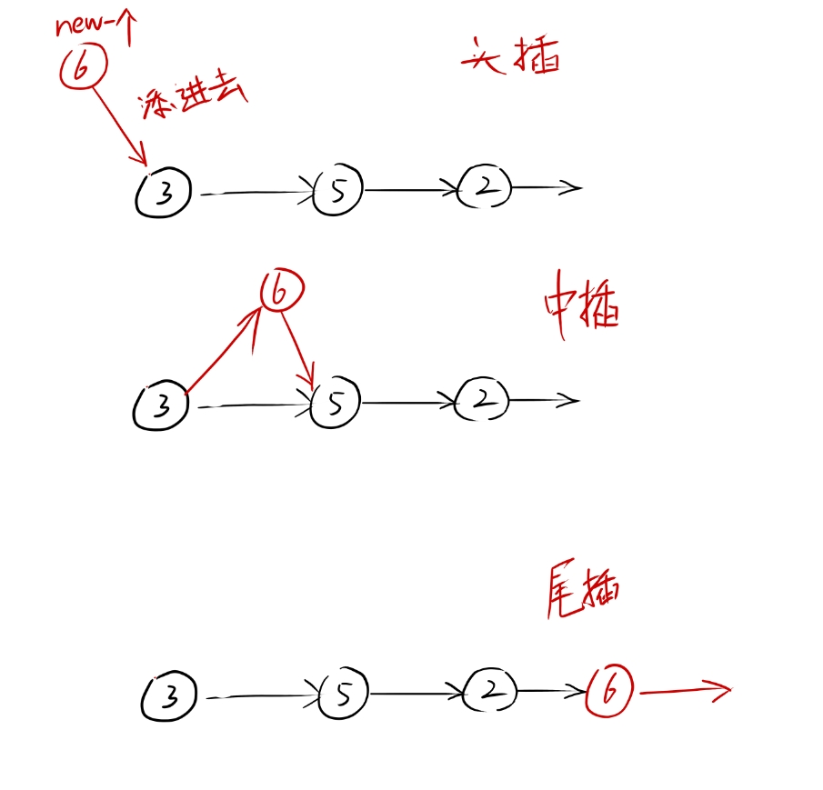

# 链表的插入和删除

## 插入


终于可以讲讲链表的插入和删除了：

链表分为 中插  头插  尾插：



先来看看最简单的两个插入，头插：

```cpp
Node* push_front(Node* p, int num) {
	Node* np = new Node;
	np->val = num;
	np->nxt = p;
	return np;
} 
```

创建一个新节点，让他指向输入进去的头节点，然后这个新节点返回回去；用原来的头节点去接收这个返回的节点，把头节点刷新：

```cpp
head = push_front(head, 2);
```

就是如此这般，简单明了。

那尾插呢？我们知道头节点在那，那我门只需要遍历到链表的尾部再开空间不就成了吗？

来看看代码：

```cpp
void push_back(Node* h, int num) {
	Node* p = h;
	while(p->nxt) {
		p = p->nxt; 
	}
	p->nxt = new Node;
	p->nxt->val = num;
	p->nxt->nxt = nullptr;

}
```

```cpp
push_back(head, 10);
```

当 p->nxt 为空时，证明已经到了链表的尾部，直接对p->nxt开辟空间，然后让这个新加入的节点的下一个指向为空；

（一定要让最后的指向为空噢！不然在输出的时候会一直输出下去，永远不会终止）

好了，理解了前插入，后插入；那剩下的那个随意插入就更不难了；

先来画个图：


假如在（1）和（2）之间插入节点，那我要得到 1 这个节点，和2  这个节点，让 1 节点的下一个 指向新开辟的节点；

让 新节点指向 2 节点；

总之我要进行插入，就要让上一个节点指向新的节点，新节点指向下一个节点；

如果我要指定位置，插入，我只要让这两个指针不断向前走，走到指定位置，进行插入操作就行；

实际上他和上一篇的删除操作一样，使用两个指针不断顺着推下去；

来看看代码：

```cpp
void insert(Node* h, int n, int num) {
	Node* lp = h;
	Node* np = h->nxt;
	for (int i = 1; i<n && lp; i++) {
		lp = np;
		np = np->nxt;
	}
	if (lp == nullptr) return;
	Node* x = new Node;
	x->val = num;
	x->nxt = np;
	lp->nxt = x;
}
```

```cpp
insert(head, 2, 30);
```

n代表在第个节点后面删除该值，当lp为空指针时，代表着这个n超过了链表的范围，跳出函数即可；


## 删除

有了插入的逻辑，删除就更不难理解了，一样的头尾中：


头删

```cpp
Node* pop_front(Node* h) {
	Node* p = h->nxt;
	delete h;
	return p;
}
```


尾删

```cpp
void pop_back(Node* h) {
	Node* p = h;
	while(p->nxt->nxt) {
		p = p->nxt;
	}
	delete p->nxt;
	p->nxt = nullptr;
}
```

可能有点好奇，为什么是 p->nxt->nxt  然后delete p->nxt呢？

还是上一篇笔记提到过的问题！delete p 是针对 p 指针去操作的， 而将p改为nullptr 也是针对于 p 指针而不是整个链表的东西；

因此要使用p->nxt 才是真正对链表进行的操作。 这也同样适用于 中间删除


中删

```cpp
void deleVal(Node* h, int val) {
	if (h->val == val) {
		pop_front(h);
		return;
	}
	Node* p = h;
	while(p->nxt->val != val && p->nxt) {
		p = p->nxt;
	}
	if (!p->nxt) return;
	Node* np = p->nxt->nxt;
	delete np->nxt;
	p->nxt = np;
}
```

这个要稍微讲讲；

这个函数是找到   对应值的节点   并对这个节点进行删除；

如果这个要找的值在头节点，直接进行头删然后   return    让函数退出即可；另一种情况就是没有找到这个对应的值，循环遍历到了空的节点，那么直接返回即可，

那剩下的一种情况就是在这个链表内了；

和链表中插的逻辑差不多，但是这里是删除节点，删除该节点后，将这个被删除节点的前一个和后一个接上即可完成。

但是有一点必须记住：

## .............所有的delete，new，都是对这个  指针  执行的操作，如果要对链表操作一定要用 p->nxt


## 注意

到这里链表的基础算是讲完了，后面就讲讲一些别的链表，

如果有更好的想法和建议，请向我补充。
