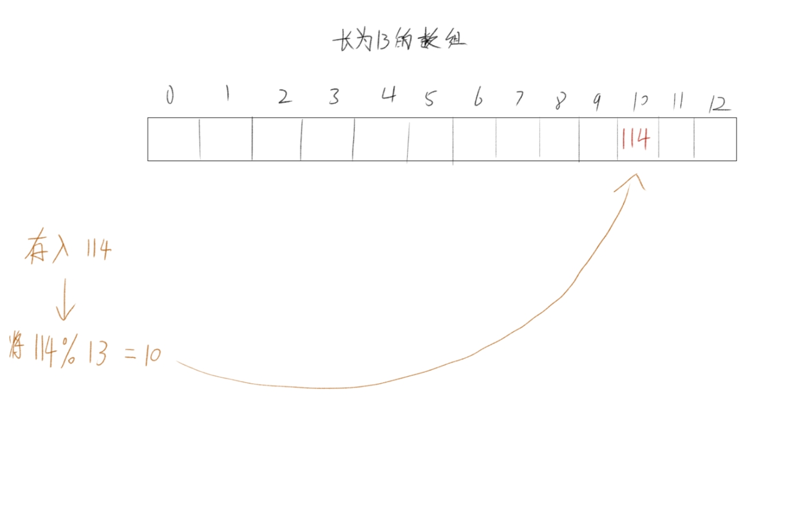
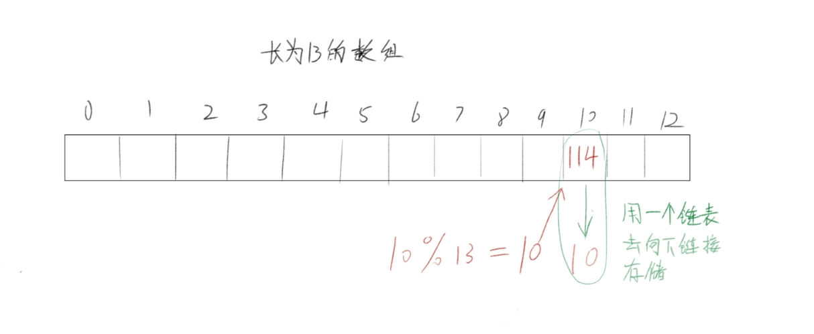

# 哈希表

## 什么是哈希表

什么是哈希表呢，就是一个混乱无序的表，相当于一个集合里面存放着数据，比如下面的集合

$$
{10,21,3,4,5,114,678}
$$

你可以找到 10，找到114，但是你不能找到 514，1919810；

也就是你只能找到在这个集合中的数，集合外的数你不能找到，而这个查找的过程速度会特别的快，

这就是哈希表

因此在设计的时候需要用到数组，只有数组的查找能够到达O(1)的速度。

但是但是，我这个数组不能有多余的数，

必须只能有集合中的数字，那这该怎么办呢？

## 哈希表的键值对对应

不妨把这些数给转化成一个简单的下标对应到数组中去；

什么意思呢？

看下图



这样就做到了一个键值对应，相反的如果我想要找到 在集合中有没有 114 只要找到他对应的键就行：

$$
key = Val 取余 Size
$$

```
(Size是数组长度)
```

算key的公式当然不仅仅只有这么一种，还有很多种，这里就讲仅讲上面这种最简单的公式。z这样我们就可以将所有的数都插入这个集合中去

现在问题就来了，114 % 13 等于10， 10 % 13 也等于10，但是114已经占领了这个位置，这时候该怎么办呢？

## 哈希冲突问题

当两个值的键值对是一样的时候，不会出现鱼和熊掌不可兼得的情况，必须全都要，因此在这里我们要利用上链表的特性

什么意思呢？

来看看图：



这样在查找的时候，只要找 val 对应的键的 链条 ，在这个链条上找值就可以了，

也因此这个哈希表所使用的数组是一个链表的数组，

不如来看看代码是怎么写的吧。

## 哈希表类的设计

首先老样子，写个类内节点结构体：

```cpp
    struct Node {
        int val;
        Node* nxt{nullptr};
        Node() {

        }
        Node(int v) {
            val = v;
            nxt = nullptr;
        }

    };
```

私有成员变量——节点指针的指针：

```cpp
Node** map;
```

为什么要用节点的指针的指针呢，因为我们要使用的是链表的数组，也就是节点指针的数组，通过指针来开辟数组可以获得更好的延展性；

来看看构造函数：

```cpp
    Mhash() {
        map = new Node*[13]();
    }
```

这里开辟13个数的长度的链表数组，数组的每一个对应的值都是一条链表

来看看哈希表的插入：

```cpp
inline int rule(int val) { return abs(val % 13); }
```

设定一下键值对的算式，inline的目的是把函数简化掉

```cpp
    void insert(int val) {
        int indx = rule(val);
        if (!map[indx]) {
            map[indx] = new Node(val);
            return;
        }
        Node* p = map[indx];
        while(p->nxt) {
            p = p->nxt;
        }
        p->nxt = new Node(val);
    }
```

当链表数组的第一个节点为空时，直接new一个值给第一个节点，当发生哈希冲突时，在节点的后面增添新值

查找同理：

```cpp
    bool find(int val) {
        Node* p = map[rule(val)];
        while (p) {
            if (p->val == val) return 1;
            p = p->nxt;
        }
        return 0;
    }
```

找到要找的数对应键值对的链表，然后在链表上面查询；

如果整个链查完了都找不到，那么返回  false 找到对应值则返回  true

老问题，不要让内存溢出！

```cpp
    ~Mhash() {
        for (int i=0; i<7; i++) {
            Node* p = map[i];
            while(p) {
                Node* np = p->nxt;
                delete p;
                p = np;
            }
        }
        delete[] map;
    }
```

清理数组上的每一个链，最后在清空数组，完成！

来看看完整的代码：

```cpp
class Mhash {
    //节点结构体定义
    struct Node {
        int val;
        Node* nxt{nullptr};
        Node() {

        }
        Node(int v) {
            val = v;
            nxt = nullptr;
        }

    };
public:
    //构造
    Mhash() {
        map = new Node*[13]();
    }
    //析构
    ~Mhash() {
        for (int i=0; i<7; i++) {
            Node* p = map[i];
            while(p) {
                Node* np = p->nxt;
                delete p;
                p = np;
            }
        }
        delete[] map;
    }
    //插入
    void insert(int val) {
        int indx = rule(val);
        if (!map[indx]) {
            map[indx] = new Node(val);
            return;
        }
        Node* p = map[indx];
        while(p->nxt) {
            p = p->nxt;
        }
        p->nxt = new Node(val);
    }

    //查询
    bool find(int val) {
        Node* p = map[rule(val)];
        while (p) {
            if (p->val == val) return 1;
            p = p->nxt;
        }
        return 0;
    }
    //输出整个哈希表
    void printHash() {
        for (int i =0; i<13; i++) {
            Node* p = map[i];
            while (p) {
                cout<<p->val<<"->";
                p = p->nxt;
            }
            cout<<"null"<<endl;
        }
    };
private:
    inline int rule(int val) { return abs(val % 13); }
private:
    Node** map;
};
```

至此简单的哈希表完成了。

但是，这样的哈希表有一定的缺点。

## 链式哈希表的缺点

数据量少的时候，他可以找的特别快，但是数据量多的时候，他的查找时间长度等于该键对应链的长度，所以最坏的情况能够到达O(n) ，看上去不大，但你想想，每次查询都用到O(n)，当你结合其他的算法，循环结合起来的时候，时间的复杂度很有可能会达到恐怖的O(n^2)

因此这个哈希表还有很大的优化空间比如：

$$
key的算式修改为更复杂的算式，
$$

$$
把链表改为红黑树，
$$

能够让复杂度最坏达到 O(logn) ，但是logn还是很慢，因此:

$$
在树到达一定深度后，断链将数组扩展
$$

这就是优化的策略，JAVA的哈希表就是基于上面的优化变成的，

但是在这里我不展开来写，毕竟连树的章节都还没到，而且在cpp的 stl库 已经将大量的数据结构给封装好，即调即用，

如果你想研究研究，你可以试试写写（反正我是不想写了XD）
