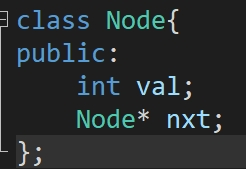

# C++面向对象思想和基础用法

这一篇是补充内容，后面学JAVA的时候面，理解向对象是很重要的，这里先提前讲了，

主要是接下来后面的数据结构我都打算使用面向对象的思想去封装起来，

而且理解了面向对象下学期开JAVA的时候就会变得没有那么困难；

## 什么是面向对

首先要知道对象是什么，什么是对象   （注 ：他可以不是你  男朋友/女朋友 ，也可以是   XD ）

比如说  一只狗， 一只鸟， 一个人， 一本书，都可以属于一个对象

而对于每一个对象，他们都有着自己的“属性”。

什么属性呢？

比如人 他的属性有 性别、年龄、有没有女朋友男朋友、有没有父母、身份证......

比如书 他有他的页数、类型、价格........

将这些属性包装起来就组成了对象；

大家可能会想着，这不就是就结构体嘛！ 是 ！但又不是！

但是这里不过多的展开讲解两者的不同；但是在C++中面向对象是使用 class 来定义的

## c++类的讲解

比如我定义一个人类

```cpp
class people{
public:
  string name;            //名字
  string sex;             //这个人的性别
  int age;                //岁数
private:
  bool parpent;            //是不是孤儿
  float price;             //个人资产
};
```

你可能会一头雾水，这些public    private都是什么啊，字面意思  公开 和 私有；

在类中  有着私有和公开这两个概念；比如说人的年龄 名字  性别  是可以公开的  （只要你不是lgbt群体，和小仙女）

像他有没有父母，个人的资产 这些是可以不给他们知道

（比如那些工资只有3000的工厂精神小伙，但是天天在网上吹虚的）

那在程序中怎么体现他是公有的还是私有的呢？

和结构体内部变量的调用一样：

```cpp
people p1;
p1.name = "李明"; 
p1.sex = "unkonw";
p1.age = 17;
```

通过    (    .    )  来调用他的公有变量 ，如果是这个类型的指针就要用  (   ->   )  来调用

对于公共成员变量就是如此

那私有成员变量呢？就不能直接调用了；


他会报  “私有成员变量调用错误”因为私有的成员只能成员自己调用

那么私有成员这就调用不了吗？接下来就是class最主要的------------成员函数；

### 成员函数

```cpp
class people{
public:
	void setprice(float p) {  //设置价格
		price = p;
	}
public:
        string name;            //名字
        string sex;             //这个人的性别
        int age;                //岁数
private:
        bool parpent;            //是不是孤儿
          float price;
};
```

```cpp
p1.setprice(3000.0);
```

通过设定一个   成员公共函数    能够被外部调用，通过   公共的成员函数   去调用   成员自己内部  私有的变量；

因为这个函数是成员自己的，那么对这个函数进行操作其实就是对成员进行的操作。

下面不如再来完善一下剩下的信息设置，再添加一个信息输出函数，将这个人的底全都输出出来：

```cpp
class people{
public:
  void setprice(float p) {		//设置价格 
	  price = p;
  }

  void setparprnt(bool p) {
       	parpent = p;
  }

  void printInfo() {
      	  cout<<"name: "<<name<<endl;
	  cout<<"sex: "<<sex<<endl;
	  cout<<"age: "<<age<<endl;
	  cout<<"parpent: "<<(parpent ? "True" : "false")<<endl;
	  cout<<"price: "<<price<<endl;
  }
public:
          string name;            //名字
          string sex;             //这个人的性别
          int age;                //岁数
private:
          bool parpent;            //是不是孤儿
          float price;
  
};

int main() {
	people p1;
	p1.name = "李明"; 
	p1.sex = "unkonw";
	p1.age = 17;
	p1.setprice(3000.0);
	p1.setparprnt(false);
	p1.printInfo();
}
```

这段代码定义了一个 人类  添加各种和人有关的信息，然后再main() 里面定义一个people 再对 people的各类成员属性进行设置；最后通过成员函数 printInfo() 输出所有的成员信息。

### 特殊成员函数---构造和析构

设定成员的属性的时候，都是 通过调用或者专门的成员函数来设置的，现在属性比较少，显得无所谓，但是要是这个对象有成百上千的属性呢，这样调用就不方便了

因此在C++ 中 有这么一个函数 构造函数

构造函数会在 开辟 这个类的空间  或者声明这个类的变量   的时候被调用；先来看看他的代码实现

```cpp
class people{
public:
	people(string _name, string _sex, int _age, bool _parents, float _price) {
		name = _name;
		sex = _sex;
		age = _age;
		parents = _parents;
		price = _price;
	}

	void setprice(float p) {		//ﾉ靹ﾃｼﾛｸ・
		price = p;
	}

	void setparprnt(bool p) {
		parents = p;
	}

	void printInfo() {
		cout<<"name: "<<name<<endl;
		cout<<"sex: "<<sex<<endl;
		cout<<"age: "<<age<<endl;
		cout<<"parpent: "<<(parents ? "True" : "false")<<endl;
		cout<<"price: "<<price<<endl;
	}
```

直接写 类名(   )   就已经定义了一个成员构造函数；那该怎么调用呢？ 看看代码：

```cpp
int main() {
	people p1("Tony", "man", 37, true, 103.0);
	p1.printInfo();
}
```


当开辟这个类型或者定义的时候就相当于要使用这个函数了，也就是说当这个成员变量有构造函数的时候就必须要传入构造函数需要的变量; 不然就无法调用这个类；


现在p2是空的构造，里面没有任何属性，因此不能调用；

对于指针类型 开辟空间的时候也要传入数据

```cpp
people* p2 = new people("jorn", "female", 11, true, 100000.0);
p2->printInfo();
```


成员函数的另一个特殊函数就是析构函数，与构造函数相反，析构函数会在程序运行完毕的时候调用，如果是这个类型的指针就要使用 delete 去析构掉这个指针


```cpp
class people{
public:
	people(string _name, string _sex, int _age, bool _parents, float _price) {
		name = _name;
		sex = _sex;
		age = _age;
		parents = _parents;
		price = _price;
	}

	~people() {
		cout << "析构" <<name<<endl;
	}

	void setprice(float p) {		//设置价格 
		price = p;
	}

	void setparprnt(bool p) {
		parents = p;
	}

	void printInfo() {
		cout<<"name: "<<name<<endl;
		cout<<"sex: "<<sex<<endl;
		cout<<"age: "<<age<<endl;
		cout<<"parpent: "<<(parents ? "True" : "false")<<endl;
		cout<<"price: "<<price<<endl;
	}
public:
  string name;            //名字
  string sex;             //这个人的性别
  int age;                //岁数
private:
  bool parents;            //是不是孤儿
  float price;
  
};
```

```cpp
int main() {
	people p1("Tony", "man", 37, true, 103.0);
	p1.printInfo();
	cout<<endl;

	people* p2 = new people("jorn", "female", 11, true, 100000.0);
	p2->printInfo();
	delete p2;
}
```


如果不是指针在程序执行完毕后会自动析构；

~类名()   一个析构函数就做好了

你可能会好奇，这个函数有什么用呢？

当你这个成员里面的属性有指针类型呢？这个指针还开辟了空间，那么这时候析构函数就很重要了，下面的设计中会讲到。


### 用面向对象来重构链表类


这里将会重构一下链表的一些简单函数

先来定义一个类  Node，里面有存放一个值，存放指向下一个的节点




将nxt初始化为nullptr，然后就是Node的构造函数；


然后就是push_back函数，这里有个特俗的指针 this   这个指针是指这个成员变量的本身


再写个输出函数


最后再写个析构函数


注意tmp的nxt一定要设为空，不然就会一直递归下去（不断的执行他的析构函数）


来看看完整代码：


```cpp
#include <iostream>
using namespace std;

class Node{
public:
	Node(int _val) {
		val = _val;
	}

	~Node() {
		Node* p = nxt;
	    while(p) {
	        Node* tmp = p;
	        p = p->nxt;
	        cout<<tmp->val<<" delete"<<endl;
			tmp->nxt = nullptr;  
	        delete tmp;
	    }
	}


	void push_back(int _val) {
		Node* p = this;
		while(p->nxt) {
			p = p->nxt;
		}
		p->nxt = new Node(_val);
	}

	void printList() {
		Node* p = this;
		while(p) {
			cout<<p->val<<"-->";
			p = p->nxt;
		}
		cout<<endl;
	}

public:
	int val;
	Node* nxt = nullptr;
};

int main() {
	Node* head = new Node(2);
	head->push_back(3);
	head->push_back(6);
	head->push_back(8);
	head->printList();
	delete head;
}
```


## 注意

接下来会回归正常的链表的讲解中，但是会使用到面向对象的知识，因此一定要看懂面向对象，这对你以后学习java会有很大的帮助；


