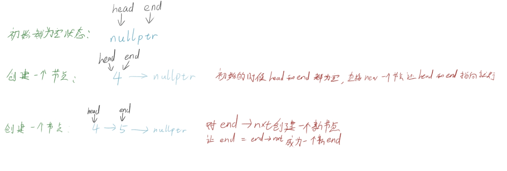

# 栈与队列

基于上面的链表我们试试去设计一个栈和队列，在设计之前，先来了解一下栈和队列是怎样的

## 栈

比如手枪的弹夹（画的有点崩 QAQ）


上弹时子弹一发一发的推入进弹夹，子弹再一发一发的从弹夹最上面射出

这就是栈的原理——后进去的先出来出

这里我会设计一个基于链表设计的栈

首先我们写一个链表的节点的结构体：

```cpp
    struct Node {
        int val;
        Node* nxt;
        Node(int _val, Node* _nxt):val(_val), nxt(_nxt) {}
        Node(int _val):val(_val),nxt(nullptr){}
    };
```

没错，在cpp中结构体是可以设置函数的，而且和面向对象的class一样可以用构造和析构，

但是class 和 struct 还是有着一些区别，一些 struct 无法做到的事情，但这里不展开讲。只要知道就行

默认构造为传入一个值，和一个指针，然后重载一个只传入值，nxt指针为空的构造函数

冒号后面是cpp面向对象中的一种特殊的初始化变量方法

成员变量(传入变量)

通过这种方式来进行初始化操作

然后把这个结构体包装进一个名为     ”栈“   的类中：

```cpp
class stack{
    struct Node {
        int val;
        Node* nxt;
        Node(int _val, Node* _nxt):val(_val), nxt(_nxt) {}
        Node(int _val):val(_val),nxt(nullptr){}
    };
public:
    stack() {}

    ~stack() {}

private:
    Node* head{nullptr};
    int size{ 0 };
};
```

这个时候Node就属于类内的结构体，只有类自己内部能调用，当然你要是想要在外部也可以调用你可以写到类的外面，

这个类的主要成员变量就是一个Node指针head，一个代表栈长的整形size

设计一个 push 函数：

```cpp
    void push(int val) {
        size++;
        if (!head) {
            head = new Node(val);
            return;
        }

        Node* p  = new Node(val);
        p->nxt = head;
        head = p;
    }
```

当头节点为空的时候，直接对头节点进行new操作；

不为空的时候new一个新的节点，然后让节点指向原来的头节点，然后更新头节点为新的节点

设计一个pop函数：

```cpp
    void pop() {
        if (!head) return;
        size--;
        Node* p = head->nxt;
        delete head;
        head = p;
    }
```

获得头节点的下一个节点，删除原来的head节点，并让head指向原头节点的下一个

再设计一些零散的值：

```cpp
    int top() {          //得到栈的头部
        return head->val;
    }

    int getsize() {      //得到栈的长度
        return size;
    }
```

对了不要忘了要清理内存，把创建的节点给删除掉

```cpp
    ~stack() {
        Node* p = head;
        while (p != nullptr) {
            Node* np = p->nxt;
            delete p;
            p = np;
        }
        head = nullptr;
    }
```

最后来看看完整的代码：

```cpp
class stack{
    struct Node {
        int val;
        Node* nxt;
        Node(int _val, Node* _nxt):val(_val), nxt(_nxt) {}
        Node(int _val):val(_val),nxt(nullptr){}
    };
public:
    stack() {

    }

    ~stack() {
        Node* p = head;
        while (p) {
            Node* np = p->nxt;
            delete p;
            p = np;
        }
        head = nullptr;
    }

    void push(int val) {
        size++;
        if (!head) {
            head = new Node(val);
            return;
        }

        Node* p  = new Node(val);
        p->nxt = head;
        head = p;
    }

    void pop() {
        if (!head) return;
        size--;
        Node* p = head->nxt;
        delete head;
        head = p;
    }

    int top() const{
        return head->val;
    }

    int getsize() const{
        return size;
    }
private:
    Node* head{nullptr};
    int size{ 0 };
};
```

## 队列

就是排队嘛，饭堂先排队的人肯定先拿到饭，要是插队就肯定不对了；

队列就是这样简单的东西——先进去的先出来；

有些部分代码和栈差不多，

先看队列自己的私有变量：

```cpp
private:
    Node* head{ nullptr };
    Node* end{ nullptr };
    int size{ 0 };
```

这里的 end指针 目的是存储链表的尾部的节点，head指针 是不动的：

```cpp
    void push(int val) {
        size++;
        if (!end) {
            end = new Node(val);
            head = end;
            return;
        }
        end->nxt = new Node(val);
        end = end->nxt;
    }
```

来看看图：



他的并没多大变化，来看看完整代码：

```cpp
class queue {
    struct Node {
        int val;
        Node* nxt;
        Node(int _val, Node* _nxt):val(_val), nxt(_nxt) {}
        Node(int _val):val(_val),nxt(nullptr){}
    };
public:
    queue() {

    }

    ~queue(){
        Node* p = head;
        while (p) {
            Node* np = p->nxt;
            delete p;
            p = np;
        }
        head = nullptr;
    }

    void push(int val) {
        size++;
        if (!end) {
            end = new Node(val);
            head = end;
            return;
        }
        end->nxt = new Node(val);
        end = end->nxt;
    }

    void pop() {
        if (!head) return;
        size--;
        Node* p = head->nxt;
        delete head;
        head = p;
    }

    int top() const{
        return head->val;
    }

    int getsize() const{
        return size;
    }
private:
    Node* head{ nullptr };
    Node* end{ nullptr };
    int size{ 0 };
};
```


队列和栈以链为基础的设计就是这么简单好理解

队列和栈的笔记大概就这么些东西了，具体的应用要到对应的题目，所以我不打算讲他的具体应用，而且后面也会学到使用到栈和队列的算法（比如图的最短路径算法，最小生成树等等），以及后面可能会学到的多线程的线程池概念等等
