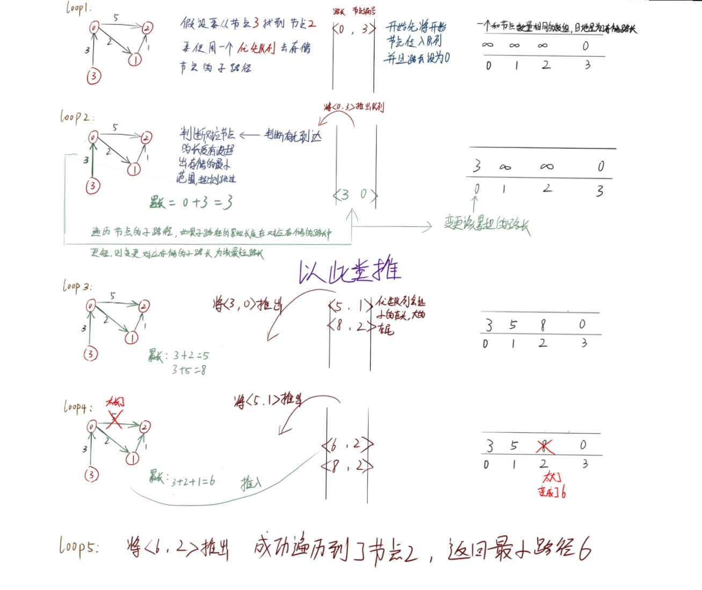

# Dijkstra 有权有向图的最短路径算法


## 设计图类

这篇笔记的图用的不是邻接矩阵表，而是一个用邻接表的表示方法；

```cpp
vector<vector<pair<int, int>>> mp{};
```

用一个二维的pair数组去储存每一个节点中的路径；

来看看如何去构造一个图：

```cpp
    Graphics(int n, vector<vector<int>> m) {
        size = n;
        mp.resize(n);
        for (auto t : m) {
            int y = t[0], x = t[1], d = t[2]; //记录从哪到哪，和两点距离
            mp[y].push_back({d, x}); //记录距离, 将 y->x 记录
        }
    }
```

传入节点的个数，传入一个二维数组 （ nx3的二维数组），然后将关键的信息传入 二维pair的数组；

这样一个简单的图就构造好了。


## Dijkstra最短路径算法

传入开始的节点和要到达的节点，通过一个优先队列，去不断的找到最找到最小的路径，到达时，返回路径的长度；

不如直接看图：



不断依次类推，最终必定能找到对应的最短路径；

直接来看代码的实现：

```cpp
 int Dijkstra(int start, int end) {
        if (start == end) return 0; //s = e直接返回
        vector<int>  dis(size, INT_MAX);//距离最小存储
        dis[start] = 0;
        priority_queue<pair<int, int>, vector<pair<int, int>>, greater<>> pq;
        pq.emplace(0, start);             //因为优先队列存储pair都是对第一个进行的排序，所以这里让距离排在第一个键值对上
        while (!pq.empty()) {

            auto [d, y] = pq.top();     //获取该路径长度，和该节点
            pq.pop();
            if (y == end) return d;                //当到达终点时返回该路的长度
            if (d > dis[y]) continue;               //该路径距离 大于 该节点的距离时，继续循环
            for (auto& [w, x] : mp[y]) {    //获取该节点的路径
                if (d+w < dis[x]) {                 //如果距离小于子节点的路径 则将其替换 并且推到队列中去
                    dis[x] = d+w;
                    pq.push({dis[x], x});
                }
            }
        }
        return -1;
    }
```
