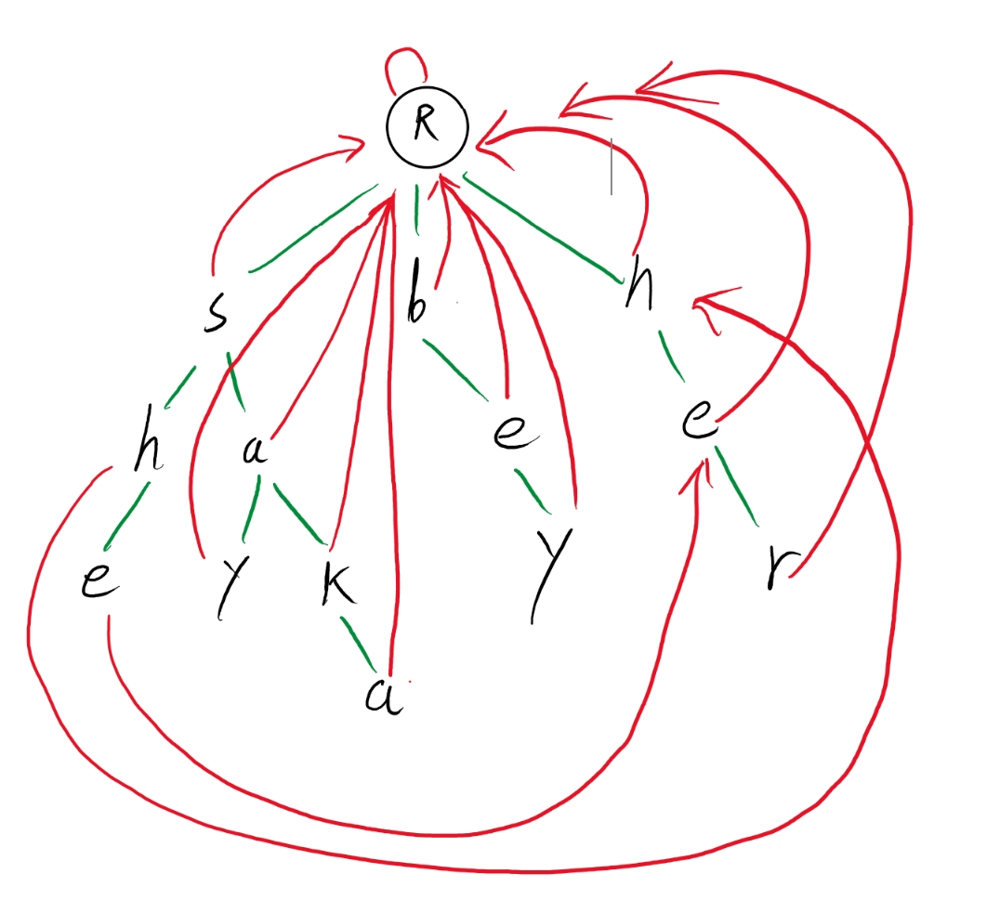

# Trie树与AC自动机

trie树是一种对字符串进行匹配的结构，处理大量的字符串搜素时，效率较高。

而AC自动机是基于tried子树进行的一个优化操作，而且能够做到多子串的匹配操作。

## Trie树

Trie树的每个节点代表着一个字符，每条路都代表着一个匹配串，比如我有两个需要寻找匹配串 “she”,"say"，"bey"那么插到树上的图是这样的：


从根节点出发，将匹配串的每个字符依次插入到树上

从根节点出发R->s->a->y， 这条路的子串就是"say"；在他们的叶子节点上，可以给他记上数，代表这个节点是一个串的结尾：


现在再给这个树，插入一个匹配串 "sakana"，这个树就会变成这样：


从根节点出发，原先的 "s", "a"本就已经存在， 那么只要在 s->a  这一条链上，从a节点开始继续往下开辟多出来的部分即可；

那么这样就清晰明了了：

在每次插入一个字符串时，都从根节点开始，将每个字符都往树上按深度插入；

如果插入的字符串的与先前的字符有匹配，那就从匹配的节点开始往下插入节点；

代码如下：

```cpp
int mp[N][26], cnts[N], cnt = 0;
//用一个二维数组来存放节点，每一行代表第i个节点与其他节点的连接情况
//cnts代表这个节点是否匹配字符串；
//cnt代表开辟的节点个数,同时指定节点的走向

void insert(string str) {
    //根节点的下标为0；p是一个移动用的指针，开始时先从根节点移动
    int p = 0;
    for (auto x : str) {
        //判断下这个这个字符串的其中一个字符有没有开辟，没有就开辟 cnt+1
        if (!mp[p][x-'a']) mp[p][x-'a'] = ++cnt;
        //指针往更深处移动；
        p = mp[p][x-'a'];
    }
    //最后给叶子节点的cnts加上1，表示这个节点匹配了一个字符串
    cnts[p]++;
}
```

那么又该如何去查找字符串有没有在树上呢？

这里以 找“say”为例:


从根节点出发，依次寻找字符串中的每个字符有没有在这个树上，找到了就返回节点的匹配字符串个数；

如果有一个字符找不到，那就返回0，代表这个树上没有这个字符串；

代码如下：

```cpp
int query(string str) {
    int p = 0;
    for (auto x : str) {
        if (!mp[p][x-'a']) return 0;
        p  = mp[p][x-'a'];
    }
    return cnts[p];
}
```

完整代码如下：

```cpp
#include  <bits/stdc++.h>

using namespace std;
const int N = 2*1e6+10;

int mp[N][26], cnts[N], cnt = 0;


void insert(string str) {
    int p = 0;
    for (auto x : str) {
        if (!mp[p][x-'a']) mp[p][x-'a'] = ++cnt;
        p = mp[p][x-'a'];

    }
    cnts[p]++;
}

int query(string str) {
    int p = 0;
    for (auto x : str) {
        if (!mp[p][x-'a']) return 0;
        p  = mp[p][x-'a'];
    }
    return cnts[p];
}


int main() {


    while(1) {
        char C; cin>>C;
        if (C == 'Q') break;

        string str; cin>>str;

        if (C=='I') insert(str);
        else cout<<query(str)<<endl;
    }

}
```

## AC自动机构建


既然已经知道如何构建一个Trie树，那就能够很轻易的创建一个AC自动机，那AC自动机的应用一般是什么呢？

比如说，查找一个字符串的出现的敏感词数量；找到一整个串的敏感词的下标起始点等等，一系列有关子串匹配的操作。

如果要用普通的Trie树，就需要将字符串的每个可能子串都要在树上查询一遍，这样的话就会特别的耗时；那能不能只要走一遍就能查询完毕呢？

```
（这里就以解决查找匹配字符串的个数为例子，要想实现其他功能，同样是在这个模板下进行修改即可）
```


答案是肯定的。

不妨先来观察观察这颗树


比如我现在有一个串 "sakabey" 符合的子串数应该是2；从根节点出发 s->a->k->a；这时候已经到叶子节点了；不能再往下走了；可是字符串还没有便利完；而b->e->y这一段是从头节点开始的，那我们就回到头节点，走bey这条路，就能够一次遍历完成；即为：


再比如下面这个例子，串"sher"，符合的子串数为3(she, he, her)；还是从根节点出发 s->h->e；这时候又到达叶子节点了；不能往下走了；可是字符串还没遍历完；现在这个串遍历了she 和 he 两个子串； 但是还有个her该怎么遍历呢？这时候我们的遍历到的字符是e，那不妨找找另外一个e节点；然后在另一个e节点往下搜索找到 r；就能一次遍历完成，返回3；即为：


通过上面的规律不难发现；其实就是在原先路径找不到后；跳出该路径找到符合规律的节点，再往找到的这个节点延申往下走；直到遍历完整个字符串；

在每次往下查找的时候，都有可能会找不到或查找失败；

那么我们就可以去记录下每个节点在往下查找失败后，应该走向的节点；也就是每个节点再多个存放一个遍历失败的指针；去存放应该走向的节点，

这个指针叫做 fail指针。

但是需要将所有的插入都插入完后，才能进行fail指针构建。即插入和构建fail指针是分开的；

那fail指针的规律应该怎么指呢？

首先是根节点下的子节点；他们的fail指针都指向根节点；根节点就指向他自己


其他的节点呢？

需要去找到他父节点的fail指针指向的节点有没有对应字符相同的节点；

可能有点绕；举个例子：h节点的父节点是 s; s的fail指针指向的是R根节点，然后根节点有另一个h节点；那么就让源h节点的fail指针指向另一个h节点；即为：


那如果其父节点的fail指针指向的节点没有对应相同的节点呢？

那就直接让他指向根节点，比如节点a:


以此类推，就能够将所有节点的fail指针构建完成：



然后要将其源节点的字符计数与fail节点的字符计数相加：


为什么要记下其他数呢？比如说 she 他即包含she 又包含 he；那也就是说 she 有两个子串，所以应当将另外匹配的字符数量给加上。

代码的实现就使用广度优先搜索；将所有节点都构造一遍：

```cpp
int mp[N][26], cnts[N], fails[N], cnt = 0;
//新添加一个存放所有节点fail指针的

//fail指针构建
void buildfail() {
    queue<int> Q;
    //将连接根节点的第一层节点全都加入队列；
    for (int i=0; i<26; i++)
        if (mp[0][i]) Q.push(mp[0][i]);
        //因为fails默认数据全为0，0就是根节点，所以这里没有让fail[mp[0][i]] = 0, 加上也没影响;  

    while(!Q.empty()) {
        int T = Q.front();
        Q.pop();
  
        for (int i=0; i<26; i++) {
            if (!mp[T][i]) continue;
            //这里也是因为fails、mp数组元素都是默认为0的，直接让其fail指针指向其父节点fail指针下面的对应节点即可
            fails[mp[T][i]] = mp[fails[T]][i];
            //将节点fail指针的对应字符计数添加到源节点上;
            cnts[mp[T][i]] += cnts[fails[mp[T][i]]];
            Q.push(mp[T][i]);
        }
    }
}
```

最后就是查询一共有几个子串的代码：

```cpp
int query(string str) {
    int p = 0, ans = 0;
    for (auto x : str) {
        //如果查找失败，就去不断的查找他的fail指针，直到查找成功或者p节点为根节点
        while(p && !mp[p][x-'a']) p = fails[p];
        //只有能找到才让p节点变为下一个节点
        if (mp[p][x-'a']) p = mp[p][x-'a'];
        //计数；
        ans += cnts[p];
    }
    return ans;
}
```

想要实现其他类型的查询，也是以此类推，多几个数据少几个数据的区别而已。

最后来看看完整的代码实现：

```cpp
#include  <bits/stdc++.h>

using namespace std;
const int N = 2*1e6+10;

int mp[N][26], cnts[N], fails[N], cnt = 0;

void insert(string str) {
    int p = 0;
    for (auto x : str) {
        if (!mp[p][x-'a']) mp[p][x-'a'] = ++cnt;
        p = mp[p][x-'a'];

    }
    cnts[p]++;
}

void buildfail() {
    queue<int> Q;
    for (int i=0; i<26; i++)
        if (mp[0][i]) Q.push(mp[0][i]);

    while(!Q.empty()) {
        int T = Q.front();
        Q.pop();

        for (int i=0; i<26; i++) {
            if (!mp[T][i]) continue;
            fails[mp[T][i]] = mp[fails[T]][i];
            cnts[mp[T][i]] += cnts[fails[mp[T][i]]];
            Q.push(mp[T][i]);
        }
    }
}


int query(string str) {
    int p = 0, ans = 0;
    for (auto x : str) {
        while(p && !mp[p][x-'a']) p = fails[p];
        if (mp[p][x-'a']) p = mp[p][x-'a'];
        ans += cnts[p];
    }
    return ans;
}


int main() {
    for (auto x : vector<string>{"she", "he", "her", "say", "sakana", "kana"}) insert(x);
    buildfail();

    while(1) {
        string str; cin>>str;
        if (str == "Q") break;
        cout<<query(str)<<"\n";
    }
}
```
