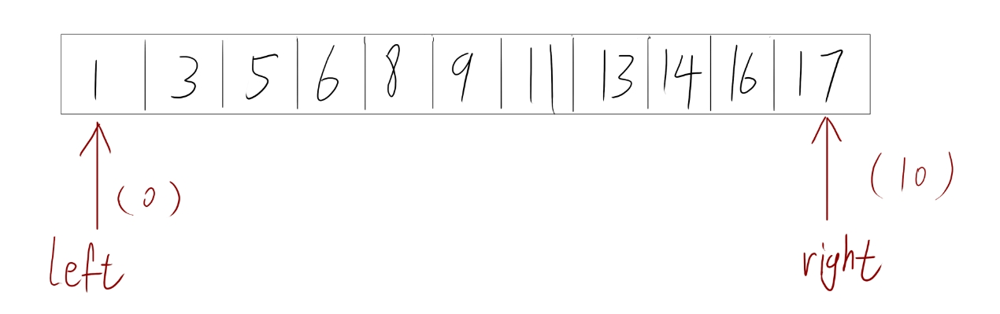
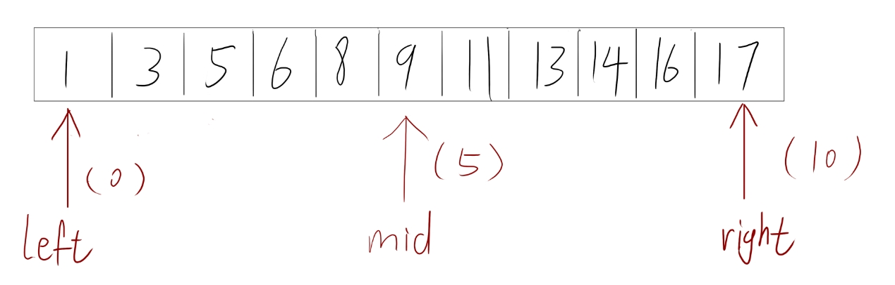
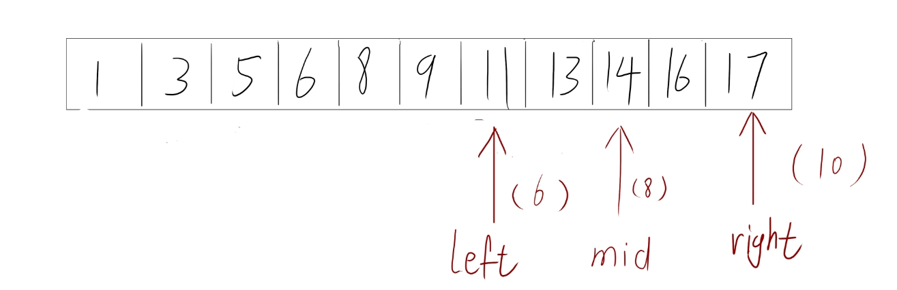
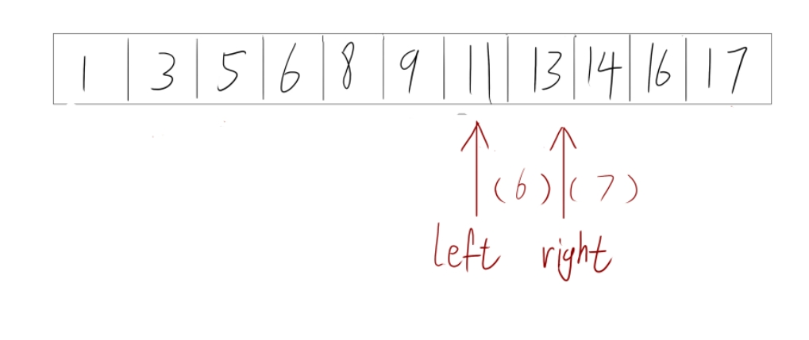
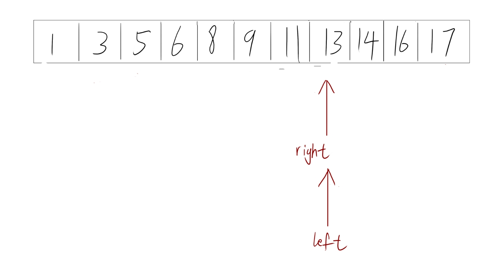
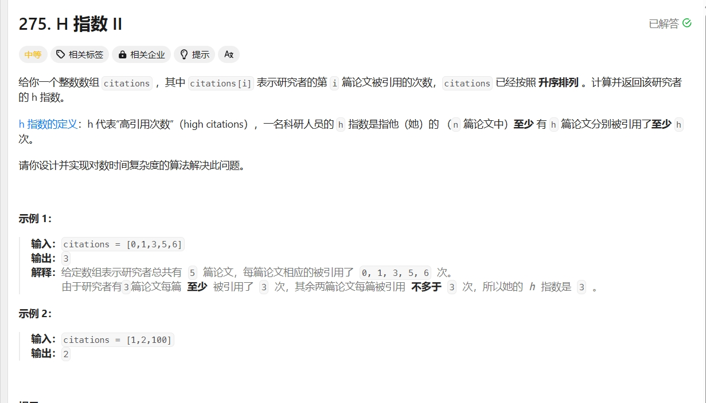

# 二分策略

## 二分算法

一种 时间复杂度O(logN) 的算法， 二分查找， 在使用二分查找之前一定要保证 查找的数据范围有单调性， 而不能乱序，

二分查找使用 双指针 的思想来实现，比如要查找有序数组的某一个值：



用左右指针分别指向数组的头和尾部； 二分策略还有一个很重要的思想就是 中间位置，即（left+ right）/ 2

获取到双指针的中间位置：



在这个搜索中我假设我要搜索 值13，现在13明显在中间值的右侧，因此需要将 左指针移动到中间位置的再右边的一个位置，然后重新计算中间值：



现在 13 变成了在中间指针的左侧，因此需要将右指针移动到中间指针再左边的一个位置：



在这里left 和 mid 重合了， 因此要让左指针移动到中间指针再右边的一个位置：



这个时候左右指针重合了，则返回左指针指向的下标；

具体代码如下：

```cpp
int find(int f, vector<int> arr) {
    int l=0, r = arr.size()-1;
    while(l < r) {
        int mid = (l + r) / 2;
        if (arr[mid] < f) l = mid + 1;
        else r = mid -1;
    }
    return l;
}

```

上面的图和代码都是 完全开区间写法；

不同的区间对应着不同的写法

左开右闭：

```cpp
int find3(int f, vector<int> arr) {
    int l=-1, r = arr.size()-1;
    while(l+1<r) {
        int mid = (l + r) / 2;
        (arr[mid] < f ? l : r) = mid;
    }
    return r;
}
```

完全闭合：

```cpp
·int find2(int f, vector<int> arr) {
    int l=0, r = arr.size()-1;
    while(l <= r) {
        int mid = (l + r) / 2;
        if (arr[mid] < f) l = mid + 1;
        else r = mid -1;
    }
    return l;
}
```

具体看情况而定要使用哪一种。

## 应用

二分策略主要是用于那些 有单调性的数组，区间，答案的枚举等等；而且这个区间范围不能太大也不能太小


比如力扣的 [275. H 指数 II](https://leetcode.cn/problems/h-index-ii/)




也就是说，根据这个**存储研究者论文被引用次数的数组**来求得的这个h，里面h篇文章，每一篇文章**至少引用了h次或以上**


先要判定单调性，这个数组中的数据都是升序的，因此可以直接使用二分；

然后确定范围，在这道题中 范围就是 [0, n)   （即left = 0, right = n+1）；

最后确定二分条件，因为是升序排好的，因此只要判断二分位置对应的值，有没有大于二分对应的长度即可，即条件为 （citations[n -mid] >= mid）

如果对应的数大于了二分位置的长度，让左指针变到mid的位置上，否则让右指针移动到mid位置上，最后返回left的位置就是二分后的最优结果啦


具体代码如下：

```cpp
class Solution {
public:
    int hIndex(vector<int>& citations) {
        int n = citations.size();
        int l = 0, r = n+1;
        while(l+1 < r) {
            int mid = (l+r)>>1;
            (citations[n-mid] >= mid ? l : r) = mid;
        }
        return l;
    }
};
```
