# 前缀和与差分

前缀和就是求取一个序列前n项和的一种方法，差分则是前缀和的逆运算，要根据情况合理的去使用

## 前缀和

### 一维前缀和

前缀和的每一个数代表的都是原数组的一段区间的累加和

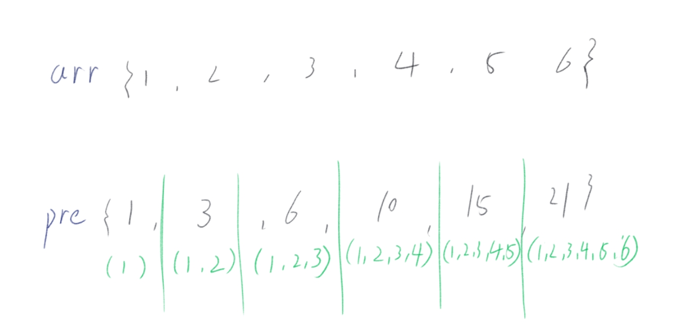

先直接看代码：

```cpp
    int arr[] = {1,2,3,4,5,6};
    int pre[6] = {0};
    pre[0] = arr[0];
    for (int i=1; i<6; i++) {
        pre[i] = pre[i-1] + arr[i];
    }
```

求取的公式为：

$$
pre[i] = pre[i-1] + arr[i]
$$

记住，首先把pre[0] = arr[0]，前缀和第一个数的集合就是只有arr中的一个数；求取这个前缀和的时间复杂度为：

$$
O(n)
$$

但是这个前缀和有什么用呢？它能够在O(1)的时间复杂度上获得数组中一段区间的总和；

比如我想得到原数组中从   下标2到下标4这段范围的累计和（闭合区间） 我就可以用前缀和数组去计算出来，即为

pre[4] -pre[2-1]，为什么左边的范围要减去1呢？

根据上图不难看出，pre[2] 是原数组 {1, 2, 3} 的累加和，pre[4] 是原数组 {1, 2, 3, 4, 5} 的累计和；

而计算从 2 到 4 之间的数的累计和区间是 {3, 4, 5} ， 需要去掉的值只有 {1, 2}，而pre[2]的区间是包括到 3 的，如果pre[4] 直接减去pre[2] ，那么这个区间就变成 {4, 5}了，因此要减去-1达到完全闭区间，

因此他的这条公式就是这样：

$$
sum[left, right]  =  pre[right] - pre[left-1]
$$

前缀和每次区间查询的时间复杂度都是:

$$
O(1)
$$

### 二维前缀和

在给出二维数组的代码和公式之前，先来画图推导一下

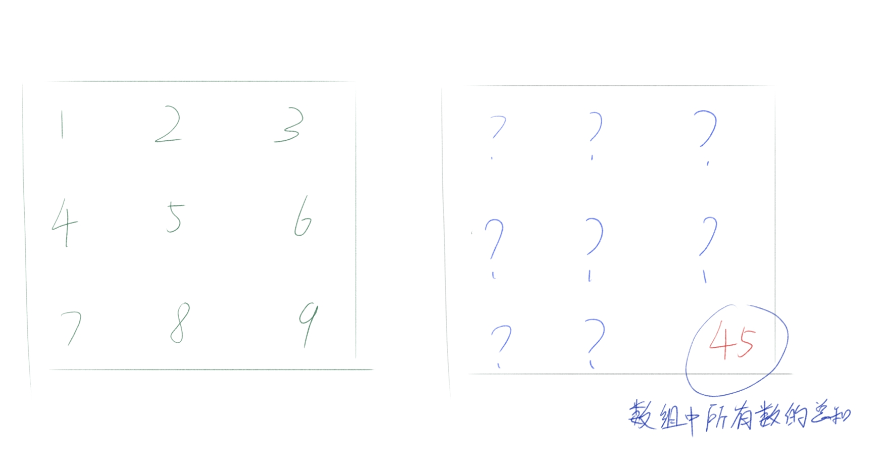

一维数组的最后一位必定是整个数组所有数字的总和，二维数组也以此类推，最后一行最后一列必定是数组中所有数字的总和，

那剩下的元素又该怎么求呢？我们不妨试试把范围缩小：

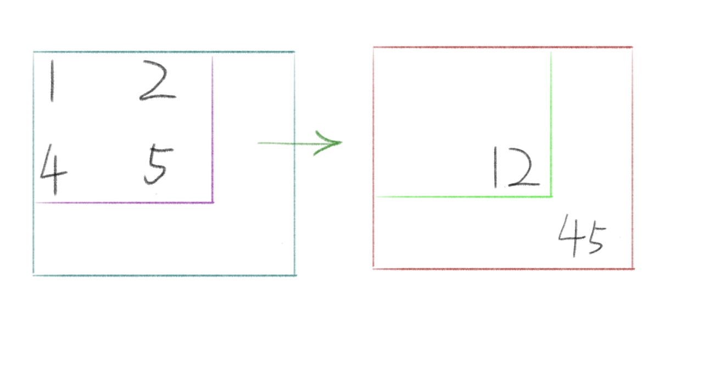

对于该数组中最后一位 pre[2][2] 的值为45, pre[1][1]的值就是12，也就是说对角线上的位置对应的值，是对角线所到达这块范围的所有值的累计和，可是，对于不在对角线的值呢？我们可以让他“变成”对角线！

什么意思呢？看下图：

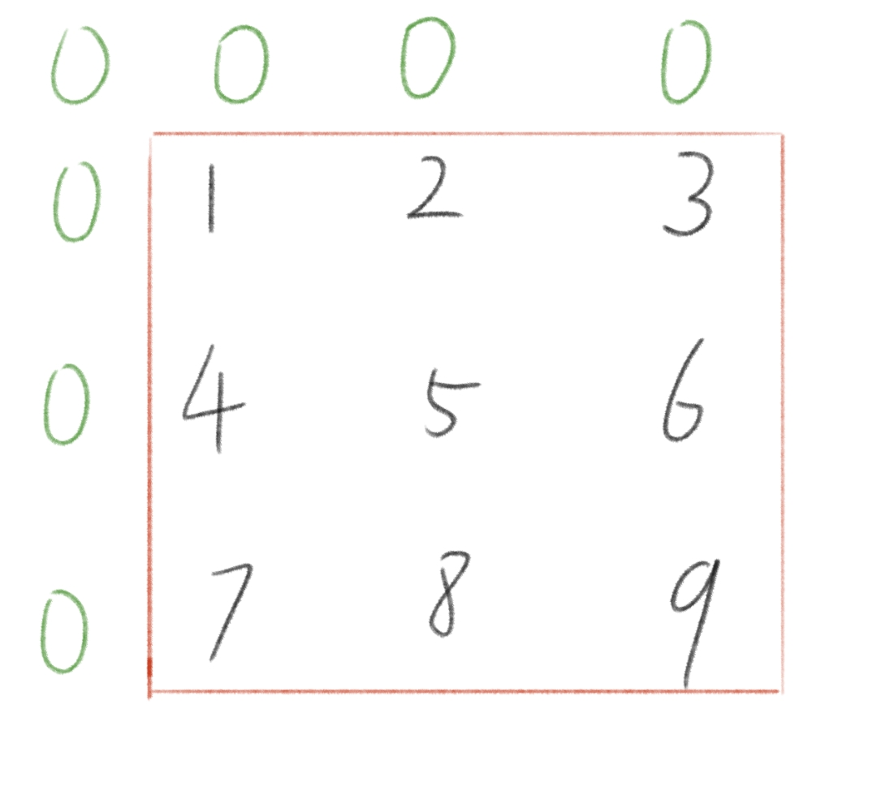

将这个前缀和数组和原数组从 3X3 变成 4X4 也就是行列都+1，让每个数都向前推进一行一列（也就是原来的 0行0列不存储数据，只存放0），这样每一个数都能够找到它对应的对角线，然后计算出结果，

这个计算过程是按照行来的，现在来模拟一遍遍历的过程：

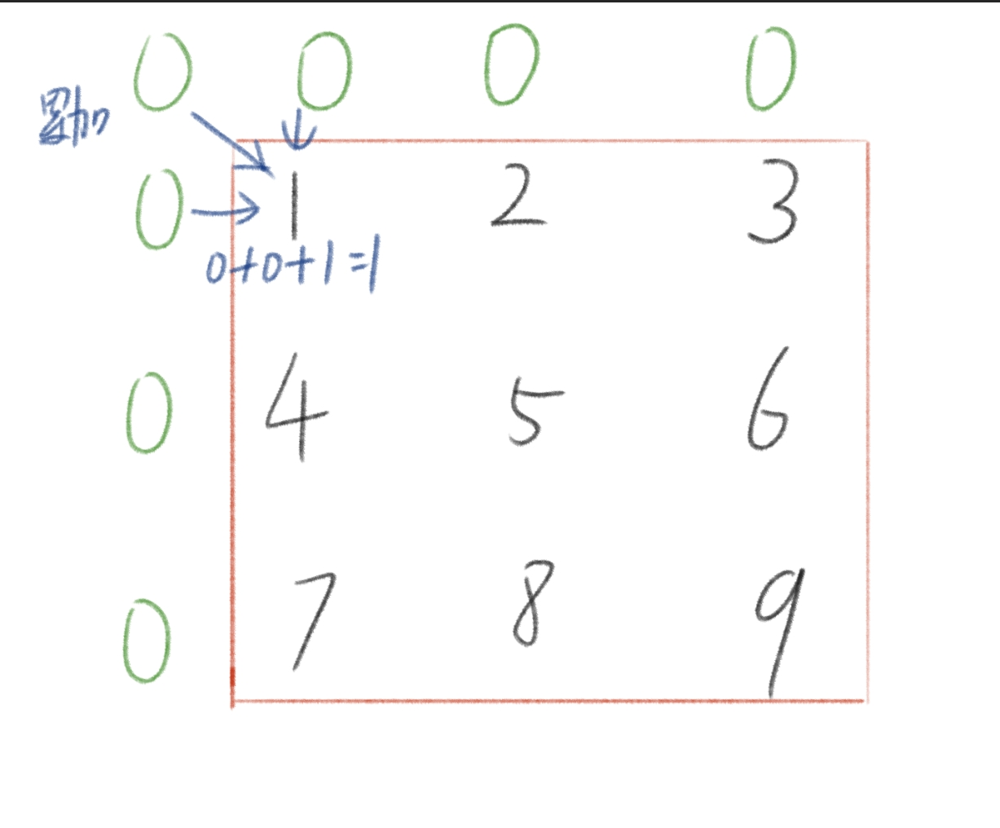

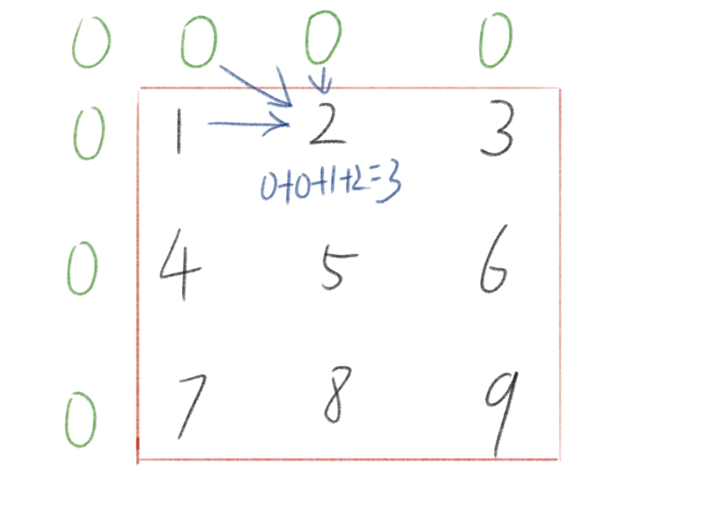

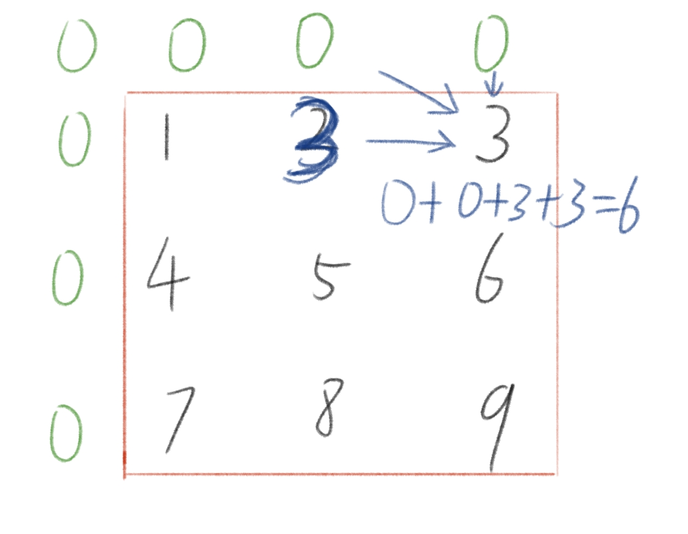

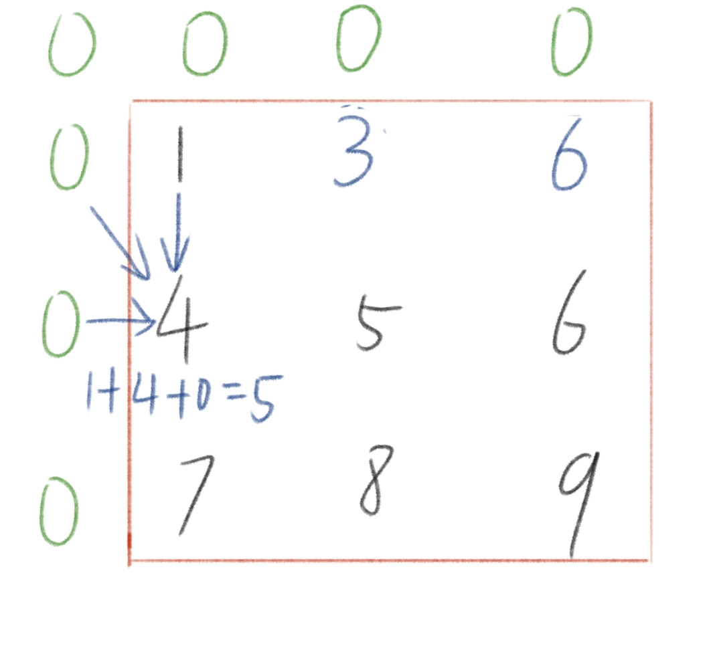

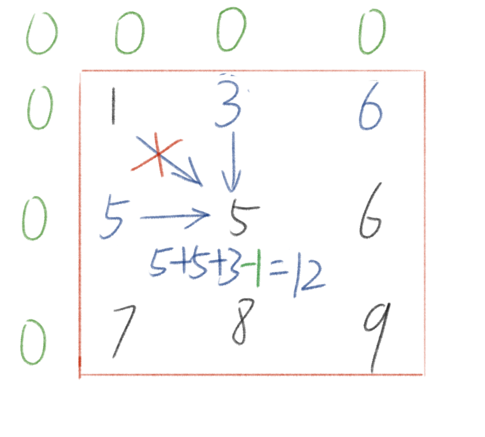

这时候要注意了！第二行中要将对角的值给减去，为什么呢？因为在之前的遍历中，也就是遍历到该数组 [2][1] 和 [1][2] 的位置的时候，已经将1给加进去了，如果这个时候，加上对角线的值是不对的，左边和上边的值也都包括了1这个数，因此在这里还需要去掉一个1；

对于接下来的遍历也是如此：

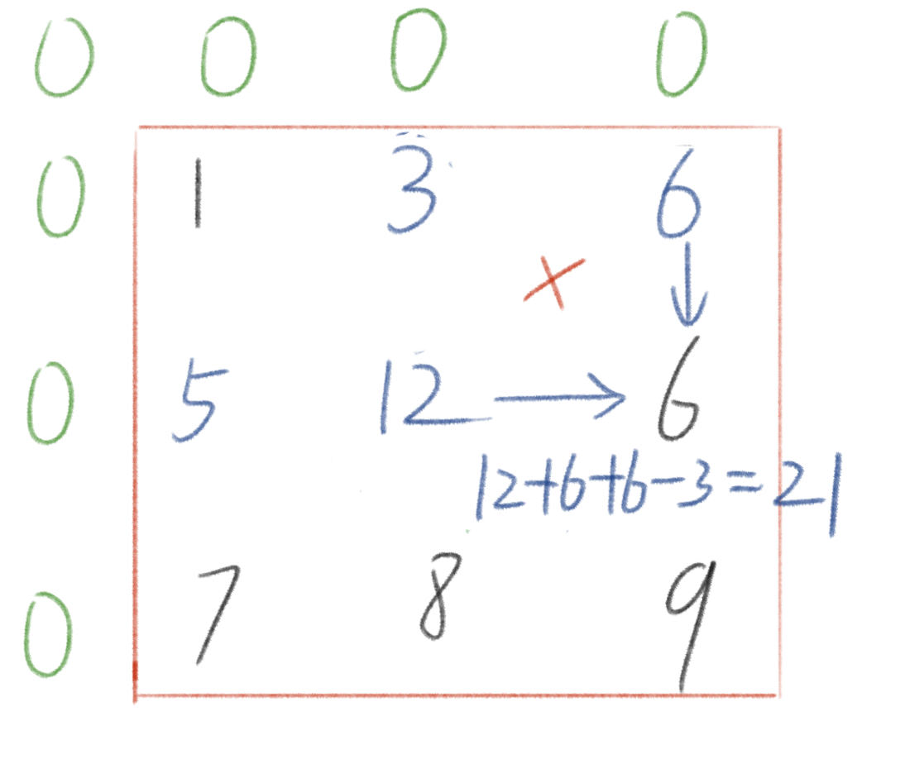

根据上面的图可以得出，边上 [0,0]范围的元素不论加还是减去都不会影响（毕竟都是0），而在边内的元素必须要减去对角线，

因此可以得到这样的一条公式：

$$
pre[i][j] = pre[i-1][j] + pre[i][j-1] + arr[i][j] - pre[i-1][j-1]
$$

$$
(i>=1;j>=1)
$$

代码如下：

```cpp
    int arr[4][4]{  0,0,0,0,
                    0,1,2,3,
                    0,4,5,6,
                    0,7,8,9};
    int pre[4][4];
    fill(pre[0], pre[3]+4, 0);

    for (int i=1; i<4; i++) {
        for (int j=1; j<4; j++) {
            pre[i][j] = pre[i-1][j] + pre[i][j-1] + arr[i][j] - pre[i-1][j-1];

        }
    }
```

他的算法时间复杂度是：

$$
O({m} \times {n})
$$

m为行，n为列；

和一维一样，二维前缀和的目的也是得到一块区间的和，但是这个区间的和从一维的  left ~ right，又添加了高度这个变量，

即为  (left, top) ~ (right, bottom) 注意top<=bottom，从左上角到右下角这个范围的累计和，比如说我想得到这段区间([2][2] ~ [3][3])的累计和：

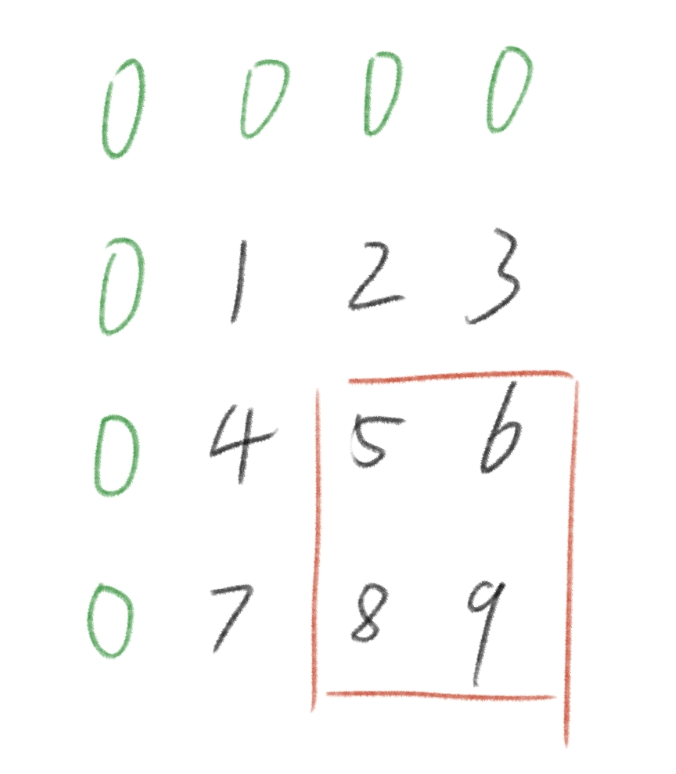

看图可以知道，要求的是 {5,6,8,9} 这个区间的对应累计和，而在前缀和中最角落的位置，是整个数组的累计和，也就是囊括了{1,2,3,4,5,6,7,8,9} 这个数组中所有的数字：

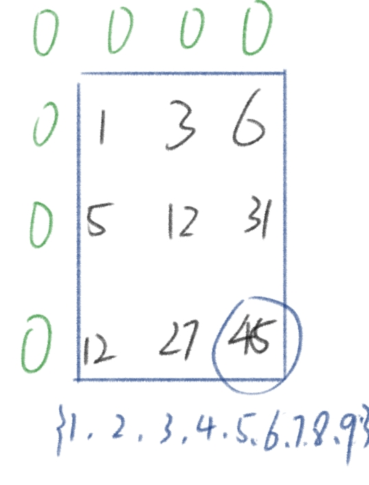

也就是说，要想得到该范围就要减去 { 1,2,3,4,7} 这一块累计的区间：

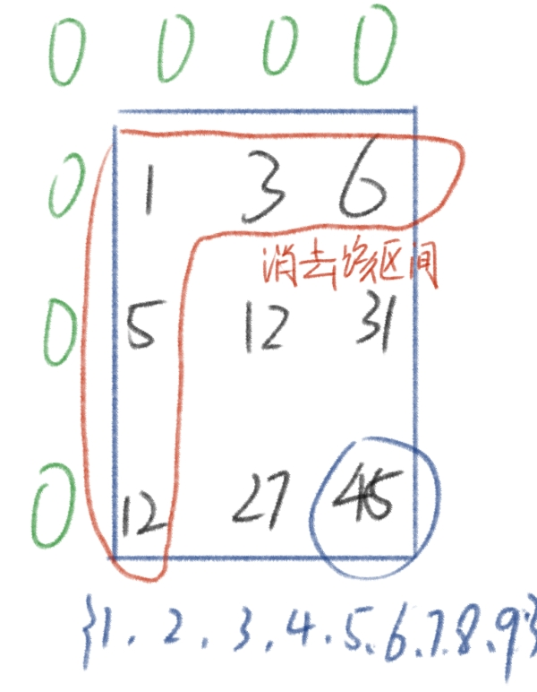

这一块区间很好得到，就是 pre[1][3] + pre[3][1] - pre[1][1]，问题又来了为什么要减去呢？

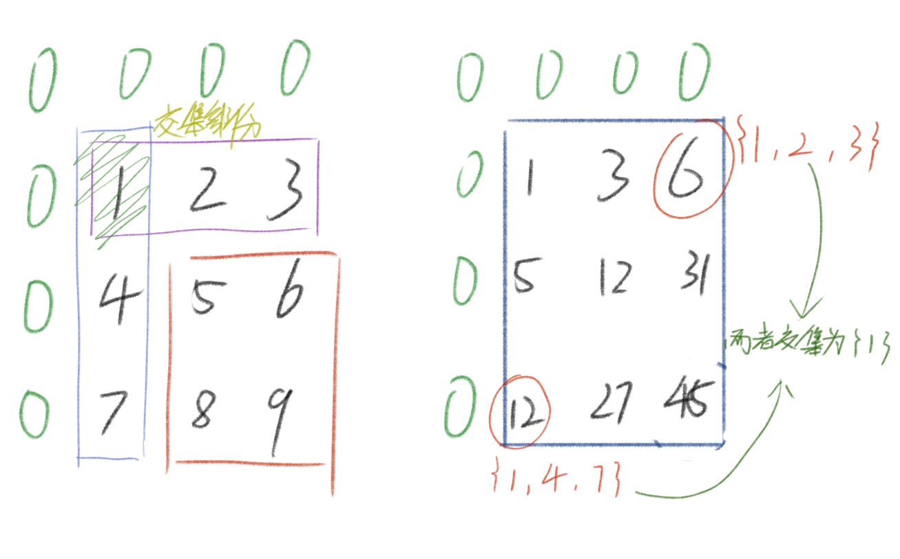

在计算前缀和的时候，这两块区间都共同计算到了 1，因此两者的交集部分是 { 1 }，重复了，因而要减去 pre[1][1]；

可以推出，这个区间的计算公式为

$$
sum[(left,top),(right, bottom)] = pre[bottom][right] - (pre[bottom][left-1] + pre[top-1][right]-pre[top-1][left-1] )
$$

$$
其中(bottom>=top) and (right >= left)
$$

代码如下：

```cpp
int getsum(int x1, int y1, int x2, int y2) {
    return pre[y2][x2] - (pre[y2][x1-1] + pre[y1-1][x2] - pre[y1-1][x1-1]);
}
```


## 差分


### 一维差分

开头就说了，差分就是前缀和的逆运算，比如上面的一维前缀和中，将pre[i] - pre[i-1]，得到的值就是arr[i]；

也就是说差分和前缀和是相对的

对于上图，pre数组是arr的前缀和，而相对的，arr数组是pre数组的差分数组；

对于计算一个差分数组刚刚已经给出公式来了：

$$
bac[i] = bac[i] - bac[i-1]
$$

$$
(i>=1)
$$

代码如下：

```cpp
    int arr[6] = {1,3,6,10,15,21};
    int bac[6];
    bac[0] = arr[0];

    for (int i=1; i<6; i++) {
        bac[i] = arr[i]-arr[i-1];
    }
    //bac = {1,2,3,4,5,6}
```

通过求前缀和的方法将得到的差分数组逆回去就可以得到原来的数组。

但是差分数组能拿来干什么呢？作用是它可以对数组中一段区间内的值进行修改，比如我想要修改原数组，下标 1 到 4 的数全都

加上一个 c，也就是 { 3+c, 6+c, 10+c, 15+c }；

可以将 bac[1]+c，将bac[5]-c；

因为逆回去，将差分求前缀和会得到原来的数组，但是现在差分数组的[1]上多加了一个C，

那么将它逆向回去的时候，前缀和数组中下标大于等于1的数都会再加上一个 c：

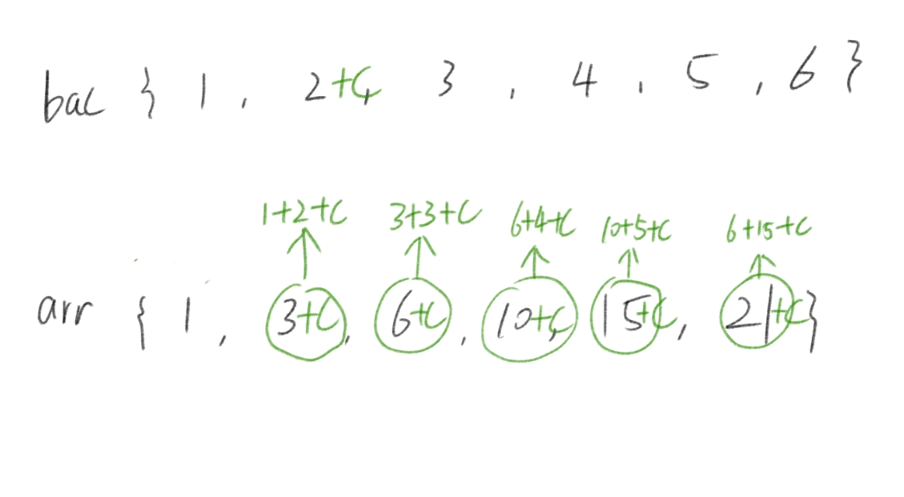

这样 [1,—]这个区间所有的数全都加上了c，但是我们这个区间是有范围的，它最多到下标4，因此为了防止他加上 c，

要在 4+1 下标位置上的数减去c：

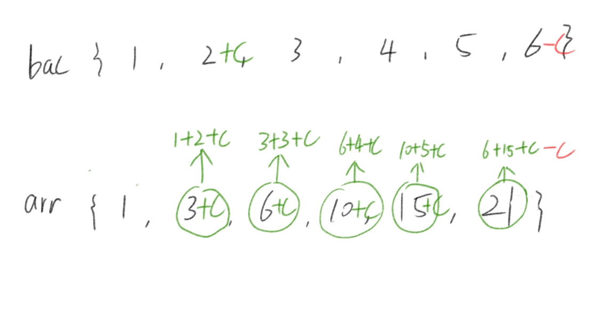

这样就对 [1,4] 这块区间内的值都加上了c，对于修改区间可以得到这样一条式子：
