# 并查集

并查集是一种树形的结构，通过一个 'f' 数组来存储每个节点对应的父节点，作用就是判断节点在不在区间

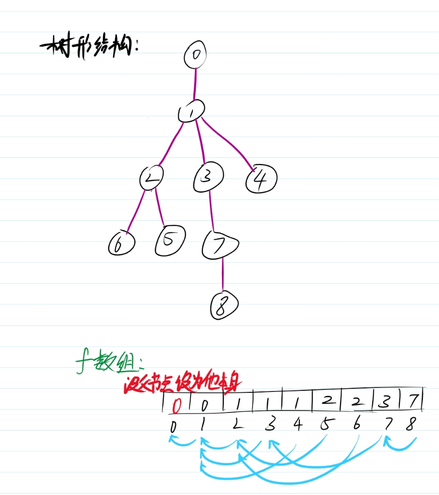

通过这个f数组就能够找到任意个节点对应上去的祖先节点 ，比如8；

通过这个数组就能够不断的往上递推直到   f[x] == x  （这个时候代表找到了这个祖先节点），8-->7-->3-->1-->0

从而来证明这个这个节点在哪个区间里

再存储一个无环图来解释清楚

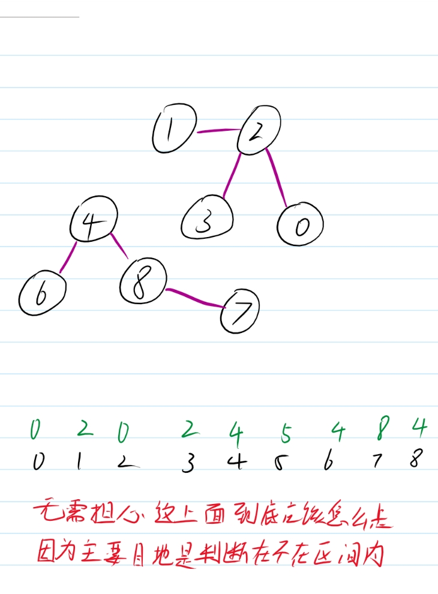

在这个图比如我要查找节点7所在的区间 f[7] = 8  -->  f[8] = 4  -->  f[4] = 4 所在区间就是以4为祖先节点的区间

再查找1节点, f[1] = 2  -->  f[2] = 0  --> f[0] = 0  1在以0为祖先的区间内

对应的查找代码就是这样：时间复杂度是 O(n)

```cpp
    int find(int i) {
        return f[i] == i ? f[i] : find(f[i]);
    }
```

既然能够查询区间，那自然就能够合并区间

要怎么合并呢？还是继续用这个图来进行操作：

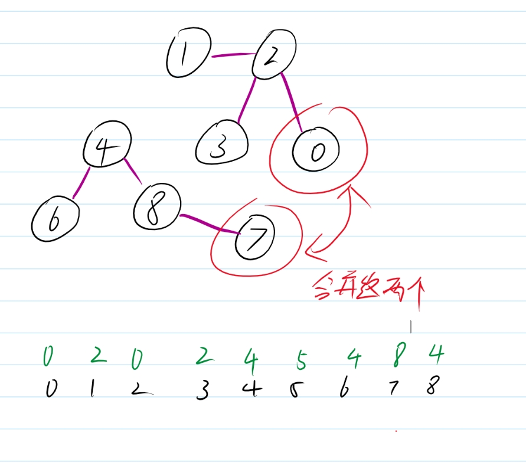

找到两个节点对应的祖先

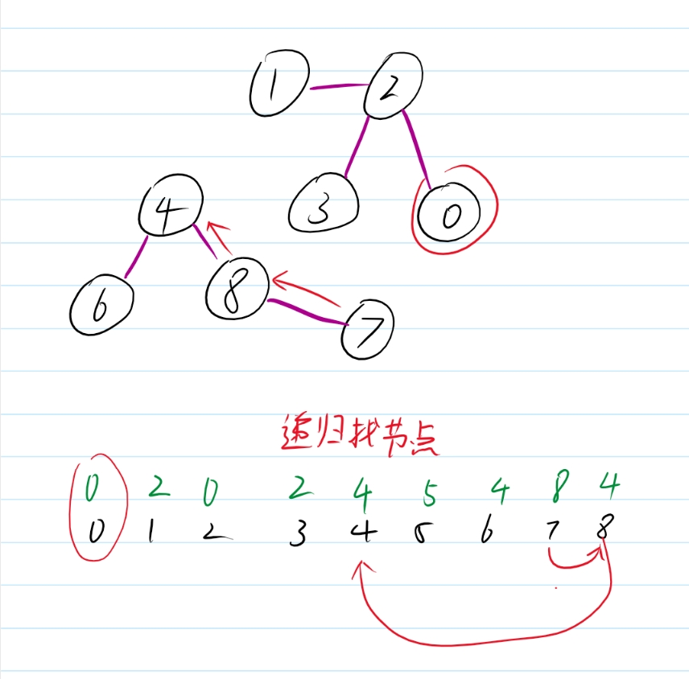

修改父节点

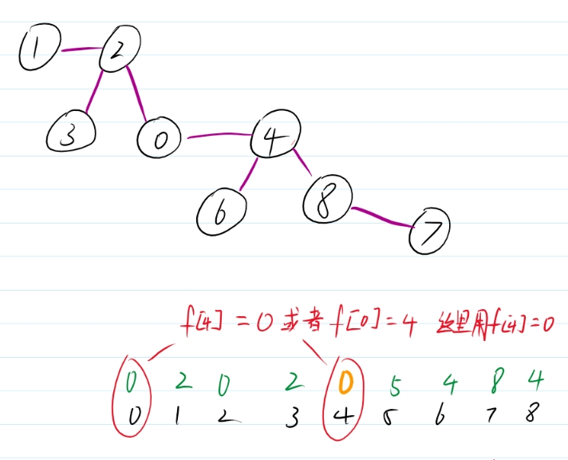

来看看对应的代码：时间复杂度是O(n)

```cpp
    void uniontree(int a, int b) {
        int fa = find(a);
        int fb = find(b);
        if (fa == fb) return;
        f[fa] = f[fb];
     }
```

这里还能够进行优化，先继续往下看。

并查集其实就是对图和树这种类型在不在某一区间的存储形式；

那么我现在有一个图，我应该如何将这个图的区间用并查集表示出来呢？

这里uniontree就发挥作用了

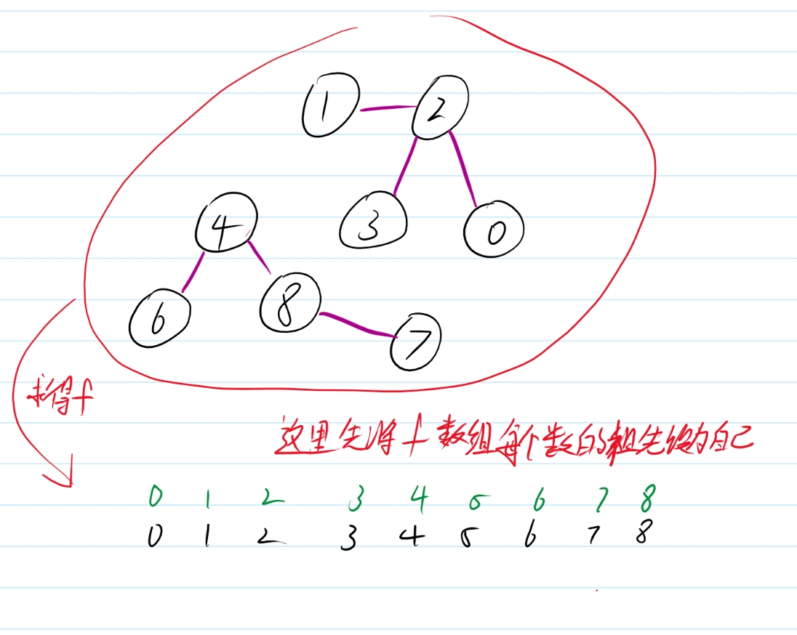

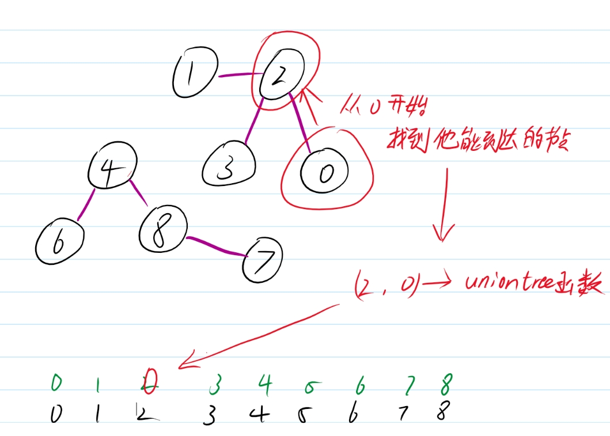

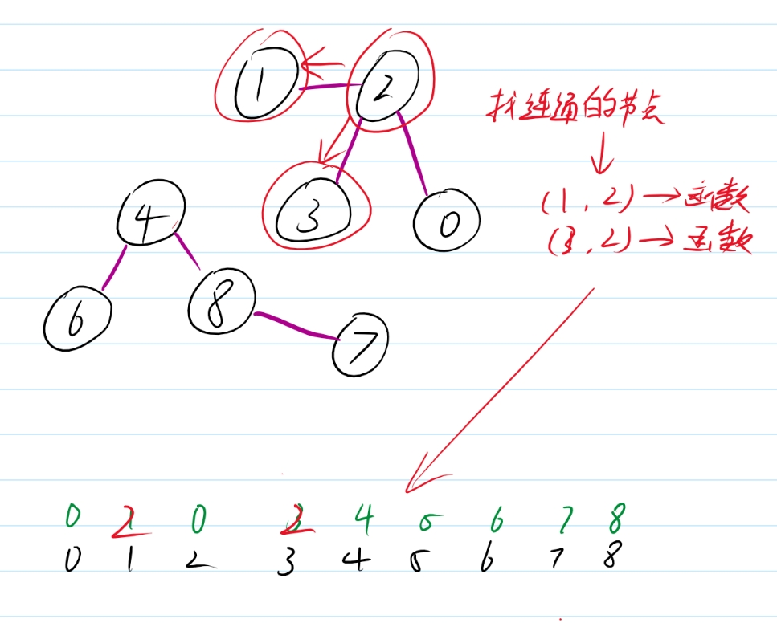

.......................

其余的节点也是如此操作最后得到整一个并查集数组，具体代码如下：

```cpp
        for (auto path : all) {    // all是一个邻接图，矩阵邻接图也一样
            from = path[0], to = path[1];
            if (ds.find(from) == ds.find(to)) continue;    //如果两者已经在这个区间内，则跳过
            ds.uniontree(to, from);
        }
```

这样子操作会很慢；因为uniontree中每次合并都会进行一次查找操作，

因此我们首先对find函数进行优化操作，实现路径压缩，让节点到祖先的路径更的短

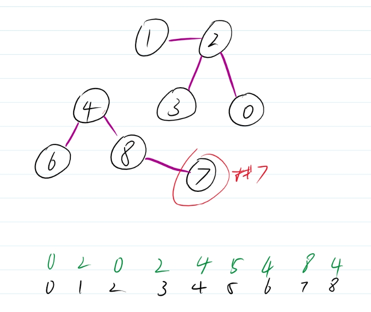

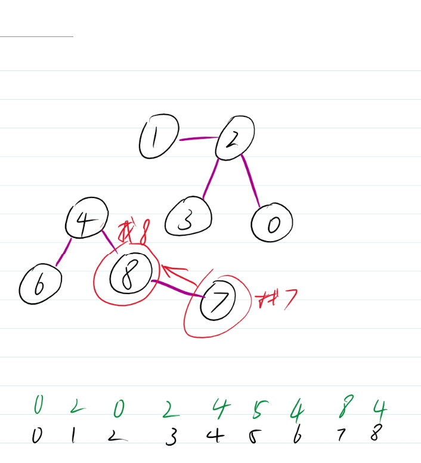

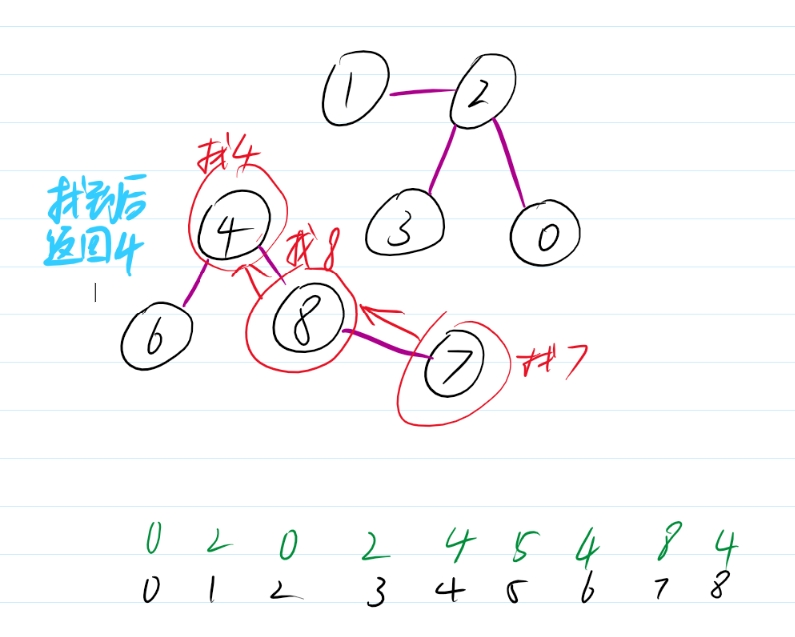

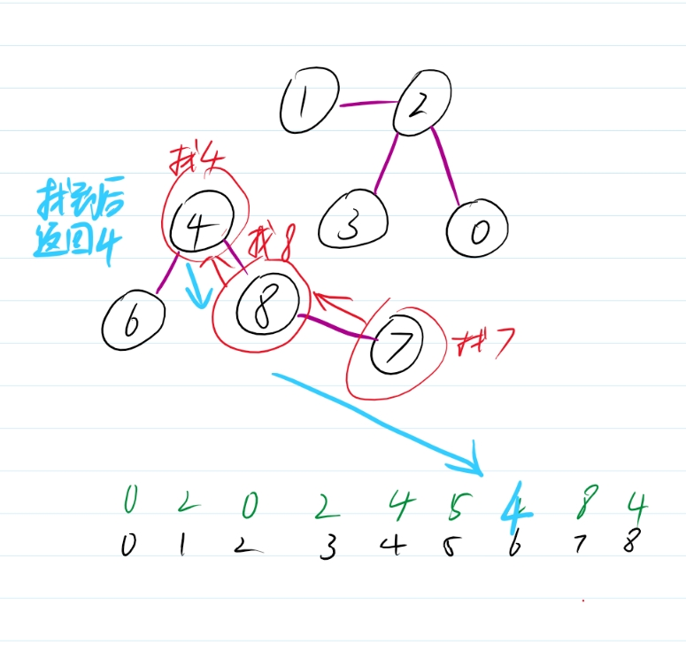

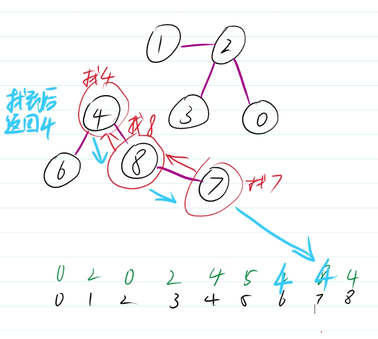

这样优化下次查询7的时候就可以很快就能知道7属于哪个节点为祖先的区间

具体代码如下：

```cpp
     int find(int i) {
        return f[i] == i ? i : (f[i] = find(f[i]));
    }
```

接着再来优化优化下合并区间，和上面思想一样，保证路最短，所以可以再加一个 深度 数组，记录每个节点的深度（初始为1），当两个节点进行合并的时候判断一下区间的深度哪个更小，将更小的指向深度更大的

直接来看代码：

```cpp
void uniontree(int a, int b) {
        int fa = find(a);
        int fb = find(b);
        if (fa == fb) return;

        if (h[fa] < h[fb]) {
            f[fa] = fb;
        }
        else {
            f[fb] = fa;
            if (h[fa] == h[fb]) h[fa]++;
        }
    }
```

要注意的是深度一致时，要对区间祖先的深度进行加1

来看看完整的并查集类的设计：

```cpp
class dsu {
public:
    dsu(int _size) {
        size = _size+1;
        f.resize(size);
        h.resize(size, 0);
        int i = 0;
        for (auto& x : f) {
            x = i++;
        }
    }

    ~dsu() {}

    int find(int i) {
        return f[i] == i ? i : (f[i] = find(f[i]));
    }

    void uniontree(int a, int b) {
        int fa = find(a);
        int fb = find(b);
        if (fa == fb) return;

        if (h[fa] < h[fb]) {
            f[fa] = fb;
        }
        else {
            f[fb] = fa;
            if (h[fa] == h[fb]) h[fa]++;
        }
    }
private:
    vector<int> f{};
    vector<int> h{};
    int size{0};
};
```
