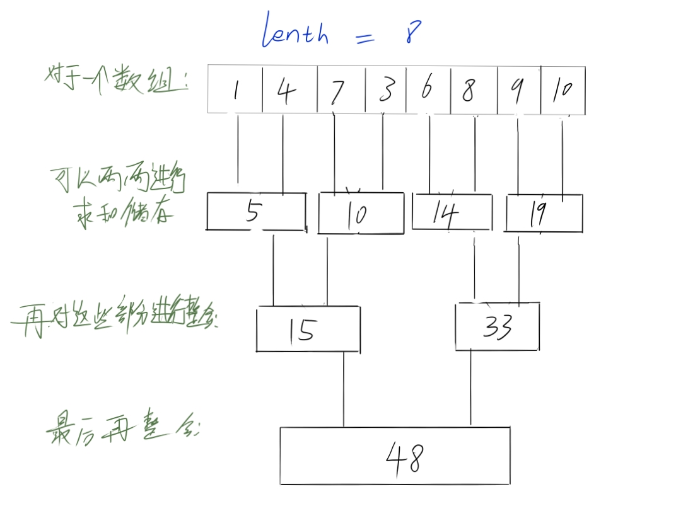
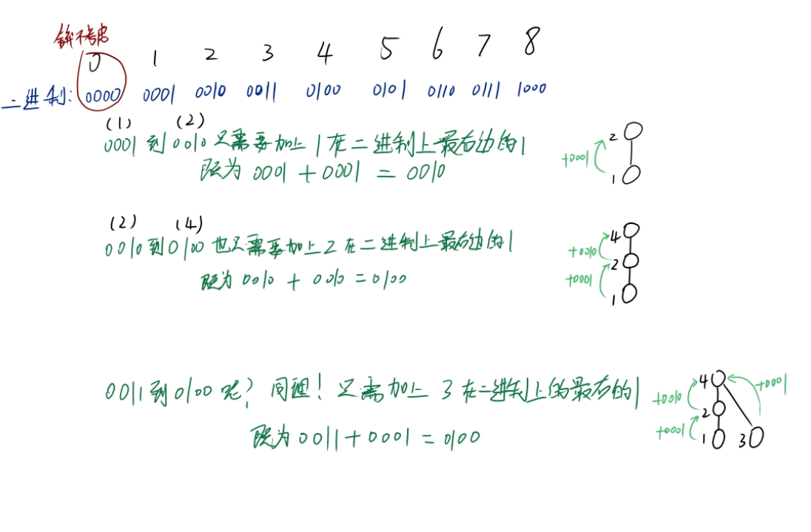
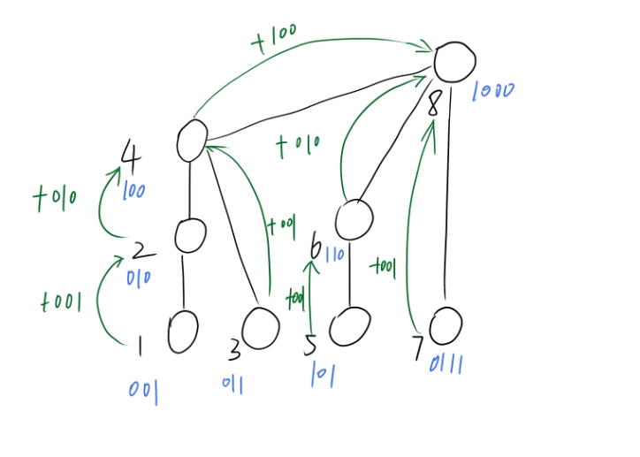
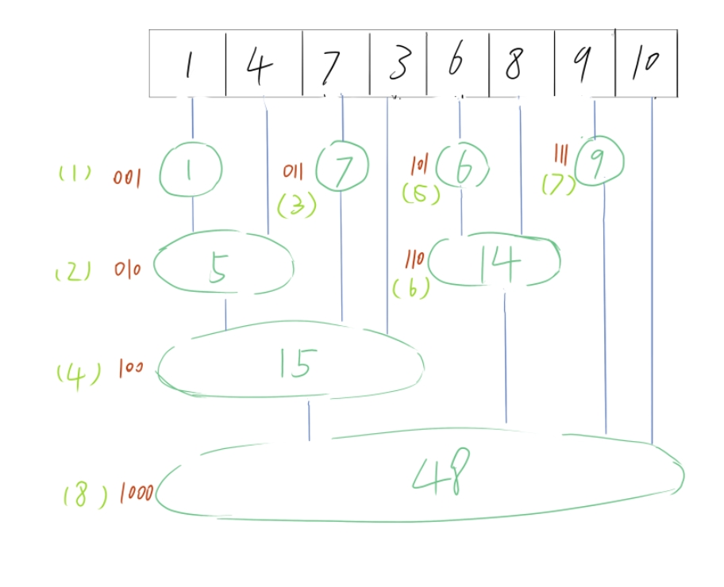
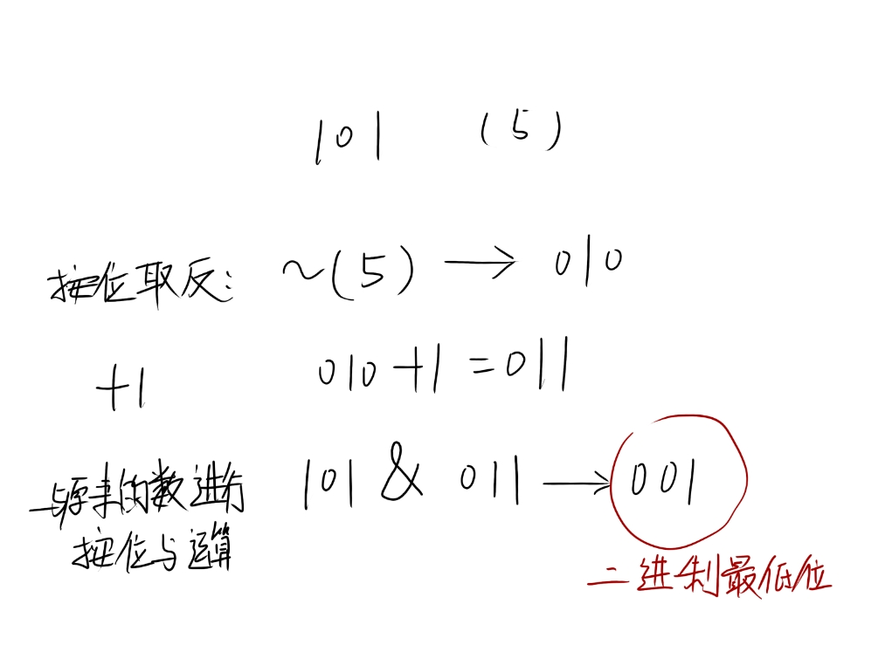
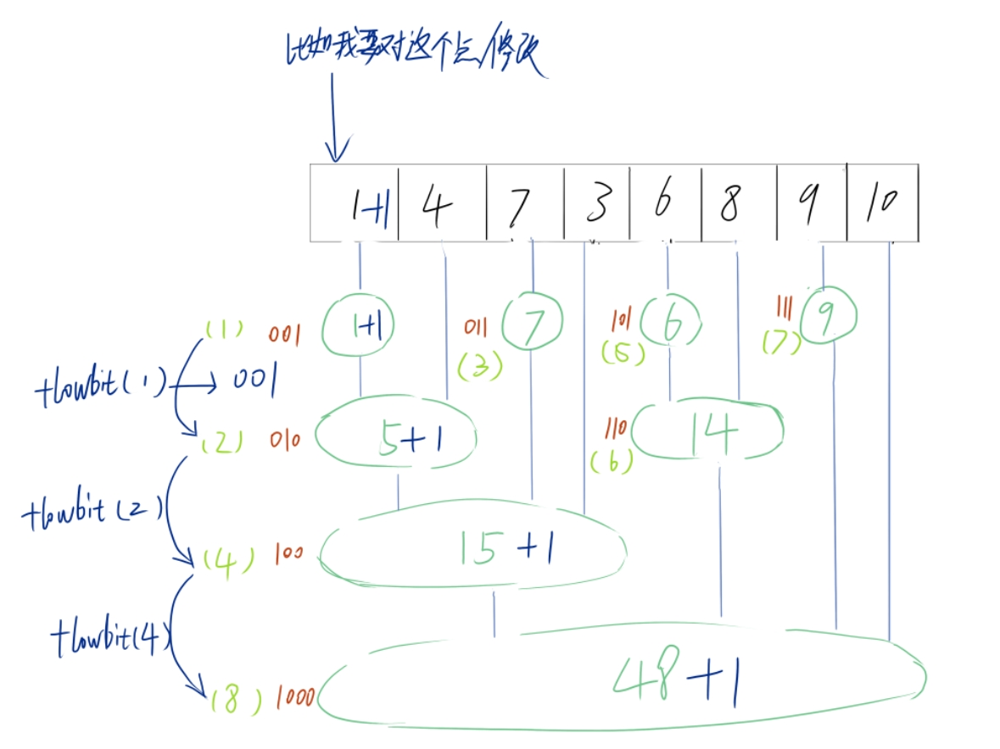
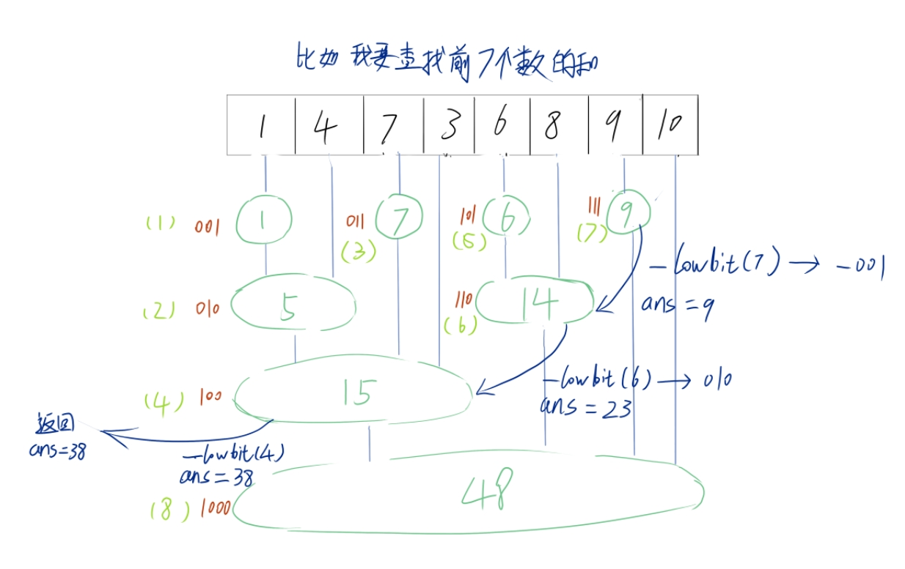

# 树状数组

## 使用原因和原理

对于区间上的问题，（单点修改、单点查询；区间修改、单点查询；区间查询、区间修改 ）

可以使用更简单的树状数组来实现这些，而不是使用复杂的线段二叉树

（当然线段二叉树能解决的树状数组不一定能解决，但是树状数组能解决的线段二叉树一定能解决，）

先来看看图：



两两的对和进行叠加，这样就组成了一个线段树，每一段区间都可以细分下去；

但是这样并不够简化；而且计算的时候也比较难写，因此需要对这个树简化为一个数组，而且是一个长度为8+1的数组

那应该怎么优化呢？

不妨先来看看他们的下标：



对于奇数的下标，只要加上 二进制中最右边的位置（即为最低位） 就可以得到他的下一个  i+1 偶数下标；

对于偶数的下标，同样的加上  二进制中最右边的位置  （即为最低位）就可以得到他  2 * i  的下标；(2 -> 4 ->8->....)

因而可以得到一个这样的关系：



每一个下标存储的区间根据这个下标的最低位来决定； 比如 6  （110） 他的最低位就是  010 --->  2； 所以存储原来的数组中两个数的和；那么依次类推，再根据原来的数组就可以组成一个新的数组，这就是树状数组：



现在知道了只要得到这个下标的最低位的1就能够创建一个树状数组，现在问题就是怎样才能得到他的最低位置呢？


## 代码实现

看下图：



将原来的数   取反 + 1   再和原来的数进行按位与运算，最后算出的数就是原数二进制中的最低位置；对于取反再加1 其实就是 取原数的负数

用代码来表示就是这样：

```cpp
    inline int lowbit(int x) {
        return x & (-x);
    }
```

他能够像线段树一样做到一些简单的操作，比如单点修改：



单点添加，对应区间内的值也要添加，代码可以这样写：

```cpp
void add(int p, int num) {
        for (int pos = p; pos < n; pos += lowbit(pos)) {
            Arr[pos] += num;
        }
    }
```

前缀和查询：



通过减去下标的最低位置，往后找下标，并且把下标对应的数给添加到ans 中 当下标为0时，返回ans，代码如下：

```cpp
int count(int p) {
        int res = 0;
        for (int pos = p; pos; pos -= lowbit(pos)) {
            res += Arr[pos];
        }
        return res;
    }
```

通过前缀和的查询可以做到很多有趣的操作；


单点查询：

```cpp
    int find(int p) {
        return count(p) - count(p-1);
    }
```

得到前p个的前缀和，和前p-1个的前缀和，然后前p个的前缀和减去前p-1个的前缀和，就能找到  原数组 p下标中对应单一的数；


区间查询：（左开右闭写法）

```cpp
    int find_range(int l, int r) {
        if (l>r) swap(l,r);
        return count(r) - count(l);
    }
```

同样的通过前缀和的相减也可以求得一个范围内的和，原理同上，唯一要注意的就只有区间，这里写的是左开右闭的写法，因此对于  l 的部分他不会添加到，如果要完全闭合区间，只要减去  count(l-1) 即可， （不过任然需要注意范围）


至此已经全部完成(其实还差个区间修改，但其实原理差不多)；来看看完整的源代码是怎么样子的：

```cpp
class TreeArray {
public:
    TreeArray(int _n): n{_n+1} { Arr.resize(n, 0);};

    ~TreeArray() {};

    void add(int p, int num) {
        for (int pos = p; pos < n; pos += lowbit(pos)) {
            Arr[pos] += num;
        }
    }

    int count(int p) {
        int res = 0;
        for (int pos = p; pos; pos -= lowbit(pos)) {
            res += Arr[pos];
        }
        return res;
    }

    int find_range(int l, int r) {
        if (l>r) swap(l,r);
        return count(r) - count(l);
    }

    int find(int p) {
        return count(p) - count(p-1);
    }
private:
    inline int lowbit(int x) {
        return x & (-x);
    }
private:
    vector<int> Arr{};
    int n{0};
};
```
