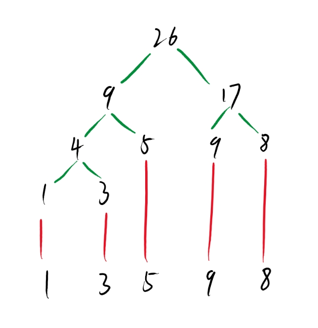
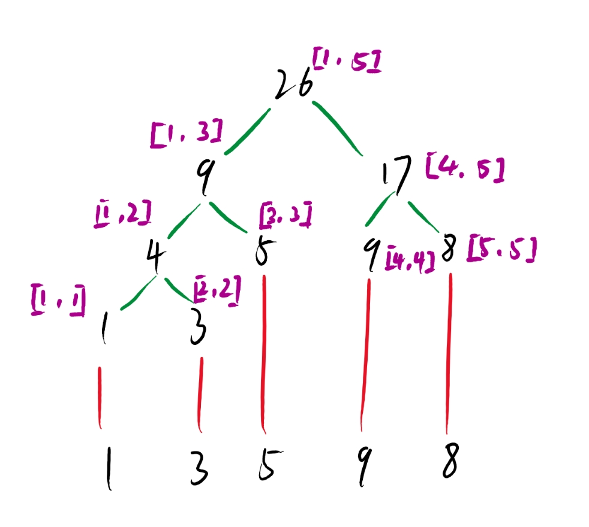
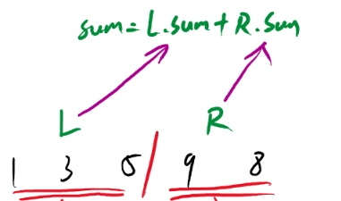
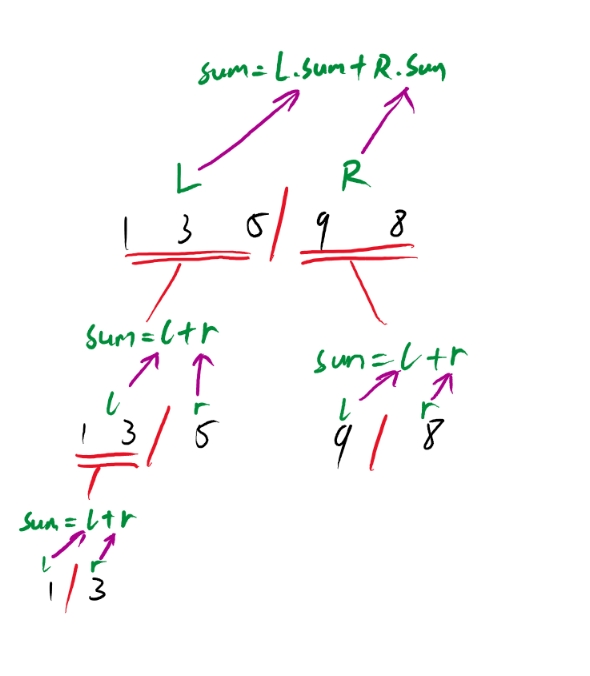
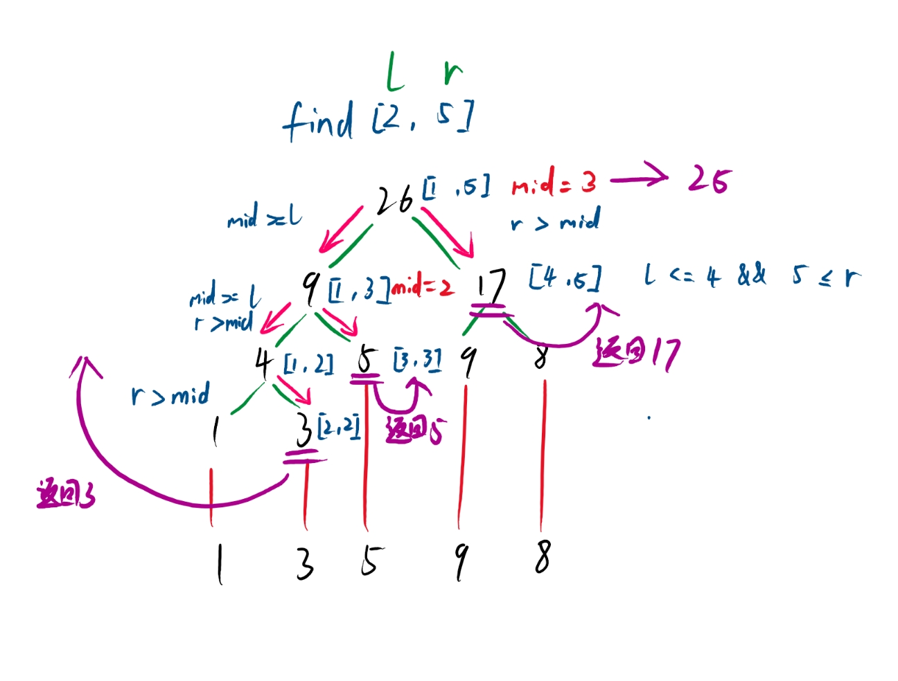
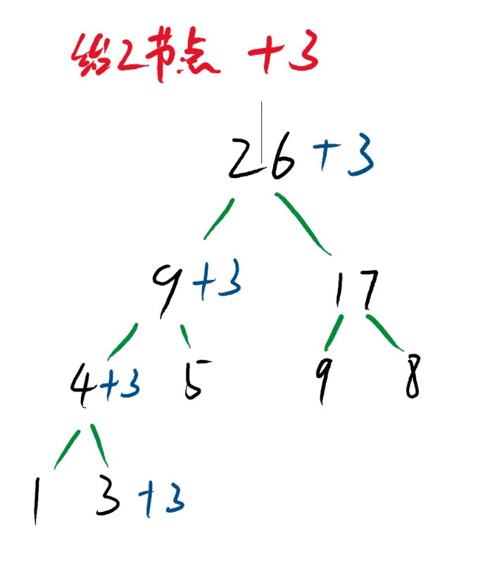
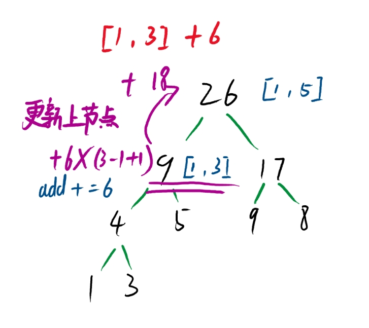
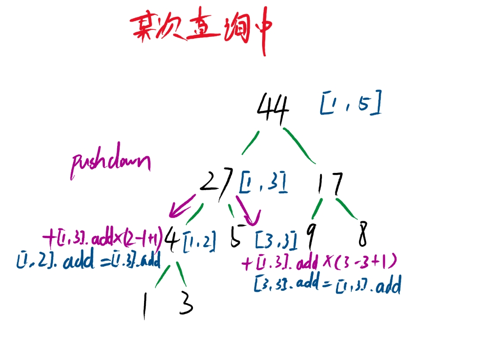

# 线段树

线段树是一种维护一段区间和的数据结构；例如数组{1, 3,  5, 9, 8}，他线段树的样子是这样的：



每个节点都对应着一个区间，其中节点区间为[l, r]，当 l == r 时，该节点为叶子节点（即该节点不能往下再分）



所以，对于每个节点的结构应该存放 sum计数值，节点的范围 l, r；如下所示：

```cpp
struct Node {
  int l, r, sum;
}Ts[N<<2]; //节点的数组，要开原数组最大范围的4倍，4倍是一个经验值
```

那么怎么通过这整个数组去求出整一颗树呢？

其实原理很简单，就是对数组进行二分，分为左右两部分，左部分的和 加上 右部分的和 就是这一整个区间的和，



然后再分别对左区间和右区间进行二分，直到不能二分为止：



根据上图不难知道，这是一个递归的过程，去自底而上的去建树。

每次递归中去二分区间往下求取最小区间，再将所有的区间合并，代码如下：

```cpp
        void bulid(int p, int l, int r) { //p一般传入根节点，即1号
            Ts[p] = {l, r, W[l]};
            if (l == r) return;           //当l == r的时候就退出递归
            int mid = l + r >> 1;         //二分区间
            bulid(Lmove(p), l, mid);      //枚举左区间，计算该节点的左节点
            bulid(Rmove(p), mid+1, r);    //枚举右区间，计算该节点的右节点
            Ts[p].sum = Ts[Lmove(p)].sum + Ts[Rmove(p)].sum;  //计算整个区间的值
        };
```

这样就成功的建立了一颗线段树。不难看出创建的时间复杂度是O(logN)（时间复杂度主要是二分带来的）

那么接下来就是在这个线段树上的所有操作的实现：

## 区间和查询

比如这棵树，我要找区间[2, 5]（L=2, R=5）的累计和，那就要找到包含在[2,5]这个区间的节点，任然是去计算遍历到节点的区间的中间值，

如果L<=区间的中间值，则证明这个区间的左边界大于了L，要往更小的部分去查找，

R>区间的中间值，则证明这个区间的右边界小于了R，要往右边更大的部分去枚举，

直到找到的区间包含在[L,R]内，将这个包含的区间累计值返回累加。如图所示：



这里面区间[2, 2]，[3, 3]和[4, 5]是包含在要查询的区间和[2, 5]里面的，返回他们的sum值并且累加，则[2, 5]区间的累计和为25。

具体代码如下：

```cpp
    //区间和查询
    int query(int p, int x, int y) {
            if (x <= Ts[p].l && Ts[p].r <= y) return Ts[p].sum;//区间包含在[x, y]里时，直接返回该sum
            int mid = Ts[p].l + Ts[p].r >> 1;
            int sum = 0;
            if (x <= mid) sum += query(Lmove(p), x, y);  //左区间范围大了，往更小的走
            if (y > mid) sum += query(Rmove(p), x, y);   //有区间的范围小了，往更大的走
            return sum;
    }
```

他的算法时间复杂度任然是O(logN)

## 单点修改

一样去找该节点区间的中间值，如果要修改的节点标号大于中间值就往右走，否则往左走，

直到找到的区间 l == r == 修改节点的标号，就证明成功的找到了这个节点，将其修改增减。然后再往上将包括这个节点的区间和给重新计算一遍，这个往上计算的操作叫做pushup操作，整体代码如下：



```cpp
     //修改后上推
    inline void pushup(int p) {
        Ts[p].sum =  Ts[Lmove(p)].sum + Ts[Rmove(p)].sum;
    }

    //单点修改
    void Point_update(int p, int x, int k) {
            if (Ts[p].l == x && Ts[p].r == x) { //找到该点，进行单点修改然后返回
                Ts[p].sum += k;
                return;
            }
            int mid = Ts[p].l + Ts[p].r >> 1;
            //判断下修改点相比之下是更小了还是更大了
            x<=mid ? Point_update(Lmove(p),x , k) : Point_update(Rmove(p), x, k); 
            pushup(p);
    }
```

## 区间修改

区间修改有一点特殊，找到包含到的区间节点，直接对其进行修改即可，但是再往下的子节点暂时不修改，先记录了下来，相当于给他的子节点记上账，

只有当下次修改或者查找区间和的时候，如果包括到他的子节点，就将他之前没修改的节点给修改，这个过程叫做pushdown，

同时为了记录要修改的值，结构体新增一个懒标记，用来记录节点添加了多少个数。

```cpp
    struct Node {
        //区间大小，计数值， 记账的懒标记
        int l, r, sum, add;
    };
```



找到了包含的区间，对该区间节点+6 * (R-L+1) 即加上的数乘以区间的长度，然后节点的add += 6，给下面的节点记上帐先，下次去遍历到该节点时就pushdown往下更新节点：



其子节点继承[1, 3]节点的add信息，然后和上面一样，节点添加上add*(R-L+1)，最后将[1, 3]节点的add记为空，代表已经还账了，子节点再记录下他给自己的子节点欠下的帐，以此类推来保证时间复杂度不会高。

具体代码如下：

```cpp
    //修改后下推
    inline void pushdow (int p) {
        if (Ts[p].add) {
            Ts[Lmove(p)].sum += Ts[p].add*(Ts[Lmove(p)].r - Ts[Lmove(p)].l+1);
            Ts[Rmove(p)].sum += Ts[p].add*(Ts[Rmove(p)].r - Ts[Lmove(p)].l+1);
            Ts[Lmove(p)].add += Ts[p].add;
            Ts[Rmove(p)].add += Ts[p].add;
            Ts[p].add = 0;
        }
    }

    //区间修改
    void update(int p, int x,int y, int k) {
        //每次更新区间时，将自身的懒标记取出，修改下面的子区间
        pushdow(p);
        if (x <= Ts[p].l && Ts[p].r <= y) {
            Ts[p].sum += (Ts[p].r - Ts[p].l+1)*k; // sum加上 (区间长度*添加值)
            Ts[p].add += k;                       // 为子节点记上账
            return;
        }
        int mid = Ts[p].l + Ts[p].r >> 1;
        if (x <= mid) update(Lmove(p), x, y, k);
        if (y > mid) update(Rmove(p), x, y, k);
        pushup(p);                                //往上修改区间值
    }
```

这样整个线段数的基础功能就实现好了，来看看他面向对象的实现模板：

```cpp
#include <bits/stdc++.h>

using namespace std;

const int  N = 1e6+10;

int W[N];
//线段树
class SegmentTree {
    struct Node {
        //区间大小，计数值， 记账的懒标记
        int l, r, sum, add;
    };
public:
    //build构建，递归的去将整个树构建出来
    SegmentTree(int size) {
        Ts.resize(4*size+1);
        function<void (int, int, int )> bulid = [&] (int p, int l, int r) {
            Ts[p] = {l, r, W[l]};
            if (l == r) return;
            int mid = l + r >> 1;
            bulid(Lmove(p), l, mid);
            bulid(Rmove(p), mid+1, r);
            Ts[p].sum = Ts[Lmove(p)].sum + Ts[Rmove(p)].sum;
        };
        bulid(1, 1, size);
    }

    ~SegmentTree() {

    }
    //单点修改
    void Point_update(int p, int x, int k) {
            if (Ts[p].l == x && Ts[p].r == x) {
                Ts[p].sum += k;
                return;
            }
            int mid = Ts[p].l + Ts[p].r >> 1;
            x<=mid ? Point_update(Lmove(p),x , k) : Point_update(Rmove(p), x, k);
            pushup(p);
    }
    //区间和查询
    int query(int p, int x, int y) {
            pushdow(p);
            if (x <= Ts[p].l && Ts[p].r <= y) return Ts[p].sum;
            int mid = Ts[p].l + Ts[p].r >> 1;
            int sum = 0;
            if (x <= mid) sum += query(Lmove(p), x, y);
            if (y > mid) sum += query(Rmove(p), x, y);
            return sum;
    }
    //区间修改
    void update(int p, int x,int y, int k) {
        pushdow(p);
        if (x <= Ts[p].l && Ts[p].r <= y) {
            Ts[p].sum += (Ts[p].r - Ts[p].l+1)*k;
            Ts[p].add += k;
            return;
        }
        int mid = Ts[p].l + Ts[p].r >> 1;
        //每次更新区间时，将自身的懒标记取出，修改之前的区间
        if (x <= mid) update(Lmove(p), x, y, k);
        if (y > mid) update(Rmove(p), x, y, k);
        pushup(p);
    }

    void printTree() {
        for (auto x : Ts) cout<<x.sum<<" ";
    }
private:
    //修改后上推
    inline void pushup(int p) {
        Ts[p].sum =  Ts[Lmove(p)].sum + Ts[Rmove(p)].sum;
    }
    //修改后下推
    inline void pushdow (int p) {
        if (Ts[p].add) {
            Ts[Lmove(p)].sum += Ts[p].add*(Ts[Lmove(p)].r - Ts[Lmove(p)].l+1);
            Ts[Rmove(p)].sum += Ts[p].add*(Ts[Rmove(p)].r - Ts[Lmove(p)].l+1);
            Ts[Lmove(p)].add += Ts[p].add;
            Ts[Rmove(p)].add += Ts[p].add;
            Ts[p].add = 0;
        }
    }
    //左移动
    inline int Lmove(int x) {
        return x<<1;
    }
    //右移动
    inline int Rmove(int x) {
        return x<<1|1;
    }
    //父节点
    inline int Fpar(int x) {
        return x>>1;
    }
private:
    vector<Node> Ts;
};
```
