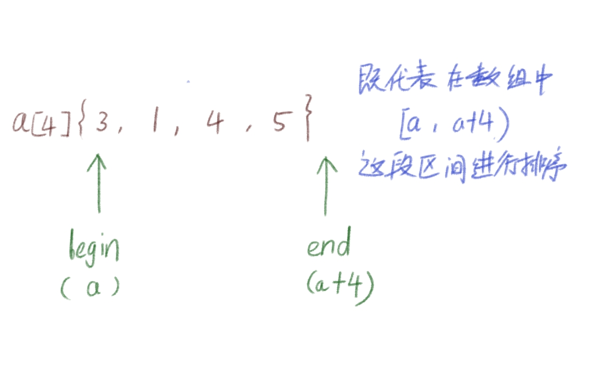

# STL库的运用

stl库是在C++中一个很重要的官方库，会用STL库，就能够很大程度上减少去设计一些基础的算法模块。比如快排，哈希表，都能够直接调用，不用自己再设计。

因此，学会使用stl库可以在竞赛中事半功倍，更好的利用写题的时间。

## CPP的标准输入输出

相信大家对这个头文件应该都熟悉的：

```cpp
#include <iostream>
using namespace std;
```

这个就是stl库专门的输入输出流API

它最主要的两个函数相信大家也不陌生：

```cpp
cin>>   //输入流
cout<<  //输出流
```

```cpp
int a;
cin>>a;
cout<<a;
```

就是一个简单，但是相比于C又更加方便的输入输出；

但是，他的效率比C的输入输出要更慢，这是因为这个C++输入输出流是和C的输入输出流是链接的，因此要使用的这个输如输出流，一定要在main函数记得将同步串联给关闭，代码如下：

```cpp
#include <iostream>
using namespace std;

int main() {
    ios::sync_with_stdio(0);
    cin.tie(0);cout.tie(0);
}
```

这样速度就和C的差不多了，同时记住，不要用endl，尽量用" \n "

```cpp
cout<<endl;             //达咩哟 🚫
cout<<"\n"              //用这个 √
```

## STL常用算法模板

以下的标准算法都在 algorithm 库中：

```cpp
#include <algorithm>
```

---

### std::sort() 快速排序

快排的平均时间复杂度是:

$$
O(nlogN)
$$

一种比较快的排序（不要再傻傻的写冒泡了）

```cpp
    int a[4] = {3,1,4,5};
    sort(a, a+4);
    // a = {1, 3, 4, 5}
```

sort需要传入数组的两个指针，begin 到 end   表示对数组的这段区间进行排序，



### std::stable_sort() 归并排序

和快排一样的时间复杂度，但是更为稳定，缺点是开辟更多空间。在某些情况下需要使用上归并排序

---

### std::reverse() 翻转

和上面的sort()一样，需要传入 begin 和 end 即代表对数组的某一个区间进行翻转:

```cpp
    int a[5] = {1,2,4,5,6};
    reverse(a+1, a+4);
    // a[5] = {1,5,4,2,6}
```

---

### std::lower_bound() / std::upper_bound() 二分查找

如果对二分查找不太了解的可以先看看我在Github上的 [二分策略]([-/算法竞赛/二分策略.md at main · SmallALb/- (github.com)](https://github.com/SmallALb/-/blob/main/%E7%AE%97%E6%B3%95%E7%AB%9E%E8%B5%9B/%E4%BA%8C%E5%88%86%E7%AD%96%E7%95%A5.md))

一共传入三个值，begin，end 和 要查找的值(val)

lower返回的是大于等于val的迭代器（就是数组某个数的地址位置）；

而upper返回的是大于val的迭代器。

```cpp
    int a[6] = {1,2,3, 4,5,6};

    int* i = lower_bound(a, a+6, 3);
    // 对 i 解引用将会得到 3
  
    int* j = upper_bound(a, a+6, 3);
  
    //对 j 解开引用将会得到4
```

---

### std::max() / std::min() 求最大值 / 求最小值

```cpp
    int a = 0, b = 10;
    int m = max(a, b);
    // m = 10
```

也可以这样求一段数据中的最大值：

```cpp
    int a = 0, b = 10, c= 30, d= 20;
    int m = max({a, b, c, d});
    //m = 30
```

最小值同理。

---

### std::abs() 求一个数的绝对值

对于求绝对值，还有一个基于位运算的更快的办法，感兴趣可以去看看我Ggithub上的 [位运算]([-/算法竞赛/位运算.md at main · SmallALb/- (github.com)](https://github.com/SmallALb/-/blob/main/%E7%AE%97%E6%B3%95%E7%AB%9E%E8%B5%9B/%E4%BD%8D%E8%BF%90%E7%AE%97.md))

```cpp
    int l = -10;
    int k = abs(l);
    // k = 10, l = -10

```

---

### std::__gcd() 求两数的最大公约数

```cpp
    int a = 15, b = 30;
    int k = __gcd(a, b);
    //k = 15
```

同时另外的最小公倍数等于两个整数的积除以最大公约数：

```cpp
int __lcm(int a, int b) {
  return a*b / __gcd(a, b);
}
```

---

### std::swap() 交换两数

```cpp
    int t = 3, l = 4;
    swap(t, l);
    // t=4 l=3
```

---

### std::next_permutation() 全排列

传入两个参数，数组的begin 和 数组的end；

然后对这一段数不断的进行枚举这个数组中这些值的排列

直到没有更多的排列

```cpp
    int a[3] = {1,2,3};
    do {
        cout<<a[0]<<a[1]<<a[2]<<"\n";
    }while(next_permutation(a, a+3));
    //输出为
    //123
    //132
    //213
    //231
    //312
    //321

```

---

## STL的常用容器模板

再讲有几种容器之前，先来了解STL中两个常有的东西

* 迭代器：其实就是这个容器对应的原始地址 用begin()表示容器地址头部end()表示地址容器地址尾部，当然部分容器没有begin()和end()
* 泛型性：每个容器的名字后面都要带有< type > 传入一个类型，表示这是个type类型的容器 比如 int 型的动态数组 vector< int >
* 算法支持：刚才上面的算法，在stl的容器中都可以使用

对于每个容器他们都是单独一个头文件，这样调用起来就十分的繁琐，因此这里使用一个叫做 “万能头的头文件”

```cpp
#include <bits/stdc++.h>
using namespace std;
```

这样就成功的将stl中不论是算法还是容器全都添加了进来

---

### std::vector< type > 动态数组

```cpp
vector<int> nums(10, 0); //代表开辟10个元素，所有元素初始化为0

vector<int> nums2 = {1,2,3,4,5,6}; //当然也可这样初始化变量

nums = nums2; //同时支持拷贝，num的范围从10变成6

cout<<nums.size()<<"\n";  //size = 6;

nums.resize(100,1); //对数组的范围重置，往大的扩原先的值不会删除，往小的缩会删掉原范围相比新范围多出来的值

sort(nums2.begin(), nums2.end()) //同时所有stl封装的算法都能够使用

cout<<nums2[1]<<"\n";//对于原始数组的用法，它都可以使用

cout<<(nums.empty() ? "it is emptied!" : "not emptied!")<<"\n"; 
//通过调用.empty()来判断是否为空,空就true,否则false
```

就是一个数组，但他是动态的，它支持尾部添加，同时可以删除尾部；

```cpp
    vector<int> nums2 = {1,2,3,4,5,6};
    nums2.push_back(10);
    // nums2 = {1,2,3,4,5,6,10};
    nums2.pop_back();
    //删除10
```

也可以插入，和删除

```cpp
    nums2.insert(nums2.begin()+1, 3);
    //num2 = {1, 3, 2, 3, 4, 5, 6, 10}
    nums2.erase(nums2.begin()+1);
    //删除
```

但是注意不要使用它来代替链表，学过数据结构的都知道数组的删除和插入是很耗时的。

最好是在你不确定大小的情况下再使用动态的数组，否则使用静态即可（除非你刷力扣）

对于下面的容器，基本上能调用的东西都差不多，（比如 empty(), size()）

初始化时都可以使用  { }  来初始化里面的元素

---

### std::queue< type > / std::stack< type > / deque< type > 队列 / 栈 / 双端队列

栈与队列不了解的可以先看看这篇 [栈与队列]([-/数据结构笔记/链表/5.栈与队列.md at main · SmallALb/- (github.com)](https://github.com/SmallALb/-/blob/main/%E6%95%B0%E6%8D%AE%E7%BB%93%E6%9E%84%E7%AC%94%E8%AE%B0/%E9%93%BE%E8%A1%A8/5.%E6%A0%88%E4%B8%8E%E9%98%9F%E5%88%97.md#%E6%A0%88%E4%B8%8E%E9%98%9F%E5%88%97))

```
stack<int> S;
S.push(3);          //推入
int k = S.top();    //获取栈顶   k = 3;
S.pop();           //出栈
cout<<(S.empty() ? "it is emptied!" : "not emptied!")<<"\n";
//判断栈是否为空

queue<int> Q;
Q.push(1);
int n = Q.front(); //获取队列的头  n = 1;
Q.pop();            //出列
cout<<(Q.empty() ? "it is emptied!" : "not emptied!")<<"\n";
//判断队列是否为空
```

但是注意！栈和队列是没有迭代器的，也不能使用 { } 初始化里面的元素：

```cpp
S.begin(); S.end();     //だめよ 🚫 没有begin 和 end
Q.begin(); Q.emd();     //だめよ 🚫  没有begin 和 end
```

双端队列就是，头 和 尾 都可以处理：

```cpp
    deque<int> deq;

    deq.push_back(3);
    deq.push_back(12);
    //此时 dep = {3, 12}

    deq.push_front(10);
    deq.push_front(13);
    //此时 deq = {13, 10, 3, 12}

    deq.pop_front();
    //此时 deq = {10, 3, 12}
  
    deq.pop_back();
    //此时 deq = {10, 3}
```

支持头插，尾插，头删，尾删；同时也支持 迭代器:

```cpp
sort(deq.begin(), deq.end());              //合法的！ √
```

但是缺点是，双端特别慢！只有在少数情况会用上，甚至不用，基本上可以用 vector 来代替。

---

### std::list< type > 链表

这个链表是双向的，支持迭代器，和双端队列一样支持头插尾插，同时普通的插入和删除的速度特别快：

```cpp
    list<int> n = {1,3,2,9,8,7};
    n.push_back(3);
    n.push_front(4);
    //n = {4,1,3,2,9,8,7,3}

    n.erase(next(n.begin(), 2)); 
    //因为是链表，元素开辟的空间不是连续的，因此要使用 next(iter, int) 来指定位置
    //上面这个代码是删除指定元素，next(n.begin(), 2)，代表从链的头开始位移两个位置，也就是把 3 给删除
    //此时 n = {4,1,2,9,8,7,3}

    n.insert(next(n.begin(), 2), 3);
    //插入同理，这里又把3插回去

    n.erase(prev(n.end(), 3));
    //因为链表是双向的，所以可以从尾遍历，但是使用prev时注意,它是从链尾开始，包括链尾往后移动3个;
    //这行删掉了 8 
    // n = {4,1,3,2,9,7,3}
  
```

---

### std::pair< key, val> 键值对容器

键值对容器， key 可以为一种 类型， val 也可以为一种类型

```cpp
 pair<int, char> p1 = {1, 'A'}

 cout<<"key:"<<p1.first<<" val:"<<p1.second<<"\n";
//通过.first调用key, 通过.second调用val
```

一般可以联合stl中其他的容器来使用：

```cpp
    list<pair<string, string>> books;
    books.push_back({"114514", "heheh"});
    books.push_back({"1919810", "dildil"});
    books.push_back(make_pair("13111", "ddssf")); //专门建立键值对的函数 make_pair
    for (auto x : books) {
        cout<<x.first<<" "<<x.second<<"\n";
    }
    //stl链表实现图书信息存储
    //114514 heheh
    //1919810 dildil
    //13111 ddssf

```

---

### std::unordered_set< type > / std::unordered_map< key, val> 散列集合(哈希表)

一种能够快速搜索集合里面有没有某个值的一种容器；它两的搜索的平均时间复杂度都是：

$$
O(1)
$$

先来看看unordered_set容器:

```cpp
    unordered_set<char> yu = {'a', 'b','e', 'i', 'o'};
    yu.erase('b');
    yu.insert('u');
    cout<<(yu.count('u') ? "has val" : "no has")<<"\n";
    cout<<(yu.count('b') ? "has val" : "no has")<<"\n";
  //count()计算里面有多少个这样的值，也就是说set是可以同时存在多个一样的值的
  //has val
  //no has
```

而unordered_map是和pair一样有键有对应值，而且这个对应键的对应关系更为严谨，如果有学过python，应该都清楚字典序，而unordered_map就是C++的字典序：

```cpp
    unordered_map<string, char> level;

    level.insert(make_pair("fish", 'A')); //插入可以使用make_pair(), 也可使用{}
    level.erase("fish");
    level["zombi"] = 'C';   
    //因为map重载了 [] 所以它可以像数组一样，但是这里输入的不是对应的下标，而是对应的键；
    //这里通过 [] = 来给这个键赋值

    if (level["zombi"]) cout<<"easy\n"; //通过[]查找这个键有没有值
    if (level["fish"]) cout<<"easy\n";
    else cout<<"no date\n";
    //easy
    //no date
```

去掉unordered_ 就会自动排序，map会对按照第一个键值对进行排序（ map / set）但是同时的他们搜索的平均时间复杂度会更慢 （因为有序map/set的实现逻辑是红黑树）：

$$
O(logN)
$$

---

### std::string 字符串

C++专有的字符串容器，比C的字符串有着更多的功能；

```cpp
string str = "abc";
cout<<str[0]<<"\n";
// 'a'
//重载了 []因此可以使用 [index] 通过下标来获得单一字符

   str += 'd';
   str = str + "efg";
   //std::string重载了 + 和 += 因此可以通过加法来进行字符串和字符拼接
   //str = abcdefg
   str.append("abc");
  //可以通过append(),来添加
   str.push_back('c');
  //通过push_back只能推入一个字符
  
```

另外的再补充几个和string有关的函数：

```cpp
int i = 114514;
string homo = to_string(i);
//将数字转字符串

int num = stoi(homo, 0);
//将字符串转为10进制整形
//num = 114514;
//传入一个字符串,以及从哪个下标开始,这里从homo字符串的0号位置开始,到字符串的结尾
//stoll() 转为long long
//stod() 转为double 
//stof() 转为float

string str = "abcdefg";
string str3 = str.substr(2,3);
//字符串切割,第一个传入从哪个下标开始切,第二个是告诉要切多少个
// str3 = cde
```

另外的对于字符串的处理在stl中还有一个叫做 stringstream 字符串流的stl容器,这个会在后面讲

## 补充

每个stl容器之间都能够相互使用，比如用vectorc存储list，map的键值对的值使用vector等等，

上面这些都是我个人认为比较常用的容器和算法，当然stl的东西肯定不止这么一点，另外的容器和算法将会在别的笔记详细讲解，

对于一些算法 比如sort函数，默认是从小到大的排序，但是只要传入一个函数指针和lambda表达式就能够让他的排序规则改变，这个后面再讲。

请一定要牢记以上的算法和容器，他将会大大的缩减写代码的时间
